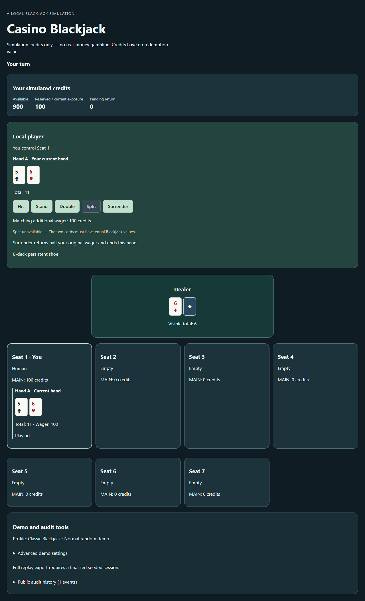
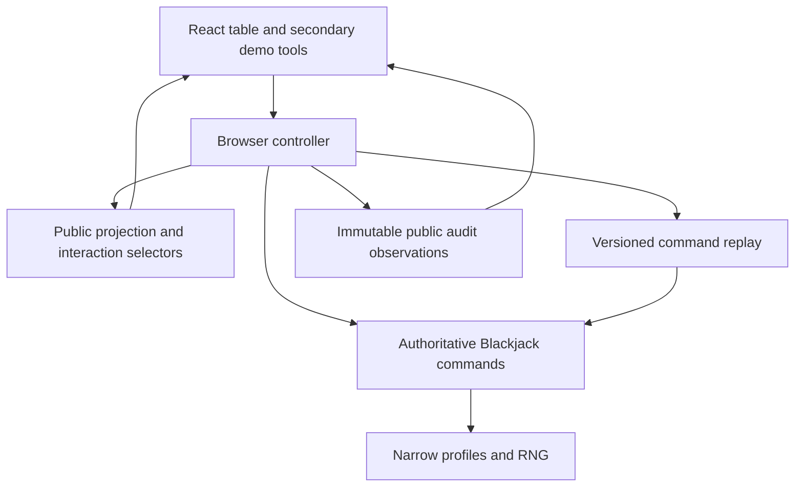
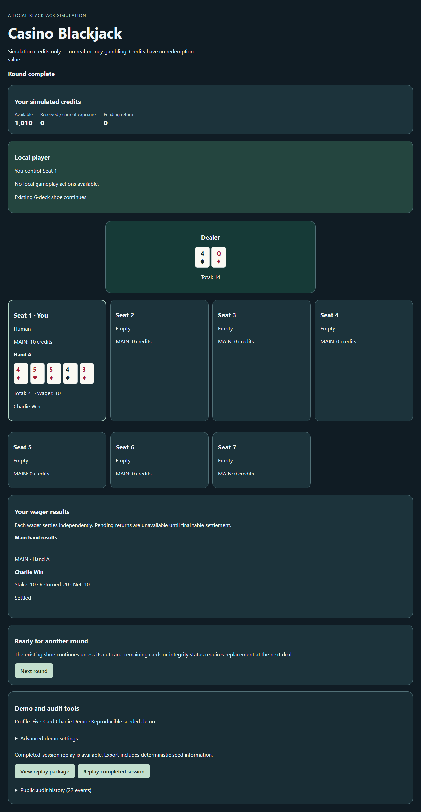
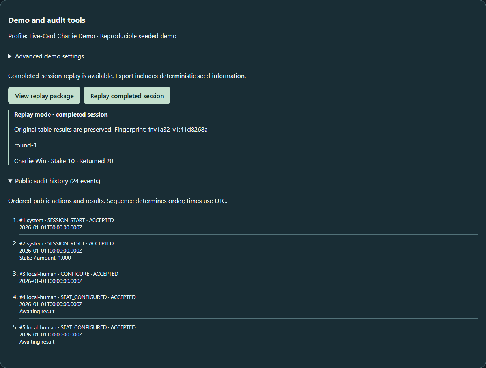

# Casino Blackjack

A TypeScript Blackjack portfolio: a headless rules engine, a responsive React table, deterministic command replay and a player-safe audit trail. Built with React, Vite, Vitest and Playwright.

**Simulated credits only, with no redemption value.** M1-M7 are HUMAN ACCEPTED; M8 is mechanically verified and awaiting fresh independent review and human acceptance. No deployment is claimed.



## Features

- Six-deck S17 Classic Blackjack: Hit, Stand, Double, Split/Re-split, restricted Split Aces and Late Surrender.
- One local player or spectator, seven configurable seats, computer Hit/Stand policy, and Bet Behind with separate funded exposure.
- Independent Pair, THREE_CARD, Insurance and Even Money results; integer half-credit accounting and exactly-once settlement or whole-round VOID/refund.
- Optional Five-Card Charlie demonstration profile, reproducible seeded sessions, terminal-only replay export and immutable public audit history.
- Keyboard controls, visible focus, live status and 320px mobile layout. Hidden cards and future shoe information stay outside the player projection.

## Engineering highlights

Rules live in immutable, headless domain transitions. The browser calls authoritative handlers and receives a safe projection; disabled controls never replace domain validation. A DOM-free compile and import checks enforce that boundary.

Replay records ordered commands and runs the real handlers again. Strict versioned schemas reject malformed input and identify failing command sequences. A canonical outcome fingerprint excludes timestamps. A bounded **256-seed** batch checks card accounting, financial reconciliation and deterministic replay; these checks make no RTP, house-edge or certification claim.

Harness Engineering uses one verification entry point, checked process exits, bounded evidence-based repair loops and explicit delivery states. Milestones end at a fresh-session, findings-first independent review gate. Implementation verification does not imply human acceptance.

## Architecture



Replay and audit are local engineering features, not persistence or production casino recovery. [DESIGN](docs/DESIGN.md) explains the boundaries.

## Run locally

Use Node **>=24.19.0 <25**, npm and Windows PowerShell:

```powershell
npm.cmd ci
npx.cmd playwright install chromium
npm.cmd run dev
```

Open the localhost address Vite prints. Choose your seat or Spectator, **Open betting**, set wagers, then **Close betting and deal**. Use enabled actions and **Continue table** for explicit computer/dealer progression. **Next round** retains credits and the shoe. Refresh resets the in-memory session.

```powershell
npm.cmd run build
powershell.exe -NoProfile -ExecutionPolicy Bypass -File ./scripts/verify.ps1
```

## Verification

Current full harness: **66 Vitest files / 951 tests**, **1 Chromium project / 38 tests**. It runs typecheck, lint, domain isolation, production build/fixture exclusion, Vitest, Chromium and independent M1-M7 preservation. Chromium tests start localhost port 4173; keep it free. No retries are configured.

[REG-M8-001..091](docs/M8_MAPPING.md) has exactly 91 unique executable owners. Accepted M7 mappings remain [UX-01..14, REG-M7-001..064 and E2E-01..15](docs/M7_MAPPING.md). Detailed timestamped evidence and historical counts live in [STATE](docs/STATE.md) and [DEVELOPMENT_LOG](docs/DEVELOPMENT_LOG.md).

## Profiles

| Profile ID | Behaviour |
| --- | --- |
| `CLASSIC_6D_S17_V1_1` | Accepted Classic rules; Charlie OFF |
| `CHARLIE5_6D_S17_V1_1` | Custom demonstration: fifth legal Hit producing exactly five cards at <=21 wins 1:1 |

Charlie is terminal, including fifth-card 21; bust takes precedence. Three/four-card 21 already stops, Dealer Natural precedes Hit, and Split Aces/Double restrictions remain. Whole-round VOID overrides every award. Profile changes require an eligible new session.



## Replay and audit demo

In **Advanced demo settings**, choose Five-Card Charlie Demo and seed **21**, then **Start new demo session**. This explicitly resets simulation credits to 1000. Keep Seat 1, open betting, set the default MAIN, close/deal, Hit three times and Continue table. The result is **Charlie Win**.

After financial completion, **Replay completed session** shows **Replay mode** without changing original results. **View replay package** and **Copy replay JSON** are available only for finalized seeded sessions; starting the next round removes export until completion. An exported package contains its seed and can reconstruct hidden information, so share it deliberately after completion. The browser supports replay of its own completed session, not arbitrary file import.

**Public audit history** is secondary to gameplay and shows sequence, UTC time, actor/action, stake and result. It excludes hole identity, physical IDs, future shoe order and active seed/state. [Replay schema](docs/REPLAY.md) and [audit schema](docs/AUDIT.md) document versions and developer boundaries.



Screenshots are generated by `tests/browser/portfolio.spec.ts` using controlled real-domain sessions, fixed audit time and only public UI. Regenerate locally:

```powershell
npm.cmd run test:e2e -- tests/browser/portfolio.spec.ts
```

## Limitations

Local memory only: no accounts, persistence/database, cloud sync, network multiplayer, payments or real money. Normal randomness is the existing browser adapter; seeded Mulberry32 is reproducible, not cryptographic or certified. The outcome fingerprint detects deterministic mismatches and is not authentication. Computer policy Hits below 17 and Stands at 17+, declining optional decisions; advanced follower paths use isolated real-domain test fixtures. Only Chromium is verified. Accessibility checks are not formal WCAG certification or a complete screen-reader audit.

## Documentation

[Rules](docs/RULES.md) · [Scope](docs/SPEC.md) · [UX](docs/UX_UI.md) · [Plan](docs/PLAN.md) · [Learning notes](docs/LAB_MANUAL.md) · [Portfolio walkthrough](docs/PORTFOLIO.md). Current review status and the final fresh-session handoff are recorded in STATE.
