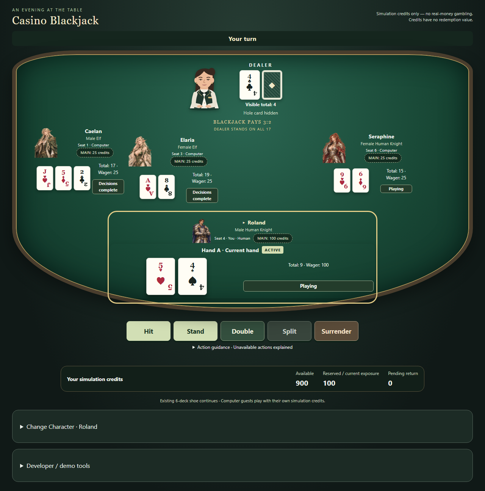

## M10A-T10 consolidated closure — 2026-10-05 06:41:43 +08:00

**M10A-T10 IMPLEMENTED / VERIFIED; M10A HUMAN VISUAL ACCEPTANCE: ACCEPTED; M10A MILESTONE: ACCEPTED / CLOSED.** Owner explicitly accepted T01–T09; this fresh session independently reviewed authority/source/diff/tests and36 newly executed representative images, then re-established full87 files/1109 Vitest/96 Chromium, current153, documentation13, native200/contrast/keyboard/44px/no-overflow, PA1 byte reproduction and scripts/verify.ps1 PASS / checked exit0. Repairs1/10: verified repository-local test-port conflict only, original failure retained. No product/test/domain/asset/geometry change. [Gate](docs/M10A_T10_EVIDENCE/technical-gate.json), [review](docs/M10A_T10_EVIDENCE/review.json), [contract](docs/M10A_T10.md). Normal main publication pending. M10-T02 next only after clean remote-parity receipt; T02/T03 future human acceptance PENDING. T04/art/Motion/animation/deployment NOT STARTED/NOT RUN. Older status receipts remain historical.

## T09 repair1/10 closed — 2026-10-05 02:49:27 +08:00

Documentation13 and git diff --cached --check PASS / checked exit0. Original failed handoff/raw check retained. Exact170 executable hashes unchanged; prior full87 files/1109 Vitest/96 Chromium, focused105/49, preservation and verify.ps1 PASS/0 remain valid. T07 final repair3/10, T08 final repair0/10, T09 final repair1/10. Batch technical tasks IMPLEMENTED / VERIFIED / COMMITTED / PUSHED; final documentation receipt follows, then actual remote parity/clean/untracked check. Human Visual Acceptance remains PENDING — OWNER REVIEW DEFERRED BY EXPLICIT OVERNIGHT AUTHORIZATION. [Handoff](docs/M10A_OVERNIGHT_HANDOFF.md). M10A-T10 NOT STARTED — WAITING FOR OWNER REVIEW OF T07/T08/T09. Other future tasks/animation NOT STARTED; DEPLOYMENT NOT RUN.

## T09 receipt publication repair checkpoint — 2026-10-05 02:47:39 +08:00

Final cumulative T09 repair1/10; T07 remains3/10, T08 remains0/10. Implementation main/2b801706140d190e1b42f68e42d1e74e9b64d2f0 already pushed; only two new handoff trailing spaces and truthful repair metadata corrected. Failed check/output retained. Exact170 executed files unchanged, prior full87/1109/96 PASS/0 retained. Documentation13/whitespace affected rerun pending; owner review remains PENDING — OWNER REVIEW DEFERRED BY EXPLICIT OVERNIGHT AUTHORIZATION. T10 and other future work NOT STARTED; deployment NOT RUN.

## Overnight T07–T09 final authorized boundary — 2026-10-05 02:45:42 +08:00

**M10A_OVERNIGHT_BATCH_T07_T09_COMPLETE** at the technical/publication checkpoint; final documentation receipt follows with unchanged executable hashes. T07 repair3/10, T08 repair0/10, T09 repair0/10; all IMPLEMENTED / VERIFIED / COMMITTED / PUSHED. T09 main/2b801706140d190e1b42f68e42d1e74e9b64d2f0, full87/1109/96 PASS/0. [Consolidated handoff](docs/M10A_OVERNIGHT_HANDOFF.md). Human acceptance for all three: PENDING — OWNER REVIEW DEFERRED BY EXPLICIT OVERNIGHT AUTHORIZATION. T06 owner ACCEPTED. M10A-T10 NOT STARTED — WAITING FOR OWNER REVIEW OF T07/T08/T09; M10-T02/M10-T04 IMPLEMENTATION/ANIMATION NOT STARTED; DEPLOYMENT NOT RUN. M10A not marked complete. Historical records below retain prior chronology.

## M10A-T09 overnight technical publication

2026-10-05 02:45:05 +08:00. Published main/2b801706140d190e1b42f68e42d1e74e9b64d2f0; full87/1109/96 PASS/0; repairs0/10. Human review PENDING — OWNER REVIEW DEFERRED BY EXPLICIT OVERNIGHT AUTHORIZATION. [Evidence](docs/M10A_T09_EVIDENCE/README.md). T06 owner ACCEPTED. Next authorized task only after clean receipt; T10/M10-T02/M10-T04/animation NOT STARTED, deployment NOT RUN. Earlier records below are historical.

## M10A-T08 overnight technical publication

2026-10-05 02:10:36 +08:00. Published main/3a718cb5929a27ccba2370d29dadf66ad3dcce9a; full86/1106/93 PASS/0; repairs0/10. Human review PENDING — OWNER REVIEW DEFERRED BY EXPLICIT OVERNIGHT AUTHORIZATION. [Evidence](docs/M10A_T08_EVIDENCE/README.md). T06 owner ACCEPTED. Next authorized task only after clean receipt; T10/M10-T02/M10-T04/animation NOT STARTED, deployment NOT RUN. Earlier records below are historical.

## M10A-T07 overnight technical publication

2026-10-05 01:42:07 +08:00. Published main/356eee37fb04529afa28faaa6ad49ff0275d7195; full85/1104/91 PASS/0; repairs3/10. Human review PENDING — OWNER REVIEW DEFERRED BY EXPLICIT OVERNIGHT AUTHORIZATION. [Evidence](docs/M10A_T07_EVIDENCE/README.md). T06 owner ACCEPTED. Next authorized task only after clean receipt; T10/M10-T02/M10-T04/animation NOT STARTED, deployment NOT RUN. Earlier records below are historical.

## M10A-T06 owner visual acceptance — 2026-10-05 00:57:53 +08:00

**M10A-T06 HUMAN VISUAL ACCEPTANCE: ACCEPTED** by explicit owner overnight instruction at main/adf52caf4329060c14a2117147f7e38a6408338e. Normal dock remains accepted; Insurance/Even Money and Round Complete read as compact game decisions/controls integrated with LocalPlayerHud/table. Behaviour/accessibility preserved. Historical repair4/10 retained. T07–T09 authorized conditional unattended technical progression; their human review is deferred, not rejected or self-accepted.

## M10A-T06 visual repair published

Compact Insurance/Even Money and Round Complete game docks verified and pushed normally on main at05c1b4c; cumulative4/10. Full84files/1101Vitest/89Chromium and all required preservation/unified checks PASS/0. [Before/after evidence](docs/M10A_T06_REPAIR1_EVIDENCE/README.md), [actual publication](docs/STATE.md). Accepted normal dock preserved; overall owner visual acceptance NOT ACCEPTED / awaiting new live review. T07 waiting; no Motion/animation/deployment.

## M10A-T06 Human Visual Repair 1 — technically verified

Insurance/Even Money and Round Complete are compact local game docks with native disclosures and visible state focus. The owner-accepted normal action dock/betting-open pixels and scene geometry are preserved. Full84files/1101Vitest/89Chromium, focused97/42 and independent/unified verification PASS / checked0; cumulative4/10. [Evidence and comparisons](docs/M10A_T06_REPAIR1_EVIDENCE/README.md). Publication pending. Overall owner T06 visual acceptance NOT ACCEPTED / awaiting new live review; fresh independent review NOT RUN. T07 waiting; no accounting HUD redesign, Dealer artwork, Motion/animation or deployment. Earlier checkpoint paragraphs below retain their historical scope.

## M10A-T06 human visual repair in progress

T06 owner visual acceptance NOT ACCEPTED. Normal action dock accepted and preserved; Insurance/Even Money and Round Complete are under a scoped composition repair, cumulative 4/10. Technical verification for this new version NOT RUN. [Contract](docs/M10A_T06.md), [new evidence](docs/M10A_T06_REPAIR1_EVIDENCE/README.md). T07 remains waiting; no accounting HUD redesign, artwork, Motion, animation or deployment.

## Current M10A-T06 Control Integration

**M10A-T06_IMPLEMENTED_VERIFIED**, repairs **3/10**. One native action dock names the current public hand; green/gold primary controls, dashed disabled states, exact wager/chip/Deal controls and compact Insurance/Even Money decisions share the accepted table scene. Full 84 files / 1098 Vitest tests / 86 Chromium cases, independent preservation and verify.ps1 PASS / checked exit 0. Stand bottom 883.359375px; desktop/tablet/mobile, text 200%, genuine browser 200% zoom, keyboard/focus and measured contrast PASS. [Task](docs/M10A_T06.md), [visual/evidence index](docs/M10A_T06_EVIDENCE/README.md).

**M10A-T05 HUMAN VISUAL ACCEPTANCE: ACCEPTED**, historical 4/10 retained. T06 owner visual acceptance PENDING; fresh independent review NOT RUN; COMMITTED / PUSHED normally on main at 37e71e6; [publication receipt](docs/STATE.md). M10A-T07 NOT STARTED — WAITING FOR HUMAN VISUAL ACCEPTANCE. M10-T02/M10-T04 implementation NOT STARTED; final accounting HUD/formal Dealer art/animation NOT IMPLEMENTED, Motion NOT INSTALLED, deployment NOT RUN.

## Historical M10A-T05 Felt Gameplay Markings

**M10A-T05_IMPLEMENTED_VERIFIED**, repairs4/10. Restrained static MAIN ellipses, hand/Dealer guides and accurate3:2/S17 print reuse real occupied seat and hand destinations. Accepted composition unchanged: Stand883.359375px and6px gap. Focused86 UI/32 Chromium, full83files/1090Vitest/79Chromium, independent preservation and verify.ps1 PASS/checked0. [Task](docs/M10A_T05.md), [visual/evidence index](docs/M10A_T05_EVIDENCE/README.md).

T04 HUMAN VISUAL ACCEPTANCE: ACCEPTED, historical5/10 retained. T05 owner visual acceptance PENDING; fresh independent review NOT RUN. COMMITTED / PUSHED normally on main at22edca3; [publication receipt](docs/STATE.md). M10A-T06 NOT STARTED — WAITING FOR HUMAN VISUAL ACCEPTANCE. M10-T02/M10-T04 implementation NOT STARTED; formal art/animation NOT IMPLEMENTED, Motion NOT INSTALLED, deployment NOT RUN.

## Historical M10A-T05 start

T04 HUMAN VISUAL ACCEPTANCE: ACCEPTED; historical5/10 retained. T05 static felt cues authorized;0/10, verification NOT RUN, owner acceptance PENDING. [Contract](docs/M10A_T05.md). Control integration, formal Dealer art, Motion and animation implementation remain unstarted.

## Historical M10A-T04 Dealer Zone Composition

**M10A-T04_IMPLEMENTED_VERIFIED**, repairs **5/10**. A dedicated upper-centre Dealer workstation groups the temporary character, public cards/hidden back, total/status, static shoe/deal origin and accurate3:2/S17 rules. Accepted normal camera/remote seats/local HUD remain in place; Stand bottom883.359375px,6px action gap retained. Desktop/tablet/mobile,200% text and native200% browser zoom PASS. Focused78 UI/29 Chromium, full82files/1082Vitest/76Chromium, independent preservation and verify.ps1 PASS / checked exit0. [Task](docs/M10A_T04.md), [visuals/evidence](docs/M10A_T04_EVIDENCE/README.md).

**M10A-T03 HUMAN VISUAL ACCEPTANCE: ACCEPTED**, historical4/10 retained; T02 accepted8/10 and T01 accepted exceptional11/11 unchanged. T04 owner visual acceptance PENDING; fresh independent review NOT RUN. Formal Dealer artwork/identity policy/new animations NOT IMPLEMENTED; Motion NOT INSTALLED; M10-T02/M10-T04 implementation NOT STARTED; deployment NOT RUN. COMMITTED / PUSHED normally on main at9a84110; [publication receipt](docs/STATE.md). M10A-T05 NOT STARTED — WAITING FOR HUMAN VISUAL ACCEPTANCE.

## Historical M10A-T03 Local Player HUD

**M10A-T03_IMPLEMENTED_VERIFIED**, repairs **4/10**. Framed original avatar/You identity, large readable cards, compact total/status, exact per-hand wager/result and textual current-hand markers form the lower-centre local HUD. Normal/five-card/two-split/four-leaf layouts pass at desktop/tablet/mobile,200% text and native200% browser zoom; existing actions and authoritative funds remain directly accessible. Full **81 files /1071 Vitest tests**, **73 Chromium tests**, independent preservation and final verify.ps1 PASS / checked exit0. Stand bottom883.359375px <=900. [Task](docs/M10A_T03.md), [visuals and evidence](docs/M10A_T03_EVIDENCE/README.md).

**M10A-T02 HUMAN VISUAL ACCEPTANCE: ACCEPTED** recorded before T03; T02 historical8/10 and T01 accepted exceptional11/11 retained. T03 owner visual acceptance PENDING; fresh independent review NOT RUN. M10A-T04 NOT STARTED — WAITING FOR HUMAN VISUAL ACCEPTANCE. Formal Dealer artwork/final T06 controls/final T07 accounting integration/new animations NOT IMPLEMENTED; Motion NOT INSTALLED. M10-T02/M10-T04 implementation NOT STARTED; deployment NOT RUN. COMMITTED / PUSHED normally on main atd4efd69; [publication receipt](docs/STATE.md).

## Historical M10A-T02 Player Seat Unit checkpoint

**M10A-T02_IMPLEMENTED_VERIFIED**, repairs **8/10**. Remote portraits, cards, score, exact stake and public hand state now share one seat frame; secondary metadata is compact and current-turn/hand states retain text. Five-card/four-split-leaf and real long-name layouts pass at desktop/tablet/mobile, 200% text and native200% browser zoom. Full **80 files / 1,059 Vitest tests**, **71 Chromium tests**, independent preservation and final verify.ps1 PASS / exit0. [Task](docs/M10A_T02.md), [comparable screenshots and evidence](docs/M10A_T02_EVIDENCE/README.md).

**M10A-T01 HUMAN VISUAL ACCEPTANCE: ACCEPTED** was recorded before T02 edits; historical11/11 exception retained. T02 owner visual acceptance PENDING; fresh independent review NOT RUN. Final Local Player HUD/Dealer formal artwork/animations NOT IMPLEMENTED; Motion NOT INSTALLED. M10A-T03 NOT STARTED — WAITING FOR HUMAN VISUAL ACCEPTANCE. M10-T02/M10-T04 implementation NOT STARTED; deployment NOT RUN. COMMITTED / PUSHED normally on main at9848e3d; [publication receipt](docs/STATE.md).

## Historical M10A-T01 contrast repair — IMPLEMENTED / VERIFIED

The retained visual shell now passes the desktop payout contrast gate:4.476153734022139 -> **4.520553075070118:1**, required>=4.5. The only exceptional change is desktop inscription colour#e2d2a4 ->#e3d3a5; composition dimensions and native controls remain intact, Stand bottom890.71875<=900. [Current evidence, screenshots and exact checks](docs/M10A_T01_EVIDENCE/exceptional-repair11/README.md), [task](docs/M10A_T01.md).

Focused UI46/Chromium22, full79 files/1050 Vitest and69 Chromium, independent preservation and final verify.ps1 PASS/exit0. Desktop/tablet/mobile,200% text, native200% browser zoom and keyboard/focus PASS. **M10A-T01:11/11 — OWNER-AUTHORIZED EXCEPTION**; previous10/10 blocker history preserved, no repair12. COMMITTED / PUSHED normally on main at1a04a5b; [publication receipt](docs/STATE.md). Human Visual Acceptance NOT ACCEPTED / PENDING; genuinely fresh independent review NOT RUN; no deployment. **M10A-T02 NOT STARTED — WAITING FOR HUMAN VISUAL ACCEPTANCE**.

## Historical M10A-T01 visual repair — blocked at10/10

The owner rejected the published8ae9ff2 scene. The current working-tree shell repair enlarges existing Dealer/occupied portraits/local cards and attaches native betting/actions more closely to play. [Comparable before/after and executed evidence](docs/M10A_T01_EVIDENCE/human-repair01/README.md), [task and scope](docs/M10A_T01.md).

Focused UI46/Chromium22, typecheck/lint and native200% browser zoom passed. The scene contrast gate failed: payout text4.476:1 < required4.5:1. At the normal10/10 cap, further product repair requires explicit authorization. Full regression/final verify.ps1/current commit/push/deployment NOT RUN. Human Visual Acceptance NOT ACCEPTED / PENDING; fresh independent review NOT RUN. **M10A-T02 NOT STARTED — WAITING FOR HUMAN VISUAL ACCEPTANCE**. M10-T02/M10-T04 implementation NOT STARTED.

## Historical M10A-T01 scene-frame publication

The Player Mode table, Dealer, existing seats, local controls and exact credit values now share one continuous felt/rail scene. A compact header keeps the simulation disclaimer visible; character preferences and demo tools follow gameplay. [Task and scope](docs/M10A_T01.md), [screenshots and executed evidence](docs/M10A_T01_EVIDENCE/README.md).

M10A planning is HUMAN ACCEPTED. T01 is IMPLEMENTED / VERIFIED:79 Vitest files/1050 tests,68 Chromium and independent preservation/final verify.ps1 PASS/exit0. Native200% browser zoom, keyboard focus and three viewport captures passed. T01 repairs3/10 (verification tools3; product0). Human visual acceptance and fresh independent review NOT RUN; deployment NOT RUN. Final seat units, local HUD, Dealer artwork and animation remain future work. **M10A-T02 NOT STARTED — WAITING FOR HUMAN VISUAL ACCEPTANCE**. M10-T02 NOT STARTED; M10-T04 IMPLEMENTATION NOT STARTED. Earlier checkpoint descriptions below retain their publication state.

## Historical M10A planning checkpoint

M10A is a new documentation/design milestone for one table-centric Blackjack game scene: coherent seat units, a dominant lower-centre local HUD, an upper-centre Dealer reserve, meaningful felt markings, integrated controls and compact exact accounting. [Planning and task gates](docs/M10A_PLANNING.md), [composition design](docs/DESIGN.md), [interaction](docs/UX_UI.md). All M10A implementation tasks remain NOT STARTED, waiting for human planning acceptance; no product/artwork/dependency change or deployment.

M10-T01 remains technically IMPLEMENTED / VERIFIED / COMMITTED / PUSHED, repairs **11/11 — OWNER-AUTHORIZED EXCEPTION**, with its geometry/evidence retained. **M10-T01 Human Visual Acceptance = NOT ACCEPTED**: the owner still sees a dashboard over a table background. M10A responds to that review with independent normal task repair accounting; it is not another T01 repair. M10-T02 NOT STARTED; M10-T04 REQUIREMENTS UPDATED FOR PLANNING / IMPLEMENTATION NOT STARTED. Reference screenshots inform general principles only; no third-party image/artwork is copied or stored.

## Prior published M10 table composition checkpoint

The published UI composition is IMPLEMENTED / VERIFIED with grouped seats, larger local cards and an action/credit dock. Desktop Stand bottom896.703125<=900 after the owner-authorized11/11 exception. Full78/1047 Vitest,67 Chromium and independent preservation PASS/exit0; actual browser200% zoom precheck PASS. Final unified verify.ps1 PASS/exit0, including type/lint/build/domain isolation and accepted preservation; publication receipts are recorded in STATE. [Technical task/evidence](docs/M10_T01.md). At publication human visual acceptance/fresh independent review/deployment were NOT RUN; the subsequent owner visual NOT ACCEPTED decision is recorded above. Earlier published receipts remain historical below.

## Prior published M10 geometry checkpoint

[Repair7 evidence](docs/M10_T01_RECOVERY.md): ordinary PA1 verification now reads historical PNGs and saves fresh screenshots through Playwright test-scoped output paths. All17 canonical hashes unchanged; original assertions retained. Windows ROOT CAUSE NOT ESTABLISHED; cumulative repairs8/10 (repair7 infrastructure; repair8 log whitespace). Earlier failures and diagnostic evidence remain available.

M10 planning HUMAN ACCEPTED for `57443bbefddd47512104ba941c65e3ff1988cf02`. M10-T01 Casino Table Geometry is IMPLEMENTED / VERIFIED: final unified verification PASS/0,78 Vitest files/1045 tests,66 Chromium and all required preservation. [T01 scope, repairs and evidence](docs/M10_T01.md). A CSS half-ellipse rail/felt, central Dealer/card anchors and presentation-only seat geometry frame the existing four participants. Desktop uses perimeter offsets; tablet/mobile retain a compact arc with readable full-size own cards and controls below. Publication receipts are recorded in STATE; human implementation acceptance and fresh independent review NOT RUN. Count configuration, Dealer animation and Motion remain future tasks. M10-T02 NOT STARTED — WAITING FOR HUMAN ACCEPTANCE; deployment NOT RUN.

Future M10-T04 planning requirement: **Dealer = avatar-derived character presentation entity**, with a separate formal casino-attire variant retaining the character's face/hair/style. Accepted PA1 assets remain immutable; the same identity is not Dealer and seated player simultaneously by default. Assignment policy remains future-defined; [DESIGN M10.7](docs/DESIGN.md) governs the contract. This requirement update creates no art/product code and starts neither T04 nor T02.

## Historical M10 planning

M10 — Casino Table Experience is **PLANNED / NOT STARTED**. [Presentation design](docs/DESIGN.md), [scope and acceptance](docs/SPEC.md), [T01–T11 task plan](docs/PLAN.md), [planning evidence](docs/M10_PLANNING.md). Planned total-player selection 1–7, responsive semicircular seats, a central animated Dealer character presentation entity and sequential presentation of already-resolved cards. Dealer character integration requires a recognizable person, six public presentation states and restrained 2D gestures; a generic icon or static/abstract SVG alone is insufficient. Current playable product remains the PA1 presentation with the M9 journey described below. Planning changes no gameplay, dependencies or assets.

M10-T01 NOT STARTED. No deployment. Historical delivery blocks below preserve their receipts; current M10 status is governed by this paragraph and STATE.

## Current PA1 work

M1-M8 and RA1 HUMAN ACCEPTED by the owner. [PA1 independent review ACCEPTED](docs/PA1_INDEPENDENT_REVIEW.md) for implementation `3c50ab4d0183cff13f2380bd60faa31583d3e988`, under the owner's conditional review delegation. M9 HUMAN ACCEPTED: NO; the separate owner experience evaluation remains outstanding. Deployment NOT RUN. Earlier delivery blocks below preserve their historical status.

M10 NOT STARTED.

PA1 is the presentation-only [Fantasy Character Presentation Pack](docs/PA1_CONTRACT.md). T01-T07 IMPLEMENTED / VERIFIED / COMMITTED / PUSHED. All twelve transparent sources passed the [individual audit](docs/PA1_ASSET_AUDIT.md), including Noble replacements, and remain unchanged in `art/source/characters/PA1_character_sources`. The [pinned pipeline](docs/PA1_ASSET_PIPELINE.md) reproduces240x320 portraits. Player Mode defaults to Roland, with a secondary native Change Character selector and unique automatic guests. Normal rounds preserve identities; changing to a guest's character exchanges only that guest with your previous avatar. Dealer independent. Domain/gameplay RNG/replay/digests/computer strategy unchanged. Independent official verification **76 Vitest files / 1031 tests**, **1 Chromium project / 63 tests** and all M1-M8 preservation PASS; twelve assets mechanically and visually reviewed. Historical T05 root cause remains unestablished; bounded5/5 E03 and42/42 integration diagnostics passed. [Evidence](docs/PA1_EVIDENCE.md), [screenshots](docs/PA1_SCREENSHOTS.md), [completed review](docs/PA1_INDEPENDENT_REVIEW.md). Recommended GPT Sol6.1/High; actual runtime NOT VERIFIED. Historical delivery blocks below preserve their earlier versions.

<!-- END CURRENT PA1 -->

## Historical RA1 delivery

House Rules v1.2 / Re-split Aces: [contract](docs/RA1_CONTRACT.md), [mapping](docs/RA1_MAPPING.md), [evidence](docs/RA1_EVIDENCE.md), [fresh-session handoff](docs/RA1_REVIEW_HANDOFF.md). M1-M8 HUMAN ACCEPTED. M9 IMPLEMENTED / VERIFIED; genuinely fresh independent review NO FINDINGS at `8326f846ad753b79fd8d35f76b00f28854e2f448`; M9 ACCEPTED: NO. RA1 ACCEPTED: NO. Deployment NOT RUN. No M10.

RA1-T01..T05 IMPLEMENTED / VERIFIED / COMMITTED / PUSHED. Final code/test checkpoint `1fc211a3b92aa095bc9d37de63e2f967a0a52ad4` published on main; normal push/fetch PASS/0 at 2026-10-02 00:52:21 +08:00, main=origin/main,0/0,clean/full untracked empty. Final evidence-only receipt SHA is identified by Git/final delivery. Official final harness PASS/0 at 2026-10-02 00:47:18 +08:00; complete Vitest/Chromium and accepted M1-M8 preservation PASS. Same-session task diff reviewed; genuinely fresh independent review remains pending. RA1 repair ledger T01..T05 `2,0,2,1,1` (each /10); historical M8 `0,2,3,2,2,1,2,6,4` and M9 `0,2,1,1,3,0,2,1,5` unchanged. Recommended GPT Sol 6.1 / High; actual model/effort NOT VERIFIED / NOT VERIFIED. RA1 fresh independent review NOT RUN.

Current inventory: **73 Vitest files / 1020 tests**, **1 Chromium project / 58 tests**; **30 uniquely mapped RSA regressions** plus additional preservation/contract/UI checks. Inventory is not execution evidence; checked results are in RA1_EVIDENCE. Default normal Player Mode: CLASSIC_6D_S17_V1_2. Supported: CLASSIC_6D_S17_V1_1, CHARLIE5_6D_S17_V1_1 (RSA OFF), CLASSIC_6D_S17_V1_2, CHARLIE5_6D_S17_V1_2 (RSA ON). Replay schema/RNG/digest/audit versions unchanged.

Records below preserve their historical versions, inventories, review boundaries and failed attempts; earlier M9 fresh-review NOT RUN statements are superseded by the supplied NO FINDINGS review at the baseline. They do not describe RA1 behavior or accept M9/RA1.

<!-- END CURRENT RA1 -->

# Casino Blackjack

Sit down at an illustrated blackjack table, choose your own wager and play. A central fictional female dealer and three unique fantasy computer guests are already present. Choose your avatar under Change Character. Computer wagers, turns and dealer resolution happen automatically; your hand and decisions stay at the near edge of the felt.

**Simulated credits only, with no redemption value.** Local TypeScript / React / Vite portfolio project.



## Current M9 delivery

M1-M8 HUMAN ACCEPTED. M8 HUMAN ACCEPTED at `8f5aca327f41f1078fc4fef20b611fd9cd494492`; final independent review NO FINDINGS, MEDIUM-05 CLOSED, all previous findings CLOSED. The owner's explicit acceptance was recorded with substantive T01. M8 repair ledger `0,2,3,2,2,1,2,6,4` remains unchanged.

M9-T01..T09 IMPLEMENTED / VERIFIED / COMMITTED / PUSHED. Stop at the fresh-session review gate. M9 NOT ACCEPTED. Fresh-session review NOT RUN. Deployment NOT RUN. Recommended GPT Sol 6.1 / High; actual model/effort NOT VERIFIED / NOT VERIFIED.

Current suite inventory: **68 Vitest files / 978 tests**, **1 Chromium project / 55 tests**. Execution results and failures are recorded separately in [M9 evidence](docs/M9_EVIDENCE.md); inventory is not a PASS claim. [Fresh review pack](docs/M9_REVIEW_HANDOFF.md). M9 cumulative repair ledger: `0,2,1,1,3,0,2,1,5`.

T09 implementation published on main at fc5cbd687a14e0e1eb1fae0ee6830e139397fe06, normal push/fetch PASS at 2026-10-01 22:35:03 +08:00, main=origin/main,0/0,clean/full untracked empty. This final documentation receipt changes no executable/test/dependency/runtime settings; its own final SHA is recorded in Git/delivery.

<!-- END CURRENT M9 -->

## Play locally

Requires Node.js/npm and Windows PowerShell for the official harness.

```powershell
npm.cmd ci
npx.cmd playwright install chromium
npm.cmd run dev
```

Open the local URL printed by Vite. Classic Blackjack is the default. Choose 10-1000 whole credits and press **Deal**. Hit, Stand, Double, Split or Surrender when eligible. Insurance / Even Money and your financial follower choices always wait for you.

The normal table uses **House Rules v1.2 / Classic**, with Re-split Aces. A Split-Ace hand receives one supplement. If it is A+A and funds/cap permit, choose **Split** or **Stand to keep Soft 12**. Otherwise it completes automatically. Hit, Double and Surrender remain unavailable; A+ten is ordinary 21. Historical v1.1 profiles remain available in secondary demo settings and preserve old replay behavior.

**Deal Again** opens betting with the same balances and shoe. **Repeat Bet** explicitly deals the last original main amount; it does not repeat side/back/Insurance stakes or Double/Split exposure. An unaffordable repeat is disabled. Optional own side/back wagers are under **Optional wagers**. Guests fund 25 credits from their own existing balance, use smaller whole-credit stakes when needed, or sit out below the minimum.

**Developer / demo tools** starts closed. Expand it for seed/profile settings, public Audit, finalized seeded Replay, or a deliberate manual demo with explicit configuration/wagering/progression. Changing modes or starting a new demo is labelled as a credit reset. Active/funded player rounds cannot reset. A refresh starts over; no session is persisted.

## Verification

```powershell
powershell.exe -NoProfile -ExecutionPolicy Bypass -File .\scripts\verify.ps1
git diff --check
git status --short --untracked-files=all
```

The harness runs typecheck, lint, Vitest, DOM-free domain compilation, production build/fixture exclusion, Chromium E2E and independent accepted M1-M8 preservation. It checks process exits and fails visibly. Current PA1 inventory:76 files/1031 Vitest/63 Chromium. Accepted M8 remains66/956/44; M9 owns22 unit/document and11 browser scenarios. RA1 adds42 Vitest and3 Chromium, including30 mapped RSA regressions. PA1 adds11 Vitest and5 Chromium checks; REG-M8-001..096 and all original assertions remain protected. Also run `node scripts/verify-character-assets.mjs` for complete original/production receipt equality and pinned byte-for-byte reproduction. [PA1 mapping](docs/PA1_MAPPING.md), [preservation](docs/PA1_PRESERVATION.md), [fresh review](docs/PA1_REVIEW_HANDOFF.md).

## Profiles and engineering

Six-deck S17 Classic includes accepted Double, Split/Re-split, restricted Split Aces, Late Surrender, separate Pair / THREE_CARD / Insurance / Even Money and Bet Behind. The optional Five-Card Charlie Demo is explicitly selected: a legal Hit that brings the hand to exactly five cards with a total of 21 or less wins 1:1. It is a custom demo profile.

| Supported profile | Charlie | Re-split Aces |
| --- | --- | --- |
| `CLASSIC_6D_S17_V1_1` | OFF | DISABLED |
| `CHARLIE5_6D_S17_V1_1` | ON | DISABLED |
| `CLASSIC_6D_S17_V1_2` (normal Player Mode) | OFF | ENABLED |
| `CHARLIE5_6D_S17_V1_2` | ON | ENABLED |

Immutable headless domain handlers own cards, bankrolls and settlement. Browser-only orchestration expands player intentions into the same replayable/audited commands, with capacity checked before composite mutation. Integer half-credit accounting, exactly-once settlement/VOID and hidden-card projection stay unchanged from accepted M8. The dealer retains its code-native SVG; fantasy portrait originals were supplied by the owner and preserved with audited transparent derivatives. Keyboard focus, semantic cards, live feedback, reduced motion and320px layouts have automated coverage.

No network multiplayer, accounts, storage, payment, real money, certification or deployment is included. [Rules](docs/RULES.md), [scope](docs/SPEC.md), [design](docs/DESIGN.md), [UX](docs/UX_UI.md), [portfolio walkthrough](docs/PORTFOLIO.md).
