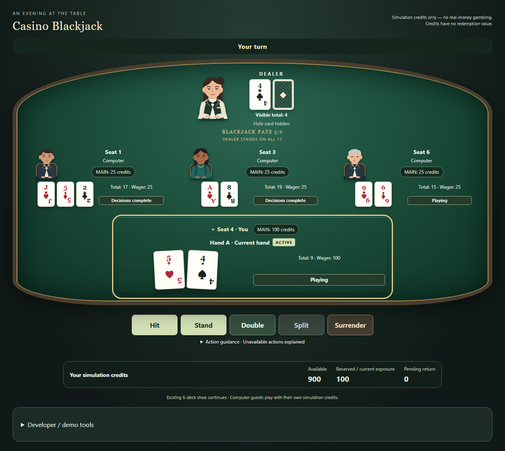

## Current RA1 delivery

House Rules v1.2 / Re-split Aces: [contract](docs/RA1_CONTRACT.md), [mapping](docs/RA1_MAPPING.md), [evidence](docs/RA1_EVIDENCE.md), [fresh-session handoff](docs/RA1_REVIEW_HANDOFF.md). M1-M8 HUMAN ACCEPTED. M9 IMPLEMENTED / VERIFIED; genuinely fresh independent review NO FINDINGS at `8326f846ad753b79fd8d35f76b00f28854e2f448`; M9 ACCEPTED: NO. RA1 ACCEPTED: NO. Deployment NOT RUN. No M10.

RA1-T01..T05 IMPLEMENTED / VERIFIED / COMMITTED / PUSHED. Final code/test checkpoint `1fc211a3b92aa095bc9d37de63e2f967a0a52ad4` published on main; normal push/fetch PASS/0 at 2026-10-02 00:52:21 +08:00, main=origin/main,0/0,clean/full untracked empty. Final evidence-only receipt SHA is identified by Git/final delivery. Official final harness PASS/0 at 2026-10-02 00:47:18 +08:00; complete Vitest/Chromium and accepted M1-M8 preservation PASS. Same-session task diff reviewed; genuinely fresh independent review remains pending. RA1 repair ledger T01..T05 `2,0,2,1,1` (each /10); historical M8 `0,2,3,2,2,1,2,6,4` and M9 `0,2,1,1,3,0,2,1,5` unchanged. Recommended GPT Sol 6.1 / High; actual model/effort NOT VERIFIED / NOT VERIFIED. RA1 fresh independent review NOT RUN.

Current inventory: **73 Vitest files / 1020 tests**, **1 Chromium project / 58 tests**; **30 uniquely mapped RSA regressions** plus additional preservation/contract/UI checks. Inventory is not execution evidence; checked results are in RA1_EVIDENCE. Default normal Player Mode: CLASSIC_6D_S17_V1_2. Supported: CLASSIC_6D_S17_V1_1, CHARLIE5_6D_S17_V1_1 (RSA OFF), CLASSIC_6D_S17_V1_2, CHARLIE5_6D_S17_V1_2 (RSA ON). Replay schema/RNG/digest/audit versions unchanged.

Records below preserve their historical versions, inventories, review boundaries and failed attempts; earlier M9 fresh-review NOT RUN statements are superseded by the supplied NO FINDINGS review at the baseline. They do not describe RA1 behavior or accept M9/RA1.

<!-- END CURRENT RA1 -->

# Casino Blackjack

Sit down at an illustrated blackjack table, choose your own wager and play. A central fictional female dealer and three evening-attire computer guests are already present. Computer wagers, turns and dealer resolution happen automatically; your hand and decisions stay at the near edge of the felt.

**Simulated credits only, with no redemption value.** Local TypeScript / React / Vite portfolio project.



## Current M9 delivery

M1-M8 HUMAN ACCEPTED. M8 HUMAN ACCEPTED at `8f5aca327f41f1078fc4fef20b611fd9cd494492`; final independent review NO FINDINGS, MEDIUM-05 CLOSED, all previous findings CLOSED. The owner's explicit acceptance was recorded with substantive T01. M8 repair ledger `0,2,3,2,2,1,2,6,4` remains unchanged.

M9-T01..T09 IMPLEMENTED / VERIFIED / COMMITTED / PUSHED. Stop at the fresh-session review gate. M9 NOT ACCEPTED. Fresh-session review NOT RUN. Deployment NOT RUN. Recommended GPT Sol 6.1 / High; actual model/effort NOT VERIFIED / NOT VERIFIED.

Current suite inventory: **68 Vitest files / 978 tests**, **1 Chromium project / 55 tests**. Execution results and failures are recorded separately in [M9 evidence](docs/M9_EVIDENCE.md); inventory is not a PASS claim. [Fresh review pack](docs/M9_REVIEW_HANDOFF.md). M9 cumulative repair ledger: `0,2,1,1,3,0,2,1,5`.

T09 implementation published on main at fc5cbd687a14e0e1eb1fae0ee6830e139397fe06, normal push/fetch PASS at 2026-10-01 22:35:03 +08:00, main=origin/main,0/0,clean/full untracked empty. This final documentation receipt changes no executable/test/dependency/runtime settings; its own final SHA is recorded in Git/delivery.

<!-- END CURRENT M9 -->

## Play locally

Requires Node.js/npm and Windows PowerShell for the official harness.

```powershell
npm.cmd ci
npx.cmd playwright install chromium
npm.cmd run dev
```

Open the local URL printed by Vite. Classic Blackjack is the default. Choose 10-1000 whole credits and press **Deal**. Hit, Stand, Double, Split or Surrender when eligible. Insurance / Even Money and your financial follower choices always wait for you.

The normal table uses **House Rules v1.2 / Classic**, with Re-split Aces. A Split-Ace hand receives one supplement. If it is A+A and funds/cap permit, choose **Split** or **Stand to keep Soft 12**. Otherwise it completes automatically. Hit, Double and Surrender remain unavailable; A+ten is ordinary 21. Historical v1.1 profiles remain available in secondary demo settings and preserve old replay behavior.

**Deal Again** opens betting with the same balances and shoe. **Repeat Bet** explicitly deals the last original main amount; it does not repeat side/back/Insurance stakes or Double/Split exposure. An unaffordable repeat is disabled. Optional own side/back wagers are under **Optional wagers**. Guests fund 25 credits from their own existing balance, use smaller whole-credit stakes when needed, or sit out below the minimum.

**Developer / demo tools** starts closed. Expand it for seed/profile settings, public Audit, finalized seeded Replay, or a deliberate manual demo with explicit configuration/wagering/progression. Changing modes or starting a new demo is labelled as a credit reset. Active/funded player rounds cannot reset. A refresh starts over; no session is persisted.

## Verification

```powershell
powershell.exe -NoProfile -ExecutionPolicy Bypass -File .\scripts\verify.ps1
git diff --check
git status --short --untracked-files=all
```

The harness runs typecheck, lint, Vitest, DOM-free domain compilation, production build/fixture exclusion, Chromium E2E and independent accepted M1-M8 preservation. It checks process exits and fails visibly. Accepted M8 remains 66 files / 956 Vitest and 44 Chromium; M9 owns its 22 unit/document and 11 browser scenarios. RA1 adds 42 Vitest checks and 3 Chromium scenarios, including 30 uniquely mapped RSA regressions. REG-M8-001..096 and all earlier accepted gameplay assertions remain. [RSA mapping](docs/RA1_MAPPING.md), [RA1 evidence](docs/RA1_EVIDENCE.md), [fresh-session handoff](docs/RA1_REVIEW_HANDOFF.md).

## Profiles and engineering

Six-deck S17 Classic includes accepted Double, Split/Re-split, restricted Split Aces, Late Surrender, separate Pair / THREE_CARD / Insurance / Even Money and Bet Behind. The optional Five-Card Charlie Demo is explicitly selected: a legal Hit that brings the hand to exactly five cards with a total of 21 or less wins 1:1. It is a custom demo profile.

| Supported profile | Charlie | Re-split Aces |
| --- | --- | --- |
| `CLASSIC_6D_S17_V1_1` | OFF | DISABLED |
| `CHARLIE5_6D_S17_V1_1` | ON | DISABLED |
| `CLASSIC_6D_S17_V1_2` (normal Player Mode) | OFF | ENABLED |
| `CHARLIE5_6D_S17_V1_2` | ON | ENABLED |

Immutable headless domain handlers own cards, bankrolls and settlement. Browser-only orchestration expands player intentions into the same replayable/audited commands, with capacity checked before composite mutation. Integer half-credit accounting, exactly-once settlement/VOID and hidden-card projection stay unchanged from accepted M8. Original code-native SVG characters use no external art or real-person references. Keyboard focus, semantic cards, live feedback, reduced motion and 320px layouts have automated coverage.

No network multiplayer, accounts, storage, payment, real money, certification or deployment is included. [Rules](docs/RULES.md), [scope](docs/SPEC.md), [design](docs/DESIGN.md), [UX](docs/UX_UI.md), [portfolio walkthrough](docs/PORTFOLIO.md).
