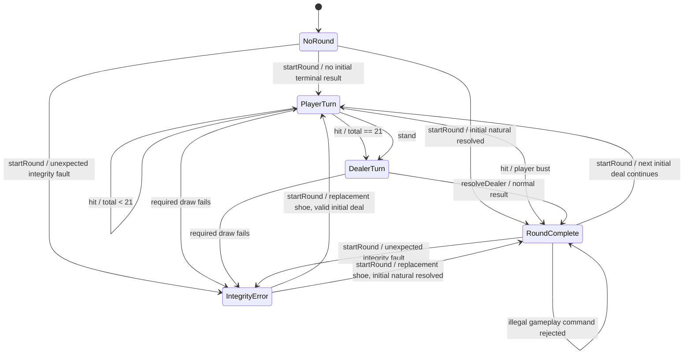

# Casino Blackjack - Design

## M8 approved extension (user batch contract)

Two immutable profiles vary only Five-Card Charlie: CLASSIC_6D_S17_V1_1 (OFF) and CHARLIE5_6D_S17_V1_1 (ON). Selected at current M4-M6 session creation, retained across commands/rounds; historical M1-M3 stay Classic. T01 identifies profiles without activating Charlie. T02 adds exactly-fifth-legal-Hit precedence and explicit outcome. No arbitrary rule configuration.

Seeded source MULBERRY32_REJECTION_V1 takes uint32 0..4294967295. Private state adds 0x6d2b79f5 modulo 2^32; Mulberry32 XOR shifts and Math.imul mix output. Integer bounds 1..2^32 use rejection sampling: reject samples >= floor(2^32/bound)*bound, return sample % bound. Descending Fisher-Yates consumes it followed by cut selection. No strings, Math.random fallback, exposed state or certification claim. Version stays stable for replay v1.

Later M8 tasks introduce strict versioned real-command replay and canonical outcome fingerprint, export only at COMMITTED/VOID boundaries. A separate public audit allowlist carries immutable attributable sequence/UTC-clock metadata. Browser tools remain secondary and clearly mark replay. No event-sourced store, persistence/network recovery or hidden fault replay.

## Implemented M7 browser architecture

This section records the authorized M7 implementation. Historical milestone designs below retain their original scope; RULES/SPEC/UX_UI remain authoritative.

```text
Authoritative domain state/commands (src/domain)
    -> browser controller closure
    -> explicit redacted/public snapshot + read-only interaction model
    -> React components

React event -> controller -> domain command
    -> latest returned immutable state -> fresh public snapshot
```

React stores only form inputs/seat selections and subscribes through useSyncExternalStore; it does not enforce Blackjack rules, keep a copy of authoritative cards or receive raw state. controller.ts owns the latest M6 BehindGameState and passes commands to matching production orchestration. Rejected commands keep the state and translate safe reasons. Commands cannot overwrite state with an old render snapshot. ADVANCE explicitly runs the existing deterministic computer/dealer logic; completed/integrity rounds are settled/voided by authoritative commands. No autoplay loop.

The snapshot starts from getPublicBehindView and copies safe configuration/local funds, visible hands, public follow metadata, stake/result fields and status. Public totals use domain evaluation of player cards and only visible dealer cards. Hidden hole identity, physical IDs, future order/cut/RNG and original-card lineage objects are excluded before React. Stable public hand IDs support ordered labels A/B and A.1/A.2/B on re-split; they do not expose physical-card identities.

getAdvancedActionError extracts the accepted Double/Split/Surrender validation order and is shared by handlers. Hit/Stand query uses the existing routing/terminal checks. getBehindInteraction uses the established M6-to-M5 adapter to return local action enablement/reasons, decision owner, Insurance/Even Money eligibility/amounts, follower affordability, legal back targets and advance/next availability. getBehindWagerError reuses the immutable non-drawing wager handlers and discards their proposed state. This is a read-only query with no RNG/card draw; it does not execute speculative Hit/Split/Double. Handlers still reject illegal direct calls. No accepted rule tables moved to React.

Domain isolation has two independent checks: TypeScript AST imports/exports must stay domain-local, without dynamic imports/require or JSX/TSX/rendering files; tsconfig.domain.json compiles with ES2023 and empty ambient types, excluding DOM/React/Node UI globals. Browser imports domain; domain never imports browser/UI. Historical REG-M6-095 reads accepted-M6 Git objects, as explicitly authorized, while current isolation is tested separately. Other accepted regression assertions remain unchanged.

### UI and lifecycle

Plain React 19.3.0/React DOM 19.3.0 with Vite 8.3.1/plugin-react 6.1.1 and CSS. App composes Setup/Betting, credits, Actions, Decisions, Table and Results. Seven seats show explicit participant/sit-out/current/terminal text; local You does not depend on colour. Dealer has a semantic Hidden dealer card back before domain reveal. Form controls query authority for timing/ranges/funds and show concise reasons; MAIN/back 10-1000 credits, own-side 1-100, whole increments. Integer half-credit units format exact .5 values. Available/reserved/pending stay separate.

Insurance is before peek; eligible Even Money is distinct. Follow windows show target, affected hand, existing/matching stake, ADD/NO ADD and explicit follower non-control. Split NO ADD explains/tracks first ordered child only. Main/side/Insurance/Bet Behind settle in separate groups. Integrity is interruption/VOID with actual-stake refund, never normal loss/winner. Next round preserves participant balances and shoe; status distinguishes existing continuation from actual replacement at a funded deal.

Local hand/actions precede secondary seats, with a keyboard skip link, semantic buttons/labels, live status and visible focus. CSS uses restrained dark surfaces/high-contrast cards, wrapping grids (4/2/1 seat columns), min-width zero and readable text. Chromium checks desktop1280x900/tablet768x1024/mobile320x720 overflow and primary touch targets. No animation/sound; reduced-motion still works.

### Deterministic browser validation boundary

Production main.tsx always creates the normal random M6 session. Only build-time MODE=e2e dynamically imports tests/browser/fixtures.ts and reads a named fixture. Playwright 1.63.0 starts a local Vite e2e server; one Chromium project, one worker, zero retries. Factories retain six-deck physical inventory and use real configure/fund/deal/action/settlement logic. Controlled computer Double/Split primitives exercise follower windows that accepted Hit/Stand bots cannot naturally open. Accounted card-exhaustion injection tests real integrity/VOID handling. No second HUMAN/alternate production policy, general seed/replay or debug globals.

Normal Vite production build strips the fixture branch; scripts/check-browser-build.mjs rejects known fixture factories/markers/query dispatch in emitted browser code. DOM/attributes/text/ARIA snapshots independently check a known K of spades/physical ID is absent until reveal. Forty controller/component/architecture checks plus 24 Chromium scenarios map REG-M7-001..064; exact unique UX-01..14/E2E-01..15 mapping is in M7_MAPPING. Domain tests remain the enforcement evidence and browser E2E covers wiring/interaction/render/accessibility/layout.

Known limits: one local HUMAN; memory only; manual computer wagers and Continue table; Chromium-only browser matrix; no full assistive-technology audit/WCAG certification. M8, server/auth/database/network multiplayer/real money/cloud/deployment remain out of scope. M7 requires genuinely fresh review and explicit human acceptance after implementation evidence.


## M6 participant ownership foundation (authorized batch)

M6 adds behindGame.ts above the preserved M1-M5 APIs. Its local session has zero or one stable local-human participant, optionally controlling one seat or remaining a spectator. Human funds start at 2000 units and persist independently of seat selection. Seven explicit computer-N identities are bound to seat positions; their funds persist while their seat is empty or HUMAN-controlled. Taking a seat never transfers its computer's money to the human. Dormant computer funds are not spendable by the human.

The embedded table omits bankrolls entirely. Each command constructs a transient M5 financial adapter, maps changes back to the input owners, and discards the adapter. No second spendable seat-bankroll copy exists in M6 state. Configuration remains CONFIGURING-only, before OPEN; the accepted max-one-HUMAN validation remains authoritative. The local action entry point derives the controlled seat from the participant, rather than accepting a follower-selected seat. Own-seat side/Insurance/Even Money and existing M5 financial finalization use the same adapter. Public projection allows only local funds, controller identities and the established redacted game view. The following sections extend this foundation with original back wagering and follower decisions, without account infrastructure or network participants.

Under the required one-HUMAN and computer Hit/Stand-only policy, every legal local back target is COMPUTER and cannot naturally initiate Double/Split/Surrender. Advanced-follow mechanics use explicitly labelled controlled domain fixtures, while the supported local command surface and computer policy remain unchanged. This is a coverage/reachability limitation, not authorization for a second HUMAN or alternate bot policy. Owner-checked controller primitives are separate from the supported local HUMAN facade; they do not alter automated computer policy.

T02 original back wagers belong to local-human and target another funded active original hand. A target-stake setter enforces one original per target, 20..2000 even units, reserves/releases delta only and is idempotent for an identical request. Own MAIN/sides and all back targets spend the same available pool. The M5 transient adapter excludes actual back reserve from its seat reconciliation without restoring that money to available. Cancelling target MAIN cascades back refund atomically. Close drops stale ineligible targets before deal and freezes detached wager records; no extra cards/RNG. One unified finalization settles controller and follower exposures; no partial table settlement is permitted.

### M6-T03 ordinary exposure/results

Close attaches each back original to its stable hand ID. Pending follower records use the controller's card outcome and the follower's own stake, with round/participant/target/hand/wager attribution and parent reference. No follower cards or gameplay commands exist. Normal table settlement validates all own-seat records through M5 and all follower reserves before publishing either result; pending returns never enter available. Repeated finalization rejects, and next-round preparation clears exposures while retaining funds. Whole-round back VOID and optional follower decisions are described in the T06 section below. Controlled surrender fixtures exercise the accepted controller rule separately because local bots never surrender; they do not add a local control path.

### M6-T04 Double timing boundary

behindController.ts supplies owner-checked domain primitives, separate from local participant commands and deterministic computer policy. Tests explicitly drive computer-N as a controller to exercise otherwise unreachable local advanced-follow rules; local-human cannot issue that controller request. Legal full controller reserve occurs before a DOUBLE followWindow and before draw. One local follower chooses ADD/NO_ADD; insufficient ADD records fundingError INSUFFICIENT_FUNDS and resolves NO_ADD, preserving follower funds/exposure before completing the already accepted controller action. The outer decision transition succeeds while its funding subrequest is explicitly rejected. No automatic paid follow. Local gameplay/automation/finalization cannot bypass the window. The closed decision is recorded before the forced single card. The narrow M6 primitive reuses card/funding/hand utilities and preserves their rules.

### M6-T05 Split/Re-split

The owner-checked Split primitive checks controller first-decision/equal-value/funds/four-leaf limits before replacing a parent with ordered children. Both retain exactly their original physical card while the follower window is pending. ADD reserves the attached parent stake once and replaces exposure with equal first/second children; NO_ADD or failed funding replaces it only with the first child. Wager identity remains original, hand and parent IDs identify the actual leaf. Each tracked re-split opens a new window; an untracked descendant skips it. Activation draws the first child's next card, fully plays it, then advances depth-first. Split-Ace children get one added card each, automatically end decisions, never Natural, and cannot re-split/Double. Double completion can activate a waiting sibling only after the follow decision. Controlled domain Stand supports ordered fixture progression; local computer automation is unchanged.

### M6-T06 Ace decisions and finalization

The one deliberate compatible extension to an accepted executable is optionalGame.ts: closeOptionalBetting accepts a default-false fourth deferAceForBackBettors argument, and closeDeferredAceDecisions validates the pending Ace phase/closed MAIN choices before invoking the existing initial resolver. Every historical three-argument caller retains its behavior. M6 requests deferral only when original back wagers exist, then resolves HUMAN own MAIN first and back decisions by ascending target seat. Computers still decline. No hole evaluation occurs before all decisions close; negative peek preserves secrecy. M6 chooses own MAIN through its wrapper so a final MAIN decision cannot bypass pending followers.

Each original back choice is independent. Insurance reserves exactly half original stake, including odd units, from the same participant available pool; insufficient funding rejects unchanged and the caller can decline. Eligible original Natural Even Money requires no new reserve, excludes Insurance and fixes 2x original gross. Results remain pending. Follow/Insurance reserves are excluded from the transient M5 seat reserve, never restored to available. One M6 finalization validates M5 seat settlement and follower actual-reserve reconciliation before publishing the combined state. Back Insurance records use original wager ID plus /INSURANCE. Whole-round VOID requires a real integrity failure, discards all normal/Even Money/Insurance outcomes and refunds actual leaf exposures plus purchased Insurance once; rejected/no-add attempts add nothing. Opposite/repeated finalization rejects, and next-round preparation preserves funds and clears the previous decisions.

## Preserved M5 additive optional-wager orchestration

The authorized M5 batch adds optionalGame.ts. Accepted M1-M4 source/APIs/tests remain unchanged. Ownership stays with the existing seven seat bankrolls: no separate bettor, spectator or follower model. T01 supports one PAIR and one THREE_CARD target per own active funded seat, 2..200 even units. Main changes use their own stake rather than total reservation; side changes move only the delta. Main cancellation releases main plus both dependent stakes atomically. Close freezes copied wager objects. No automatic computer wagers. Evaluation and the separate Ace-decision flow belong to the following tasks, not T01.

## M4 additive hand orchestration (authorized batch)

M4 adds advancedGame.ts and advancedPublicView.ts while preserving accepted M1-M3 modules/APIs/tests. Pre-deal configuration, main-wager validation and initial dealing delegate to M3 through a CONFIGURING/OPEN-only adapter. Archived M4 rounds are preserved and never routed through the single-hand M2 engine. There is one authoritative M4 round.

T01 stores ordered leaves in round.players: every hand for one seat precedes the next seat. Each hand has a round-local path ID, root/parent identity, ORIGINAL/SPLIT origin, immutable original-card snapshot, current cards/stake, first-decision flag, split-Ace context, decision completion and optional gameplay result. Current seat/hand selects the first unfinished leaf. Stand/ordinary 21 end decisions but still need comparison. Natural eligibility requires original origin and no parent. Public projection groups leaves by seat, explicitly copying visible fields without physical IDs, shoe/cut or hidden dealer data.

Hit/Stand, unchanged computerDecision and S17 supply compatibility and fixture-level multi-hand sequencing. Per-leaf result attribution and sum-per-seat settlement/refund plumbing preserve a complete lifecycle; T01 adds no Double/Split/Surrender command. Proceeds remain pending until one table commit. Integrity clears every normal result and preserves cards/stakes. Local callers retain the latest returned state; this is not a concurrent request service.

T02-T06 implement available-only matching reserve before Double/Split, depth-first child activation, four-leaf cap, one-card Split Aces and Late Surrender after initial natural exclusion. No future wager/follower window or bot-strategy change. Split-Ace completion ends decisions; surviving ordinary totals still require dealer comparison under R12. Only determined outcomes permit skipping dealer draws. Historical milestone designs below remain the preserved contracts of their APIs.

Required-draw integrity failure after an accepted additional reservation preserves that actual exposure, invalidates all normal outcomes, retires the shoe and preserves diagnostic cards/fault. voidAdvancedRound reconciles leaf stakes against each seat's reserved balance before refunding it once; rejected actions reserve nothing and create no hypothetical refund. No card fabrication, mid-round replacement or automatic replay. Public multi-hand projection remains an explicit allowlist; raw internal state is not a player view. Finalized records are frozen, but the complete state is not deep-frozen or a validated persistence/import format.

Document date: 2026-09-28  
Document task: DESIGN-1.0  
Intended repository location: `docs/DESIGN.md`  
Rules baseline: `docs/RULES.md` — Blackjack House Rules v1.1  
Specification baseline: `docs/SPEC.md` — SPEC-1.0  
Status: design for M1 planning and implementation; not evidence of implementation, verification, acceptance, deployment, commit, or push.

## 1. Purpose

This document defines the minimum software design for **M1 — Headless Blackjack Core**.

`RULES.md` remains the authority for game rules. `SPEC.md` remains the authority for milestone scope and acceptance criteria. This document explains how M1 should satisfy those requirements without changing them.

If this design conflicts with `RULES.md` or `SPEC.md`, implementation must stop and the conflict must be surfaced. The design must not silently redefine the rules to make coding easier.

## 2. M1 design principles

M1 follows these constraints deliberately:

1. **Plain TypeScript domain code.** No React, DOM, database, server, transport, or cloud dependency.
2. **Pure state transitions where practical.** Accepted commands return a new state. Rejected commands return the unchanged state.
3. **Small modules with one clear reason to exist.** No generic casino framework, plugin system, dependency-injection container, or speculative rules engine.
4. **Explicit phases.** Legal actions are determined from the round phase, not inferred from UI state.
5. **Controlled randomness.** Randomness enters only through a small injected boundary used for shuffle and cut-position selection.
6. **Separate internal and public state.** The dealer hole card may exist internally without being exposed through the player-facing view.
7. **Rules are independently testable.** Hand evaluation, dealer S17 policy, cut boundaries, and outcome resolution can be tested without running a browser.
8. **Integrity failures are not gameplay losses.** Unexpected card exhaustion produces an explicit integrity state, not a fabricated winner.
9. **M1 does not pre-build M2–M8.** Seats, wagers, Split, Double, side bets, Bet Behind, Charlie, replay products, and networking remain outside the M1 implementation.

## 3. Architectural overview

M1 uses one in-memory game state and a small set of domain modules.

```text
External caller / tests
        |
        v
+------------------------+
|   game.ts              |
|   state transitions    |
|   start / hit / stand  |
|   dealer resolution    |
+-----------+------------+
            |
     +------+------+-------------------+
     |             |                   |
     v             v                   v
+----------+  +-----------+      +-------------+
| shoe.ts  |  | hand.ts   |      | dealer.ts   |
| cards    |  | scoring   |      | S17 policy  |
| cut      |  | blackjack|      +-------------+
| lifecycle|  +-----------+
+----+-----+         |
     |               v
     |         +-------------+
     |         | outcome.ts  |
     |         | comparison  |
     |         +-------------+
     v
+-------------+
| random.ts   |
| RandomSource|
+-------------+

Internal GameState
        |
        v
+----------------+
| publicView.ts  |
| redact secrets |
+----------------+
        |
        v
Player-facing state
```

There is no UI/controller layer in M1. Tests call the domain API directly.

## 4. Proposed M1 source layout

Create files only when their implementation task begins. The target layout is:

```text
src/
  domain/
    card.ts
    random.ts
    shoe.ts
    hand.ts
    dealer.ts
    outcome.ts
    game.ts
    publicView.ts
  index.ts

tests/
  unit/
  integration/
  helpers/
```

Responsibilities:

| Module | Responsibility | Must not own |
| --- | --- | --- |
| `card.ts` | Card/rank/suit types and six-deck physical inventory creation | shuffle, hand scoring, round state |
| `random.ts` | `RandomSource`, production random adapter, Fisher–Yates helper | Blackjack rules or game state |
| `shoe.ts` | shoe identity, available/in-play/discard accounting, draw, cut state, replacement lifecycle | hand totals or outcomes |
| `hand.ts` | pure hand evaluation and natural-Blackjack classification | shoe mutation or turn sequencing |
| `dealer.ts` | pure S17 decision from evaluated dealer hand | drawing cards itself |
| `outcome.ts` | pure ordinary/natural outcome decisions from final hand facts | shoe lifecycle |
| `game.ts` | M1 state machine and command orchestration | UI formatting or hidden-card serialization |
| `publicView.ts` | explicit player-facing projection and hole-card redaction | game-rule decisions |
| `index.ts` | intentional public exports | hidden internal helpers |

Do not create `Seat`, `Wager`, `BetBehind`, `SideBet`, `SplitHandTree`, `RuleEngine`, or persistence abstractions in M1.

## 5. Core domain model

### 5.1 PhysicalCard

Every physical card has a stable identity so six copies of the same rank/suit remain distinguishable.

Conceptual shape:

```ts
interface PhysicalCard {
  id: string;
  deckIndex: number; // 1..6
  suit: Suit;
  rank: Rank;
}
```

Requirements:

- `id` is unique within a shoe.
- `deckIndex` distinguishes physical copies but has no scoring meaning.
- Suit/rank determine card identity for game rules.
- No Joker type exists.

The exact string format of `id` is an implementation detail, but it must be deterministic for a newly constructed unshuffled inventory and testable.

### 5.2 RandomSource

M1 needs one minimal randomness boundary:

```ts
interface RandomSource {
  nextInt(maxExclusive: number): number;
}
```

Contract:

- for valid `maxExclusive > 0`, return an integer in `[0, maxExclusive)`;
- production may adapt `Math.random()` because this portfolio has no real-money/security claim;
- tests inject scripted values;
- no domain module calls `Math.random()` directly except the production adapter.

Uses:

1. Fisher–Yates shuffle;
2. cut-card selection: `219 + nextInt(31)`.

This design deliberately does **not** add seeded replay as an M1 product feature. Later replay work may add another `RandomSource` implementation without changing Blackjack rules.

### 5.3 ShoeState

Conceptual state:

```ts
interface ShoeState {
  shoeId: string;
  available: readonly PhysicalCard[];
  inPlay: readonly PhysicalCard[];
  discarded: readonly PhysicalCard[];
  cutPosition: number;          // 219..249
  reshufflePending: boolean;
  retired: boolean;
}
```

Derived value:

```text
consumed = 312 - available.length
```

`consumed` is derived rather than stored independently, avoiding a second counter that can drift from card inventory.

Invariant while a shoe is healthy:

```text
available ∩ inPlay = empty
available ∩ discarded = empty
inPlay ∩ discarded = empty

available + inPlay + discarded = exactly the shoe's 312 physical cards
```

A successful draw:

1. removes exactly one card from the front/top of `available` according to the chosen internal convention;
2. appends that exact physical card to `inPlay`;
3. recalculates whether `consumed >= cutPosition`;
4. sets `reshufflePending = true` when the threshold is reached or crossed;
5. never reshuffles during the active round.

The chosen top-of-shoe convention must be documented in code/tests and used consistently. Scenario tests should not depend on array-direction guesswork.

At normal round completion, every card used by the round is moved from `inPlay` to `discarded` exactly once.

An integrity-failed shoe is marked `retired` and must not be reused for a later round.

### 5.4 Hand and HandEvaluation

M1 hands can be represented directly as ordered physical-card arrays. M1 does not add split-hand ancestry because Split is outside scope.

Pure evaluation result:

```ts
interface HandEvaluation {
  total: number;
  isSoft: boolean;
  isBust: boolean;
  isTwentyOne: boolean;
}
```

Evaluation algorithm:

1. count every Ace initially as 11;
2. sum all cards;
3. while total is over 21 and an Ace is still counted as 11, reduce one Ace by 10;
4. `isSoft` is true only if at least one Ace remains counted as 11;
5. `isBust` is `total > 21`;
6. `isTwentyOne` is `total === 21`.

`isNaturalBlackjack(cards)` is a separate pure predicate:

- exactly two cards;
- one Ace;
- one ten-valued card.

In M1 every player/dealer initial hand is unsplit, so no speculative split-origin field is added yet. M4 must revise the natural-classification context when Split is implemented.

### 5.5 RoundPhase

Externally meaningful M1 phases are:

```ts
type RoundPhase =
  | 'PLAYER_TURN'
  | 'DEALER_TURN'
  | 'ROUND_COMPLETE'
  | 'INTEGRITY_ERROR';
```

Initial dealing and dealer peek occur inside `startRound()` as one controlled transition. M1 therefore does not expose half-dealt intermediate phases such as `DEALING_CARD_3`.

This is intentional: no M1 caller has a valid action during the initial-deal sequence, and avoiding externally actionable partial states reduces the legal state space.

### 5.6 RoundState

Conceptual shape:

```ts
interface RoundState {
  roundId: string;
  phase: RoundPhase;
  playerCards: readonly PhysicalCard[];
  dealerCards: readonly PhysicalCard[];
  outcome?: RoundOutcome;
  outcomeReason?: OutcomeReason;
  integrityError?: IntegrityError;
}
```

`dealerCards` contains the true internal dealer hand, including the hole card. Secrecy is enforced by the public projection, not by deleting the card from internal truth.

M1 round outcomes:

```ts
type RoundOutcome =
  | 'PLAYER_BLACKJACK'
  | 'PLAYER_WIN'
  | 'DEALER_WIN'
  | 'PUSH';
```

Illustrative reason values:

```ts
type OutcomeReason =
  | 'PLAYER_NATURAL'
  | 'DEALER_NATURAL'
  | 'BOTH_NATURAL'
  | 'PLAYER_BUST'
  | 'DEALER_BUST'
  | 'HIGHER_TOTAL'
  | 'LOWER_TOTAL'
  | 'EQUAL_TOTAL';
```

Outcome and reason remain separate. Do not create additional financial/payout outcomes in M1.

### 5.7 GameState

M1 requires a shoe that persists across rounds:

```ts
interface GameState {
  shoe: ShoeState;
  round: RoundState | null;
}
```

State transition functions return a new `GameState`; they must not mutate the input state. Therefore a caller/test that keeps the old terminal state already has an immutable prior-round snapshot for regression checks.

M1 does not maintain an unbounded round-history collection, event store, database, or persistence layer.

## 6. Command result model

Expected illegal user/gameplay requests are explicit rejections, not exceptions and not integrity failures.

Conceptual result:

```ts
type CommandResult =
  | { ok: true; state: GameState }
  | { ok: false; state: GameState; error: ActionError };
```

For a rejected command:

```text
result.state === input state in gameplay meaning
```

No card, shoe position, phase, outcome, or randomness consumption may change.

Example M1 action errors:

```text
NO_ROUND
WRONG_PHASE
ROUND_ALREADY_TERMINAL
```

Programmer-contract violations or impossible internal corruption may throw during development, but expected gameplay rejection must use the explicit result path. Unexpected draw exhaustion after the round has begun is an integrity failure recorded in round state, not a normal action error.

## 7. M1 state machine



`startRound()` is permitted only when there is no active non-terminal round. A terminal previous state is not mutated; the returned game state contains the new round.

## 8. `startRound()` design

High-level algorithm:

```text
1. Reject if the existing round is PLAYER_TURN or DEALER_TURN.
2. Choose the shoe for the next round:
   a. if current shoe is retired -> create a new shoe;
   b. else if reshufflePending -> create a new shoe;
   c. else if fewer than 4 cards remain -> create a new shoe;
   d. otherwise reuse the existing shoe unchanged.
3. Deal exactly in this order:
   player card 1
   dealer upcard
   player card 2
   dealer hole card
4. Evaluate initial naturals.
5. If dealer upcard is Ace or ten-valued, perform internal peek.
6. Resolve terminal natural cases if applicable.
7. If player natural and dealer is not natural, resolve PLAYER_BLACKJACK.
8. Otherwise enter PLAYER_TURN.
9. If any required draw unexpectedly fails after the round starts,
   enter INTEGRITY_ERROR and retire the affected shoe.
```

Normal terminal completion also transfers the round's cards from `inPlay` to `discarded` exactly once.

When an initial natural resolves the round, the public completed-round view may reveal the dealer hole card as required by R12; no unnecessary dealer draw occurs.

## 9. Player command design

### 9.1 `hit(state)`

Precondition:

```text
round.phase == PLAYER_TURN
```

Accepted path:

1. draw exactly one card;
2. append it to the player hand;
3. evaluate the hand;
4. if bust: resolve `DEALER_WIN / PLAYER_BUST`, reveal terminal dealer information, complete the round, and do not draw dealer cards;
5. if total is exactly 21: transition to `DEALER_TURN`;
6. otherwise remain in `PLAYER_TURN`.

Rejected path:

- do not draw;
- do not consume randomness;
- do not modify phase or cards;
- return explicit action error.

### 9.2 `stand(state)`

Precondition:

```text
round.phase == PLAYER_TURN
```

Accepted path:

- draw no card;
- change only the phase needed to enter dealer resolution;
- return `DEALER_TURN` state.

Dealer cards are not drawn by `stand()` itself. This separation makes the state transition observable and keeps dealer policy independently testable.

## 10. Dealer resolution design

M1 uses one command:

```text
resolveDealer(state)
```

Precondition:

```text
round.phase == DEALER_TURN
```

The command resolves the entire deterministic dealer turn in one call. M1 does not create a UI-animation-oriented `dealerStep()` API.

Algorithm:

```text
1. Hole card is now authorized for public reveal.
2. Evaluate dealer hand.
3. If dealer total < 17 -> draw one card and repeat.
4. If dealer total >= 17 -> stop, including soft 17.
5. If dealer busts -> PLAYER_WIN / DEALER_BUST.
6. Otherwise compare final totals:
      player > dealer -> PLAYER_WIN / HIGHER_TOTAL
      player < dealer -> DEALER_WIN / LOWER_TOTAL
      equal           -> PUSH / EQUAL_TOTAL
7. Complete the round and move used cards to discard.
```

`dealerShouldHit(evaluation)` is a pure rule:

```text
return !evaluation.isBust && evaluation.total < 17
```

Soft/hard status is carried for testing and explanation, but under S17 no extra branch is required at total 17.

## 11. Initial Blackjack resolution

Initial resolution must not be implemented as ordinary total comparison.

Decision order:

```text
playerNatural = isNaturalBlackjack(player initial cards)
dealerNatural = isNaturalBlackjack(dealer initial cards)

if dealer peek is required:
    inspect dealerNatural internally

if dealerNatural && playerNatural:
    PUSH / BOTH_NATURAL
else if dealerNatural:
    DEALER_WIN / DEALER_NATURAL
else if playerNatural:
    PLAYER_BLACKJACK / PLAYER_NATURAL
else:
    PLAYER_TURN
```

For dealer upcards 2–9, a natural is impossible, so no separate peek action is required. Player natural can be resolved immediately.

A three-card 21 must never enter the natural branch.

## 12. Public-state projection and dealer secrecy

Do not expose internal round state directly to a browser/UI caller in later milestones. M1 establishes an explicit projection now because AC-M1-010 requires a player-facing secrecy boundary.

Conceptual output:

```ts
interface PublicRoundView {
  phase: RoundPhase;
  playerCards: readonly PublicCard[];
  dealer: {
    upcard: PublicCard;
    holeCard: PublicCard | null;
    visibleCards: readonly PublicCard[];
  };
  outcome?: RoundOutcome;
  outcomeReason?: OutcomeReason;
}
```

Before reveal:

```text
dealer.holeCard = null
```

The implementation must build this object field-by-field. It must **not** spread/serialize the internal `RoundState` and then try to delete the hole card afterwards.

Hole-card visibility:

| Internal phase/result | Public hole card |
| --- | --- |
| `PLAYER_TURN` | hidden |
| `DEALER_TURN` | visible |
| `ROUND_COMPLETE` | visible |
| `INTEGRITY_ERROR` | do not expose unrevealed secret data merely because an error occurred |

A negative dealer peek does not reveal the card identity.

M1 is a local headless engine, so this projection is a correctness/privacy boundary, not a claim that a local user cannot inspect process memory.

## 13. Shoe lifecycle across rounds

Normal lifecycle:

```text
NEW SHOE
   |
   v
shuffle + cut position
   |
   v
ROUND 1 cards inPlay
   |
   v
round complete -> cards discarded
   |
   +--> cut not reached --> ROUND 2 uses same shoe and same cut
   |
   +--> cut reached -----> reshufflePending
                              |
                              v
                        next startRound()
                              |
                              v
                         NEW SHOE
```

Important distinctions:

- crossing the cut threshold does not interrupt the active round;
- `reshufflePending` is sticky for that shoe;
- cut position is selected once per new shoe;
- `startRound()` does not create a new shoe unless one of the explicit replacement conditions is true;
- replacing a shoe produces a new `shoeId`;
- a retired/integrity-failed shoe is never reused.

## 14. Integrity-error design

M1 has no wagers, so R17 financial VOID handling is deferred. The non-financial integrity behaviour is still required.

If a required draw fails after a round begins:

1. do not fabricate a card;
2. do not reshuffle into the same round;
3. do not produce `PLAYER_WIN`, `DEALER_WIN`, `PUSH`, or `PLAYER_BLACKJACK` from the fault;
4. set round phase to `INTEGRITY_ERROR`;
5. record a machine-readable error code such as `SHOE_EXHAUSTED_DURING_ROUND`;
6. mark the current shoe retired;
7. preserve the existing round cards for diagnostics;
8. require a new shoe before later play.

M1 does not add a general recovery framework. The only supported next gameplay action after integrity failure is a new round using a replacement shoe.

## 15. Deterministic test seams

### 15.1 Randomness tests

Use a scripted `RandomSource` to prove:

- cut lower bound 219;
- cut upper bound 249;
- repeated scripted random input yields repeated shuffle/cut results;
- production modules do not bypass the injected source.

### 15.2 Scenario fixtures

Most Blackjack scenario tests do not need to express hundreds of shuffle random calls. `tests/helpers/` may contain a **test-only shoe fixture builder** that:

1. starts from a valid 312-card inventory;
2. places explicitly requested physical cards at the next-draw positions;
3. fills the remainder with the unused physical cards;
4. sets a valid cut position;
5. checks that no physical card is duplicated or missing.

This helper is test code, not a production extensibility API.

It must not call production hand/outcome functions to derive expected answers.

### 15.3 Independent expected values

Required regression tests must state expected totals/outcomes directly, for example:

```text
A,9,5 -> expected total 15
A,6   -> expected dealer Stand
A,K   -> expected natural Blackjack
```

Do not write a test that obtains the expected value by calling the same production evaluator being tested.

## 16. Error and validation boundaries

M1 separates three categories:

### A. Expected action rejection

Examples:

- Hit with no active round;
- Hit during dealer turn;
- Stand after completion.

Result: explicit `ActionError`, unchanged gameplay state.

### B. Input/configuration validation

Examples:

- cut position 218 or 250 supplied by a controlled test constructor;
- invalid `nextInt()` output from a test/random adapter.

Result: fail fast with a clear validation error before gameplay state is accepted.

### C. Runtime integrity failure

Example:

- required draw finds the active shoe empty unexpectedly.

Result: `INTEGRITY_ERROR`, no gameplay winner, shoe retired.

Do not collapse these categories into one generic `ERROR` path.

## 17. Data and immutability rules

M1 does not require a third-party immutable-data library.

Implementation guidance:

- TypeScript interfaces should use `readonly` where practical;
- transition functions create new arrays/objects for modified state;
- rejected commands return the original gameplay state unchanged;
- tests retain before/after snapshots for AC-M1-017;
- do not mutate a completed round while starting the next one.

Performance optimization is explicitly not a goal for a 312-card local portfolio engine.

## 18. M1 public API target

Exact names may be adjusted during implementation if tests show a simpler equivalent, but the M1 capability surface should remain approximately:

```ts
createGame(randomSource): GameState
startRound(state, randomSource): CommandResult
hit(state): CommandResult
stand(state): CommandResult
resolveDealer(state): CommandResult
getPublicView(state): PublicGameView
```

Pure helpers used by tests/domain code include approximately:

```ts
createSixDeckInventory(): readonly PhysicalCard[]
evaluateHand(cards): HandEvaluation
isNaturalBlackjack(cards): boolean
dealerShouldHit(evaluation): boolean
```

Do not expose a generic command bus, rules registry, event store, or casino-game superclass in M1.

## 19. M1 verification mapping

| Acceptance criteria | Primary design area |
| --- | --- |
| AC-M1-001 | `card.ts`, six-deck inventory |
| AC-M1-002 | `shoe.ts` accounting invariants |
| AC-M1-003 | `random.ts`, scripted source, test fixture helper |
| AC-M1-004 | `shoe.ts` cut selection/validation |
| AC-M1-005 | `shoe.ts` + `game.ts` lifecycle |
| AC-M1-006 | `startRound()` pre-deal replacement |
| AC-M1-007 | integrity-error path |
| AC-M1-008 | `hand.ts` |
| AC-M1-009 | `hand.ts` natural classifier |
| AC-M1-010 | deal order + `publicView.ts` |
| AC-M1-011 | `startRound()` initial resolution |
| AC-M1-012 | `hit()` |
| AC-M1-013 | `stand()` |
| AC-M1-014 | `dealer.ts` + `resolveDealer()` |
| AC-M1-015 | `outcome.ts` |
| AC-M1-016 | initial natural precedence |
| AC-M1-017 | pure transition/rejection design |
| AC-M1-018 | game/shoe lifecycle |
| AC-M1-019 | repository harness, not domain architecture |
| AC-M1-020 | documentation/evidence process |

No acceptance criterion is considered satisfied merely because its design appears in this table. Executable evidence is still required.

## 20. Test boundaries

M1 tests should be divided by purpose, not by artificial coverage targets.

### Unit tests

Use for:

- six-deck inventory;
- shuffle/cut helpers;
- hand evaluation;
- natural classification;
- S17 policy;
- ordinary outcome comparison;
- public-view redaction.

### Integration/domain-flow tests

Use for:

- initial deal order;
- dealer peek and natural resolution;
- Hit/Stand transitions;
- dealer resolution using the shoe;
- cut crossing and deferred reshuffle;
- same-shoe next round;
- pre-deal replacement;
- unexpected draw exhaustion;
- terminal-state immutability.

No browser/E2E test exists in M1. That status is `NOT APPLICABLE`, not `PASS`.

## 21. Explicit M1 non-designs

The following are deliberately **not** designed for implementation in M1:

- seven-seat data model;
- player accounts or balances;
- wager reservation/settlement;
- Double/Split/Surrender/Insurance/Even Money;
- Perfect Pairs or 21+3;
- Bet Behind;
- Five-Card Charlie;
- computer-player strategy;
- browser components or animation;
- REST/WebSocket interfaces;
- database schemas;
- authentication;
- server-authoritative secrecy;
- deployment architecture;
- cryptographic RNG or gambling certification;
- generic table-rule configuration framework.

Their rules remain documented in `RULES.md` and their delivery milestones remain in `SPEC.md`. They must receive their own design revision when their milestone begins.

## 22. Design decisions and tradeoffs

### D-M1-001 — Pure transitions instead of a mutable engine class

**Decision:** commands accept state and return new state.

**Why:** makes terminal immutability and rejected-action non-mutation mechanically testable with minimal framework code.

**Tradeoff:** copies small arrays/objects more often. Performance cost is irrelevant at M1 scale.

### D-M1-002 — Explicit public projection

**Decision:** player-facing state is constructed separately from internal state.

**Why:** prevents accidental dealer-hole-card disclosure and establishes a clean future UI boundary.

**Tradeoff:** some fields are mapped twice. This is preferable to exposing internal truth.

### D-M1-003 — One RandomSource abstraction

**Decision:** inject only integer randomness and build shuffle/cut selection on it.

**Why:** enough for deterministic M1 tests without a DI framework or replay subsystem.

**Tradeoff:** future replay may add another implementation, but M1 does not promise a serialized seed format.

### D-M1-004 — Dealer resolves in one command

**Decision:** `resolveDealer()` performs the deterministic dealer draw loop in one M1 call.

**Why:** no UI animation exists yet; a per-card command would add state/API complexity without an M1 requirement.

**Tradeoff:** M7 may refactor presentation timing while preserving the same dealer-policy tests and outcomes.

### D-M1-005 — No split-origin field in Hand

**Decision:** M1 natural classification works on original two-card hands only; no speculative Split metadata is added.

**Why:** Split is M4 scope. Adding ancestry now would be unused abstraction.

**Tradeoff:** M4 must extend the hand model deliberately and add regression tests proving split `A + ten-value` is not natural.

### D-M1-006 — Derive consumed cards from inventory

**Decision:** `consumed = 312 - available.length`; do not maintain a second mutable consumed counter.

**Why:** fewer synchronized values and easier invariant checking.

**Tradeoff:** assumes one fixed 312-card shoe in M1, which matches the locked rules.

## 23. Implementation order after repository bootstrap

The design suggests the following small implementation sequence; `PLAN.md` owns the final task IDs and status.

```text
1. Physical cards + six-deck inventory
   -> verify inventory and identity invariants

2. RandomSource + shuffle + cut selection
   -> verify deterministic seams and boundaries

3. Shoe lifecycle + accounting
   -> verify draw/discard/cut/new-shoe invariants

4. Hand evaluation + natural classification
   -> verify Ace/soft/hard/bust regression cases

5. Round start + public hole-card projection
   -> verify deal order, peek, secrecy, initial naturals

6. Hit / Stand state transitions
   -> verify accepted and rejected actions

7. Dealer S17 + outcome resolution
   -> verify dealer cases and final comparisons

8. Cross-round and integrity regression
   -> verify same shoe, deferred reshuffle, exhaustion, terminal immutability

9. Full scripts/verify.ps1 regression + fresh-session review gate
```

Each implementation task must define its own scope, acceptance subset, commands, and repair counter before code changes.

## 24. Design completion status

This document may be marked **DESIGN READY FOR REPOSITORY BOOTSTRAP** only when:

- it is consistent with the current `RULES.md` and `SPEC.md`;
- no unresolved M1 architecture ambiguity blocks implementation;
- the user has not requested a conflicting design change.

That label does not mean M1 is implemented or verified.

## 25. M2 approved extension (user batch contract)

The sections above describe the accepted M1 API. M2 adds separate table modules while reusing card, random, shoe, hand, dealer and ordinary-outcome primitives; the M1 one-seat API remains regression protected. No generic rules/controller framework or dependency is required.

T01 TableState owns seven fixed SeatState positions. Occupancy is EMPTY/HUMAN/COMPUTER; EMPTY cannot sit out or participate, occupied seats may sit out, and at most one HUMAN is configured. Atomic configuration is permitted only between rounds. freezeTableSeats copies/freezes ascending active seats; no-active-seat start is rejected. releaseTableSeats is a round-boundary primitive used by later orchestration, not an active-round player command. As with the M1 shoe primitives, direct low-level construction/misuse is outside the command API contract.

The approved following tasks add TableGameState with one persistent shoe and round, one hand/result per frozen active seat, two-pass deal followed by peek/naturals, a current-seat cursor and separate HUMAN commands. Computer policy consumes only its evaluated public hand total (<17 HIT, otherwise STAND); automation runs until HUMAN input or terminal state, resolving one shared S17 dealer when decisions end. Public projection explicitly copies visible fields and preserves M1 reveal timing. Non-financial integrity errors retire the shoe and clear normal table results while retaining diagnostic cards. Wagers and refunds remain M3 scope. This paragraph records approved design, not completed functionality; PLAN/STATE own delivery status.

## 26. M3 financial extension (authorized batch)

Ownership is seat-scoped for this local seven-seat demo. Each stable seat position owns one bankroll for the session; occupancy/controller/sit-out changes preserve that bankroll, including an empty seat. No account, wallet service, transfers or M6 ownership architecture is introduced. Initial allocation occurs only at session creation. R06 reset is optional and deferred; no reconfiguration replenishment is permitted.

T01 implements CreditUnits as validated safe integers: one unit is half a credit, initial available=2000, reserved=0. Zero is valid state but not a reserve request. Generic funding permits single-unit precision; original main wager increment validation belongs to T02. One reservation per seat rejects duplicate reserve, and release returns the actual reserved amount once. Immutable rejected results retain the input reference. No game/RNG dependency exists in funding primitives. Overflow is rejected by safe-integer invariants.

The subsequent approved design is a thin funded orchestration layer over the preserved M2 engine. Its supported workflow requires OPEN betting and explicitly funded participation. M1/M2 low-level APIs remain historical primitives, not the M3 command surface. Pending hand returns are separate from available/reserved funds; financial finalization requires all table outcomes. A committed settlement or VOID is terminal and rejects repeated financial application. Old immutable state snapshots are historical values, not an external stale-request store. Callers retain the latest state.

T02 implements bettingGame.ts as the M3 command surface. CONFIGURING -> OPEN locks configuration; OPEN accepts target main stakes of 20..2000 even units or explicit cancellation. Changes move only the delta; identical target requests are unchanged no-ops. Closing requires at least one wager, freezes stakes and ascending funded participation, then delegates dealing to M2 with an internal participation adapter. The real seven-seat configuration is preserved in the round snapshot. No computer bet is automatic. M3 commands cannot deal without funding; direct M2 APIs are historical low-level primitives. CLOSED prevents all main-wager and seat edits, including after gameplay ends but before financial finalization. Explicit funded Hit/Stand/automation/dealer wrappers reuse accepted M2 mechanics. No settlement is implemented at T02.

T03 derives PENDING records from known hand outcomes without copying them into available funds. Records identify the session-local round and seat (one wager/hand per seat), stake, outcome, gross, net and status. Gross uses integer expressions: win=2*stake, Natural=(stake/2)*5 (original stake is even), push=stake, loss=0. settleMainWagers requires M2 gameplay ROUND_COMPLETE, validates every result/reservation and safe-integer available sum, then atomically clears reserved and adds gross once for all seats. COMMITTED is explicit; duplicate commit is unchanged rejection. M2 ROUND_COMPLETE denotes gameplay completion/discard; the M3 financial cycle remains CLOSED until settlement, with configuration/next round locked. Retaining the returned state is required; no persistence/concurrent request service is implied.

T04 voidFinancialRound requires CLOSED plus an actual M2 INTEGRITY_ERROR. Illegal player commands cannot request voluntary VOID. It preserves diagnostic cards/fault/retired shoe, replaces every pending effect with actual-reservation refunds and zero net, then enters explicit VOID with REFUNDED records. Repeat VOID, settle after VOID, and VOID after COMMITTED reject unchanged. prepareNextBettingRound is permitted only after COMMITTED/VOID, retains bankrolls/shoe and returns to CONFIGURING; the caller retains prior immutable snapshots. No replay or replenishment occurs. Shoe replacement remains at the next explicit funded deal. Demo reset remains deferred: SPEC M3 does not require it and R06 only permits it; no reset API is implemented.

### M4-T02 implementation

Double validates the current HUMAN seat and hand ID, two cards, unused first decision, total below 21 and no split-Ace restriction. additionalFundingError checks safe-integer funds and only available >= current stake. reserveAdditional transfers the matching amount before the single required draw; stake doubles and decisions end regardless of the card total. No Double-for-less or original-limit cap. Eligible non-Ace split-origin fixtures use the same handler. Rejection retains the input reference; accepted draw failure retains the added reserve for whole-round VOID.

### M4-T03 implementation

Split accepts an active first-decision two-card HUMAN hand of equal Blackjack value. Ten ranks share value 10; Ace pairs only with Ace. Full matching reserve precedes parent replacement; each child retains its corresponding original physical card and stake. Parent is absent from leaves/results. IDs append .1/.2 to the parent. selectNextHand supplies the second card only when a one-card split child becomes first unfinished; it recursively skips automatic terminal decisions, preserving depth-first order. Split-Ace children and ordinary 21 end decisions but never gain Natural status. T04 permits non-Ace re-split with the same in-place replacement. Count all leaves sharing rootHandId before reservation; four leaves reject independently of available funds. Completed/busted leaves remain counted. Split-Ace children end automatically after their one added card, so another Ace cannot re-split; no subsequent player decision is legal. Surviving ordinary split 21 still compares with the shared S17 dealer.

### M4-T05 implementation

The completed initial deal establishes dealerNaturalExcluded: a 2..9 upcard makes Natural impossible; the reused M3 Ace/ten peek excludes it before PLAYER_TURN. No Insurance window exists. Late Surrender checks this fact plus ORIGINAL/no-parent, two cards, no first decision, non-Natural and no split-Ace restriction. It draws/reserves nothing, records SURRENDERED/LATE_SURRENDER and ends the hand. Per-leaf gross is stake/2; original even units make this exact. All leaf results identify round/seat/hand/stake/outcome/gross/net/status. Final commit checks the sum of leaf stakes against each seat's reservation and credits all gross returns once. Parents never settle. Ordinary split-Ace hands require comparison; Natural, bust and surrender outcomes need no dealer draw when nothing else remains.

### M5-T02 evaluation

sideBets.ts accepts distinct physical originals, classifies same rank before suit/colour for Pair and highest of suited trips/straight flush/trips/straight/flush for three-card. A23 and QKA are straight; KA2 is not. Close evaluates each placed wager once from immutable original player cards plus only dealer upcard. Frozen category/gross/net PENDING records never credit available funds. Advanced play preserves their values; no cards drawn for evaluation.

### M5-T03 delayed peek

M5 now owns initial two-pass dealing through preserved shoe/table primitives. It allocates every funded original hand before drawing, retaining all exposure on partial-deal failure. decisionPhase INSURANCE is the explicit outer decision state; M4 round gameplay is dormant with no current hand. All M5 gameplay wrappers block it. Computer choices close as DECLINE, human decisions wait without timer. Only closure calls resolveInitialDecisions; Ace/ten performs one peek, 2..9 none. No hole inspection occurs on the Ace pending path. Natural resolution then establishes normal M4 hands and dealerNaturalExcluded, preserving first-decision Surrender. Public projection uses an allowlist and labels this phase INSURANCE. Raw internal/legacy APIs are not the M5 player boundary.

### M5-T04 Even Money

EVEN_MONEY is a decision on the same original main wager, not a second reserve. Only an original Natural with a PENDING Ace choice may elect it; the shared decision record prevents Insurance coexistence or reversal. Lower-level M4 hand outcomes retain their card meaning; getOptionalMainResults overrides elected financial outcome to EVEN_MONEY/gross 2*stake without ordinary 3:2 stacking. The computer always declines both.

### M5-T05 one financial commit

OptionalWagerResult identifies round/seat/wager/type, hand for MAIN, actual stake, outcome/category, gross/net and status. MAIN records adapt M4 leaf results with the Even Money override; original side results and peek-determined Insurance join them. No return is available early. Settlement requires ROUND_COMPLETE and every expected record, reconciles all seat reservations and safe integer sums before publishing balances and frozen COMMITTED records. VOID requires actual INTEGRITY_ERROR; it constructs zero-net actual-stake records for leaves/sides/accepted Insurance, reconciles and refunds in one operation. Repeated/opposite finalization rejects unchanged. prepareNextOptionalRound explicitly clears wager decisions/results while preserving balances and shoe diagnostics/history.

### M5 command boundary and delivery status

The implemented current API is optionalGame.ts plus optionalPublicView.ts. Internal AdvancedGameState remains embedded to reuse accepted gameplay unchanged; its raw functions must not be called as M5 commands during the Insurance phase or for M5 settlement. Outer decisionPhase plus the M5 wrapper gates are the supported control boundary. Original-card arrays and final records are frozen, but arbitrary caller-object mutation/import is not validated. Independent fresh-session review and human acceptance remain separate from the executed M5 harness. T07 changes documentation only.
