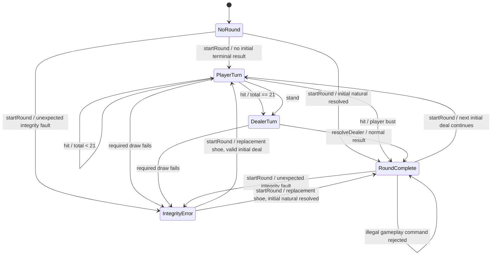

## M10-PRE-T11 owner requirement and acceptance — 2026-10-06 10:43:11 +08:00

M10-T07 / T08 / T09 / T10 HUMAN VISUAL ACCEPTANCE: **ACCEPTED**, explicitly recorded by the owner. Their dated PENDING records remain historical. [Legacy Dealer cleanup](M10_PRE_T11_DEALER_CLEANUP.md) is a new task, starting 0/10 with normal maximum10; closed T04/T06 counters remain unchanged. M10-T11 NOT STARTED; DEPLOYMENT NOT RUN.

The old cartoon Dealer is retired from all live setup, active, exhausted-pool, unconfigured, failed-image, replay, quiet/immediate and responsive paths. Keep the exact five approved roster identities, deterministic session ordinal and seated exclusion. Before safe session resolution, or with no eligible/available roster portrait, use the owner-approved **non-roster generic formal portrait**; requested image failure -> generic PNG -> neutral non-image placeholder. No new identity, seat, RNG, replay/digest state, fake preview session, animation or timing change. This supersedes only the earlier generic illustration depiction; historical evidence and computer guest drawings stay intact. Implementation/verification of this new task initially NOT RUN; owner acceptance of this task PENDING.

## M10-T04B approved formal pool amendment — 2026-10-05 11:29:53 +08:00

The owner supplies and approves the five-pair Dealer pack in [M10-T04B](M10_T04B.md), superseding the earlier absent-asset prerequisite and canonical-ID production fallback policy. The production registry is exactly noble_female/Celestine, knight_female/Seraphine, mage_female/Nyra, elf_female/Elaria, halforc_female/Vesha. Sources1086x1448 and runtime240x320 are transparent3:4 PNGs copied unchanged; original MANIFEST.json and separate import/provenance receipt retained. No PA1 artwork/provenance is rewritten and no generation/resizing is performed.

Use the existing presentationSession ordinal, starting0 on a new controller, to begin at ordinal modulo5 and scan cyclically past all seated human/computer identities including Sitting Out. Preserve the entire existing lineup; if all five are seated use null/non-roster generic Dealer. Successful existing NEW_TABLE/new-demo/MODE reset advances the ordinal; NEXT/REPEAT/actions/resize/avatar changes retain the assignment. Assignment is presentation-only and consumes zero gameplay RNG. No wall clock or persistent storage is used. The old unconfigured helper remains supported; its historical tests use an explicit e2e-only legacy input.

The portrait uses contain within the existing Dealer reserve, with short alt text Dealer: name and generic fallback on unavailable/decode-failed artwork. Actual visible cards, hidden-card back, public total/status, shoe and3:2/S17 rules remain authoritative and separate from decorative cards held in the portrait. IDLE/DEALING/WAITING_PLAYER/REVEALING/DRAWING/SETTLING all use the same static PNG. STATIC FORMAL PORTRAIT USED FOR ALL SIX STATES. ANIMATION NOT IMPLEMENTED.

This static integration has focused technical/visual evidence; full gate and owner human visual acceptance are recorded separately in STATE. Earlier planning/absence records remain historical. M10-T05 NOT STARTED; MOTION NOT INSTALLED; DEPLOYMENT NOT RUN.

# M10A — Casino Game UI Recomposition design

This owner-authorized composition correction is a planning proposal, not implementation or human planning acceptance. M10-T01 is technically IMPLEMENTED / VERIFIED / COMMITTED / PUSHED at task commit `6486ed9c2f5eab5fa87862de72a609884c4f1797`, with publication receipt `0c943b088740d291e9604ebe09ef4a5b3363e271`. Its repair count remains **11/11 — OWNER-AUTHORIZED EXCEPTION**. The owner now records **M10-T01 Human Visual Acceptance = NOT ACCEPTED**: the interface still reads as a web dashboard over a table background. Retain its geometry and executed evidence. M10A is a separately authorized design/composition milestone; [SPEC](SPEC.md) owns acceptance, [PLAN](PLAN.md) owns tasks, and [M10A planning](M10A_PLANNING.md) owns the planning rationale and gates. All M10A implementation tasks and M10-T02/T04+ remain NOT STARTED; deployment NOT RUN.

## M10A.1 Visual North Star

The player should perceive one Blackjack table that they are playing. The table scene occupies the primary viewport; browser-page title, setup and supporting tools recede into a quiet game frame. Retain original restrained felt/rail/card/character styling. The owner describes reference screenshots as inspiration for seat-anchored avatars, grouped cards, nearby score badges, central Dealer and lower-edge controls. No reference image was supplied as an inspectable image in this request; these are owner-described principles, not an image-analysis claim. Store no third-party image, logo, trademark, character, button artwork, exact layout or decorative asset. Create an original composition from the existing assets.

## M10A.2 Composition Hierarchy

Cards are the primary gameplay objects. Within a seat, priority is cards -> avatar/seat identity -> score -> wager -> bankroll -> secondary metadata. Across the scene, prioritize the current local hand and its legal decision, then the Dealer/public state and other seats. Betting and round-result states retain the same spatial ownership. Avoid giving headings, borders and financial headings the visual weight of cards. Use contrast, spacing and restrained framing rather than a separate dashboard panel for each fact.

## M10A.3 Table Scene

Use the retained table geometry as the scene's coordinate foundation, with a Dealer reserve above an occupied-seat arc and an integrated local zone along the lower rail. The rail, hand destinations and wager spots organize a single surface. Increase useful seat/card/Dealer coverage by composing their footprints together; do not achieve density merely by shrinking the table or scaling/clipping content. Compact supporting controls may share the frame but must not compete with the table. The scene may grow vertically for accessible stress cases. No new absolute-coordinate system replaces `tableGeometry.ts`.

## M10A.4 Seat Unit

Compose each occupied seat from stable real seat number/controller identity, avatar/name, public cards grouped by handId, nearby total/state badge, wager spot, balance position and turn/active-hand marker. A sitting-out computer keeps its identity and explicit status, with no invented hand or funded wager. Visual slots never renumber accounts, hands, commands or turns. Keep cards upright and place each label beside its owner. Split leaves remain subunits of one seat with separately identified cards, stake and result.

Use a compact framed portrait preserving the accepted 3:4 asset aspect ratio as the initial design direction; a seat/role ring can surround that frame. Circular medallions and cropped busts are alternatives only after checking every existing portrait for face/hair recognition at small sizes. Framing or a later CSS/SVG mask must not rewrite PA1 PNGs. A derived asset would require its own authorized provenance/hash record. A portrait failure leaves the seat name, number and controller readable. Decorative portrait framing is not the sole active-turn cue.

## M10A.5 Local Player HUD

Seat 4 remains the local human identity. Its complete cards, score, wager, avatar/You label, current hand and action area form the strongest lower-centre focal zone. Preserve the canonical real-seat arc: at even future counts Seat 4's slot can be right-central. Associate that slot visibly and semantically with the lower-centre HUD; the HUD is a presentation of the same seat, not another seat/account or a second independent hand. Render each full semantic card/decision representation once. This explicitly refines the earlier fixed-centre-versus-dynamic-arc wording without changing the anchor contract or engine seat order.

## M10A.6 Dealer Zone

Reserve upper-centre space for the future avatar-derived Dealer's readable face/upper body, public cards, shoe origin, status and dealing/reveal/settlement destinations. Shoe artwork communicates an origin only; never show future card order. The existing temporary `CasinoPerson.tsx` can occupy this reserve until separately authorized M10-T04 integration. M10A-T04 composes the zone; **M10.7 below remains authoritative** for recognizable roster identity, separate formal attire, dimensions/alpha/provenance/hashes, default Dealer/player identity exclusion and six public states. M10A creates no Dealer asset, selection policy, gestures or animation.

## M10A.7 Cards

Keep original readable rank/suit faces and card backs. Each Dealer/player/split-hand lane owns its cards and nearby label; original two-card hands and five-card hands preserve rank/suit corners. Let five cards wrap or use a tested bounded fan only when every card identity remains legible. Up to four ordered split leaves retain stable labels, stakes, results and visible active-hand context; never merge leaves into one total. Avoid requiring hover to identify a card. A hidden Dealer card is a generic back with no rank/suit/physical ID in text, ARIA, attributes or assets. The Dealer lane reserves capacity for later public draw additions; actual draw sequencing remains M10-T08.

## M10A.8 Score / Status

Place a compact total badge beside the corresponding card lane. Preserve hard/soft information where currently available and distinguish Visible total before Dealer reveal. Add concise text for Bust, Blackjack, decisions complete and actual Charlie result when the selected profile permits it. Five cards alone do not imply Charlie, and split-origin 21 is not natural Blackjack (RULES R05/R16). An explicit Current hand label plus a border/icon accompanies active styling. Do not reconstruct eligibility, outcome or turn from colour, card animation or UI totals.

## M10A.9 Wager / Chips

Place the accepted main wager in a restrained spot inward of its seat and each split stake next to its own hand. Reserve named origins/destinations for future accepted-reserve, cancellation, committed collection and gross-return presentation. Main, side, Insurance and Bet Behind remain distinguishable where offered; no new wager is introduced by a marking. Exact credit text remains authoritative while future chips are decorative. M10-T09 owns transfer/settlement animation and exactly-once presentation; M10A does not apply payouts or move chips.

## M10A.10 Controls

Place existing Hit / Stand / Double / Split / Surrender controls adjacent to the local hand or along its lower rail, within one HUD. Keep native buttons, existing labels, enabled/rejected reasons and dispatch semantics. Current Insurance/Even Money/follower choices, Deal, Deal Again and Repeat Bet remain reachable in the applicable state. Do not convert actions to unlabeled artwork, drag-only gestures, automatic bets or new hotkeys. Geometry and DOM/focus order must agree about which seat/hand owns a decision. Existing optional wagers and deliberate manual/demo tools remain available through subordinate, labelled access.

## M10A.11 Credits / Accounting HUD

Keep Available, Reserved / current exposure and Pending return as compact labelled values in the local HUD/status strip. They remain directly accessible during decisions and results, with exact half-credit formatting; expandable detail may add explanations/per-wager results but must not conceal these three authoritative values. Pending is not spendable. Do not use a chip count or an aggregate balance to replace the accepted accounting semantics (RULES R06/R07/R13).

Data prerequisite: the inspected `BrowserView` exposes human available/reserved, pending returns, public hands and wagers, but no computer-bankroll value; `getPublicBehindView` supplies human funds only. The seat design reserves a guest-balance position, but **guest-bankroll display is BLOCKED pending a separately approved safe read-only projection contract**. Do not guess a balance from 1,000, infer it from cards/results, expose raw engine state, or display a fictional zero. Future T02/T07 must resolve that affected scope with explicit data/AC/preservation evidence before claiming complete guest-balance support. No domain change is authorized; any proven domain need requires separate approval.

## M10A.12 Felt Markings / Page Chrome

Restrained hand landing zones, main-wager spots and Dealer reserve make the felt useful. Keep `BLACKJACK PAYS 3:2` and `DEALER STANDS ON ALL 17` consistent with RULES R12/R13 and the natural-only 3:2 explanation. An Insurance arc is permitted because R09 supports Insurance, but its label/control appears only for the real eligible window and never implies constant availability. Unsupported side-bet spots or payout text are forbidden. Separate side/back context remains explicit where existing controls expose it.

Reduce the title/header to a quiet frame label; retain clearly readable simulation-only/no-redemption disclosure at entry and during play. Betting/turn/result status belongs near the relevant hand rather than in a large detached banner. Integrate the credit strip and future setup landing zone into the same frame. M10-T02 still owns actual player-count/Start behaviour; M10A does not introduce a selector. Secondary character/demo/audit controls remain labelled, keyboard accessible and visually subordinate.

## M10A.13 Responsive Composition

| Surface | Composition principle and testable expectation |
| --- | --- |
| Desktop 1280x900 | Table dominates; all occupied seats remain recognizable, Dealer is prominent, full local hand/actions stay along the lower centre. Normal existing four-seat primary Stand remains within 900px. Avoid unnecessary page growth; support secondary/stress vertical flow without clipping essential content. |
| Tablet 768x1024 | Tighten seat framing/metadata before card legibility; preserve coherent arc, Dealer, labelled hand units and integrated local controls. |
| Mobile 320x720 | Preserve a visible Dealer, compact seat arc/active-opponent context, felt, full local/current hand and integrated controls. Expand other public hands in labelled ascending-seat context when needed. No generic stacked dashboard replacement; accessible vertical scrolling is allowed. |

Density is conceptual until M10-T02/T03 provide actual count integration: 1 = one lower-centre local unit and Dealer; 2 = two balanced slots with dominant local HUD; 3 = left/centre/right arc; 4 = existing identity set with tighter coherent footprints; 5 = five evenly distributed slots with compact guest metadata; 6 = six slots with deeper/reflowed guest hand lanes; 7 = full seven-slot arc with maximum footprint testing and restrained metadata. At every count, keep one human plus 0–6 computers, stable ascending identities, distinct split hands and useful card/wager destinations. Empty/sitting-out/funded states are different. Never obtain density by hiding configured players, overlapping cards, reducing touch targets or faking runtime count support. Count layout fixtures may be used for future composition verification; actual occupancy/turn/funding integration remains M10-T02/T03.

## M10A.14 Accessibility

Preserve logical semantic order: Dealer -> occupied seats in real ascending order with their named hands -> local decisions -> labelled financial detail/status -> secondary tools. CSS position must not change command ownership or keyboard order; the lower-centre local HUD still identifies Seat 4 and its actual active hand. Use visible focus, non-colour turn/hand/result text, native controls, meaningful region/hand labels and at least 44x44px primary touch targets. A screen reader must understand, for example, Seat 1 / Computer / character name / hand label / public total without relying on its visual location.

Verify text contrast at least 4.5:1 for normal text and 3:1 for large text; primary non-text/focus cues at least 3:1 against adjacent colours. Check failed portraits, long names/statuses, 200% text and actual browser 200% zoom separately; record real zoom factor/CSS viewport, not CSS scaling as a substitute. Permit vertical reflow, reject essential clipping/intersection/page horizontal overflow, and keep all decisions/fund values operable. Preserve current focus restoration and polite decision/result announcements; avoid duplicate card announcements and per-frame live messages. Reduced motion shows the same static public facts and focus/choices; future queue equivalence stays with M10-T05/T10. Bounded tests are not a certification claim.

## M10A.15 Animation Landing Zones

| Composition destination | Future owner and boundary |
| --- | --- |
| Dealer character reserve, public card lane, shoe origin, status | M10-T04 character/variant integration; M10-T08 reveal/draw |
| Original player card slots and generic hidden Dealer slot | M10-T05 sanitized event infrastructure; M10-T06 initial two-pass deal |
| Named seat/hand lanes, retained split-card/child positions, active marker | M10-T07 action/depth-first split sequencing |
| Accepted wager spot, committed collection/return destinations | M10-T09 chips/settlement presentation |
| Stable labels, latest public state, compact controls/Skip reserve | M10-T05 input/queue boundary; M10-T10 replay/reduced motion |

These are layout destinations on retained anchors, not an implemented event API, timeline, scheduler or extra state machine. Coordinates can be measured later from the safe rendered scene. Resize, skipped motion and reduced motion must never dispatch commands. Do not add Motion or introduce sequencing under a composition task.

## M10A.16 Domain / Presentation Boundary

Only current public snapshots and legal interaction descriptions may drive the static scene. Preserve `src/domain/**`, rules, RNG/random source, shoe/card consumption, accounting/bankroll, turn order, settlement, strategy, replay/digest/journal and command semantics. Retain `src/presentation/tableGeometry.ts` and its 1–7 normalized anchors; footprint composition is added around that foundation. Do not create an authoritative UI ledger or derive future cards/eligibility from presentation. Same commands/configuration must retain identical financial/game/replay results. A missing safe value/destination is an affected-scope blocker requiring explicit authorization, not permission to expand domain implicitly. Accepted PA1 source/production/provenance and canonical screenshots are read-only; historical evidence is retained.

## M10A.17 Non-goals

This task changes documentation/evidence only. Future M10A tasks compose static presentation and integrate already-existing controls/public facts; they do not implement M10-T02 count selection, M10-T04 formal Dealer artwork/selection/character motion, M10-T05 infrastructure/Motion, M10-T06–T10 sequencing/replay animation, new rules/side bets, domain refactors, asset replacement, network/accounts, sound/3D, paid resources, real money or deployment. All implementation requires later explicit authorization. The dedicated M10A milestone does not reset T01 or accept its rejected visual composition.

## M10A.18 Visual Acceptance Criteria

[AC-M10A-001..010 in SPEC](SPEC.md) and [task/gate matrix](M10A_PLANNING.md) govern future acceptance. Review normal betting/dealt/decision/results as one game scene: each seat has clear card/avatar/score/wager ownership, lower-centre local HUD is instantly identifiable, Dealer reserve has useful weight, markings express real rules, controls belong to the local hand, and accounting is exact/readable without dominating. Capture the three required surfaces, all seven count-layout fixtures, five cards, four real ordered split leaves, long names/statuses, failed portraits, 200% text, actual browser zoom and keyboard/reduced motion. Count fixtures are not proof that runtime selection exists.

Mechanical fit, regressions and static screenshots cannot decide whether the dashboard feeling has been removed. Before each future bounded task closes, inspect actual renders and ask the owner to review the relevant composition against these criteria; the M10A-T10 final walkthrough covers at least betting, a normal hand, a split case and results on desktop/tablet/mobile. Genuinely fresh independent review, technical verification, planning acceptance, human visual acceptance, commit/push and deployment remain separate. **M10A-T01 NOT STARTED — WAITING FOR HUMAN PLANNING ACCEPTANCE**.

# M10 — Retained geometry and future motion design

Retained M10 planning HUMAN ACCEPTED at `57443bbefddd47512104ba941c65e3ff1988cf02`; original planning baseline `4e6cd7efdca91651633931edcd9445a401886bce`, main. T01 is technically verified/published with11/11 historical repairs and owner visual NOT ACCEPTED, as recorded in the current M10A amendment. T02..T11 NOT STARTED. [Scope/acceptance](SPEC.md), [task contracts](PLAN.md), [historical planning evidence](M10_PLANNING.md), [T01 implementation/evidence](M10_T01.md). The geometry/count/Dealer/motion contracts below remain future authority except composition explicitly refined by M10A; historical pre-M10 designs retain their scope. M10A/M10 do not accept M9 or revise RULES.

## M10.1 Design goals

P0: a responsive semicircular table, real configurable player count, visibly sequential initial dealing, and a central animated Dealer character presentation entity. Preserve understandable player decisions, public-card secrecy, deterministic gameplay and the accepted PA1 characters. Additional action/chip/result motion follows P0. **Authoritative state MUST NOT depend on animation timing.**

## M10.2 Non-goals

No rule/paytable/strategy changes, replacement Blackjack engine, domain refactor, multiplayer, persistence, sound, 3D/skeletal rig, paid assets, changes to accepted PA1 portraits, real money or deployment. This planning repair creates/selects no artwork; future separate Dealer variants follow the M10.7 asset contract under later implementation authorization. No domain changes are authorized by this plan. Animation is an observer, never a game command source.

## M10.3 Casino-table visual direction

The current composition direction is M10A.1–18 above: one game scene, complete seat units, a lower-centre local HUD and controls/accounting integrated along its rail. This supersedes the earlier detached outside-felt dock prescription. Retain the T01 normalized geometry and the future M10 player-count, Dealer asset/state and event/motion contracts below. Existing optional wagers, character choice and deliberate manual/demo tools remain available and secondary.

## M10.4 Table geometry

Use a lower half-ellipse with normalized coordinates and a dedicated reserved dealer band. Starting desktop anchors: centre `(50%, 34%)`, horizontal radius `40%`, vertical radius `48%`; seat centres follow `x=50%+40%*cos(theta)`, `y=34%+48%*sin(theta)`. For one seat theta=90 degrees; otherwise distribute evenly from 160 to 20 degrees in ascending seat order, left to right. Thus one is central, two are symmetric, three are left/centre/right, and four through seven are evenly distributed. This is presentation geometry, not domain ordering code.

T01 must verify footprint sizes and settle responsive tokens before T03: account for portraits, names, wagers, five-card hands and four split leaves, not just anchor points. Increase table height/vertical flow or use compact public summaries when space is insufficient; never overlap cards, shrink primary controls, or conceal split results to preserve a mathematical arc. Cards/text stay upright rather than rotating the whole seat. Draw the felt/rail with CSS; no new art pipeline.

Retained T01 geometry contract: pure `tableGeometry.ts` defines the above1–7 normalized slots independently of occupied/funded state. Current physical1/3/4/6 identities use canonical seven-slot guest x/depth values; full human cards remain near-edge in normal flow until T03 count-specific binding. The published composition checkpoint changed footprint/spacing tokens and fits Stand at896.703125px in1280x900; its authoritative measured evidence is [T01](M10_T01.md) and actual values remain in unchanged `styles.css`. Do not reuse obsolete pre-composition footprint/depth constants as current measurements. Full hands/leaves and enlarged text use bounded upright boxes/vertical reflow. Current rendered evidence covers four players; seven-count runtime integration remains T02/T03. M10A defines new visual footprint composition without replacing the pure anchors. No motion dependency/queue was introduced in T01.

## M10.5 Seat model

Keep authoritative seatNumber/controller and public handId as stable identities. Visual slot/index/angle are derived independently; moving a seat must not renumber accounts, wagers, hand IDs or commands. A presentation card key uses session/round/seat/hand/card-index, never a physical-card ID. Maintain separate configured occupancy, funded active-round participation and visual allocation. Occupied sitting-out seats retain their portrait and explicit status; they receive no cards. Freeze slots during the round. At the next round an unfunded guest may sit out without changing the configured count or other identities.

## M10.6 Dynamic player-count behaviour

The inspected engine has seven numbered seats and at most one HUMAN. Normal Player Mode will support **1–7 total seated players, including you**, with `count-1` COMPUTER guests. Dealer is excluded. Default remains four; one local HUMAN remains Seat 4. Deterministic configured seat sets:

| Total | Occupied ascending seat numbers | Computer count |
| --- | --- | --- |
| 1 | 4 | 0 |
| 2 | 3, 4 | 1 |
| 3 | 3, 4, 6 | 2 |
| 4 | 1, 3, 4, 6 | 3 |
| 5 | 1, 3, 4, 5, 6 | 4 |
| 6 | 1, 2, 3, 4, 5, 6 | 5 |
| 7 | 1, 2, 3, 4, 5, 6, 7 | 6 |

Seat 4 is the central slot for odd counts and the right central slot for even counts. The M10A.5 refinement retains those slots while associating the same local seat with its dominant lower-centre HUD; that HUD is not a new seat or duplicate hand. Default four retains existing controller identities. Ascending seats drive arc allocation and actual engine deal/turn order, including noncontiguous sets. M10A grants no player-count implementation authorization.

Offer a native labelled total-player selector before explicit Start table/session. Default four is preselected; setup contains only this choice, not guest wager forms. T02 must move automatic CONFIGURE/OPEN/guest MAIN preparation behind Start, because the current constructor already reserves guest stakes. Validate integer count before any commands/RNG/reset. Configure all seven real occupancies with existing CONFIGURE, OPEN and funded MAIN commands; do not hide seats to fake a count. Selected count persists through Deal Again/Repeat Bet without asking again. Disable changes during funded/active play; an explicit new session at an existing legal reset boundary can change count, clearly disclosing starting-credit reset. Do not reopen OPEN as CONFIGURING or silently reset money. Changing count within an ongoing session is outside scope.

Fund guests with the existing 25-credit/affordable-whole-credit/minimum-10 policy and existing accounts; no refill. The configured total is a maximum of participants for that session, not a guarantee of funded cards each round. Retain spectator/manual setup separately. Use existing PA1 chooser with up to six unique guests excluding the human; stable lineup for normal rounds/collision exchange remains. Recompute journal-capacity preflight from actual composite command count plus finalization headroom before mutation: current constants assume three guests and cannot simply be reused for six. Preserve manual cap policy and atomic rejection.

## M10.7 Dealer character integration, placement and states

**Dealer = avatar-derived character presentation entity.** The Dealer may use a character identity from the established avatar roster or a dedicated visual variant derived from that identity. Preserve recognizable face, hair, general character identity and established art style while adapting attire and role presentation. For example, Lucien's default Noble portrait and a future Lucien formal Dealer variant depict the same character identity. An unrelated standalone dealer illustration does not satisfy this avatar-based contract. A generic icon, abstract SVG or unchanged static illustration alone still does not satisfy the character/motion requirement; SVG remains an allowed rendering medium.

M10-T04 owns the Dealer character/component contract: roster character identity, Dealer role marker, separate formal-attire variant and provenance, sanitized public presentation state, event destination/gesture intent, accessible Dealer label and motion preference. Inputs contain no raw domain state, gameplay RNG, private cards or command/finalization callbacks. The existing T01 Dealer head/card anchors remain the geometry target: show a recognizable face and upper body at the head / upper centre above the dealer cards, without changing T01 geometry in this repair. The current standalone `CasinoPerson.tsx` depiction remains unchanged in the shipped T01 product; it is not proof that the future avatar/formal-variant contract is met.

When an avatar is used as the Dealer, its presentation supports a dedicated formal casino-attire variant while preserving that character's recognizable identity. Aim for elegant, premium evening-table styling, a readable silhouette, restrained detail and consistency with the established character art; cards and table retain visual priority. Tuxedo, formal suit, dealer waistcoat, evening wear or an elegant casino uniform are examples, not rigid gender-specific clothing rules. Exclude sexually explicit or exaggerated styling. This repair chooses no character, outfit or artwork.

**Accepted PA1 character assets remain immutable; Dealer attire variants are separate presentation assets.** Never overwrite source/production PNGs, replace Lucien or Celestine originals, alter accepted hashes/provenance or silently substitute variants into player assets. A shared character ID may identify player/default and dealer/formal presentations; canonical filenames and storage follow the existing project conventions when T04 defines the asset contract. No new asset structure is created by this planning repair.

Within one active table/session, the default role constraint is **Dealer character identity != every occupied player character identity**, including the human and computer guests. The same person must not simultaneously appear as Dealer and a seated player unless a later explicit design decision changes that rule. Future assignment/exclusion policy must preserve this constraint through setup and later player-avatar changes. No Dealer selection control is required by the current plan. Fixed, rotating, configured or eligible-pool assignment remain possible future policies; no policy is chosen or selection/exclusion logic implemented here.

Future T04 asset acceptance must define and verify the following before integration; approved reuse is valid only when it meets this identity/formal-role contract:

| Contract field | Required future evidence |
| --- | --- |
| Canonical filename / location | Separate Dealer-variant identity following repository asset conventions |
| Character ID / role / variant | Established roster ID, explicit Dealer role and formal variant |
| Dimensions / aspect ratio | Declared source and display dimensions/aspect ratio with decoded checks |
| Transparency | Declared alpha requirements and mechanical validation |
| Source / provenance / method | Traceable original and whether generated, manually authored or derived; derivation retains original provenance |
| Hashes / preservation | Source/output hashes and evidence; accepted PA1 sources/production hashes unchanged |
| Visual identity / integration | Face/hair/style comparison with the established character, formal attire and readable silhouette at the existing Dealer anchor |

This is a future asset gate, not present artwork authorization. If an eligible approved variant is unavailable, record that asset prerequisite before later integration; do not silently edit accepted portraits.

Restrained 2D body/arm gestures must visibly communicate the relevant dealing, reveal, draw and settlement states; no 3D/skeletal rig is required. A quiet character pose in IDLE or WAITING_PLAYER is intentional, while the normal-motion action states must demonstrate actual character motion. States are presentation enums, never domain phases:

| State | Observed cause | Presentation |
| --- | --- | --- |
| IDLE | Ready/betting/complete, no pending event | Static professional pose |
| DEALING | Initial public deal events | Small dealing gesture toward destination |
| WAITING_PLAYER | Presented human hand/Insurance/Even Money/follower choice | Static attention pose and clear decision text |
| REVEALING | Public reveal event | Brief gesture concurrent with card flip |
| DRAWING | Already-resolved dealer card events | Small draw gesture per card |
| SETTLING | Already-committed wager result events | Restrained collect/return gesture |

Stop gestures at human decisions and queue drain. No endless idle animation. Normal rejection shows concise feedback; integrity/VOID cancels normal celebration and uses interruption text. Dealer can wait while authoritative automation has already finished: presentational waiting must never misrepresent a request for a human action that does not exist.

The required direction is **authoritative engine result -> presentation state -> Dealer visual state -> animation**. Dealer character identity, clothing variant, pose and animation are presentation-only: they never determine card identity/draws, gameplay RNG, shoe order, turn order, Dealer strategy/hit/stand policy, settlement, bankroll, replay digest, journal or authoritative game state. Dealer animation never triggers a gameplay action.

Card-dealing interaction is observational: character gestures align with already-produced INITIAL_CARD/HIDDEN_CARD/REVEAL/DEALER_CARD events and safe destinations. Start/completion/skip/cancellation cannot issue game commands. T04 prepares character integration, role/asset contract, placement and six-state mappings with deterministic public-event fixtures. T05 owns general presentation-event/animation infrastructure; T06 owns initial round-robin dealing; T08 owns Dealer reveal/draw sequencing; T09 binds committed settlement presentation. T04 does not absorb those later live sequencing tasks.

At1280x900,768x1024 and320x720 the avatar-derived formal Dealer remains readable and visually prominent at the existing central table head, separate from cards, wagers and controls; adapt framing while preserving face/upper body and public status. Reduced motion retains understandable character/state text in quiet poses or immediate state changes with zero gesture/flight delays and identical gameplay. Asset/render failure retains readable Dealer text. T04 acceptance covers identity/formal-variant/provenance contracts, immutable PA1 hashes, Dealer/player role exclusion, all six state fixtures, restrained moving gestures, three-viewport placement, reduced-motion equivalence and the unchanged authoritative boundary. Human visual review must confirm recognizable roster identity and appropriate formal attire, not merely a name/component/SVG tag.

## M10.8 Card presentation

Reuse custom rank/suit cards and the original CSS back. Initial card events follow two passes over funded ascending seats, each followed by Dealer: first upcard, then a generic hidden hole-card slot. Even if CLOSE resolves dealer natural immediately, show the hidden slot before a separately authorized public reveal. Player originalCards, not post-ADVANCE final hand lengths, supply the two initial cards.

A hidden event contains only destination and card-back intent: no rank, suit, physical ID, seed, future order, hidden tooltip/ARIA/text or preloaded secret image. Reveal identity is copied only from an authoritative projection where revelation is public. Totals/outcomes in the staged visual hand advance consistently with displayed cards; do not show a final total or result ahead of its card sequence. The latest legal interaction/funds remain tied to authority, not staged totals. Duplicate flying cards are decorative/aria-hidden; one semantic public card representation is sufficient.

## M10.9 Chips and betting presentation

Use custom CSS chip stacks and exact formatted credit amounts. Chip buttons continue selecting input amounts before explicit wager acceptance. Accepted MAIN/SIDE/BACK/Insurance/Double/Split reserves produce observational chip events; rejection moves nothing. Available/Reserved/Pending remain accurate from the latest authoritative snapshot, clearly separate from decorative chips. Animate a gross return once per committed wager record; never infer payout from chip count, award pending profit early or deduct a loss twice. Keep own/main/side/Insurance/back returns, surrender half-return and VOID refunds distinct. No drag-to-bet or automatic repeat.

## M10.10 Animation principles and interaction

Execute commands and existing synchronous automatic progression immediately, recording observations before React publication can coalesce intermediate snapshots. Play resulting public events in order on a separate presentation cursor. Never split authoritative ADVANCE into timed calls or change command order to make animation convenient.

While a sequence catches up, label `Dealing cards`/`Showing dealer play` as presentation status. Temporarily gate UI submissions that depend on not-yet-presented cards and offer a native **Skip animations** button that immediately flushes to latest public state. This gate does not alter domain legality or queue user game commands. Disable duplicate Deal/Repeat/financial/action clicks at the UI boundary and preserve authoritative stale/repeated-command rejection. Enable the real current human decision as soon as its prerequisite visual events are delivered; decorative settlement must not block next-round access. Skip, cancellation, resize, unmount or a failed animation only changes the visual cursor. No completion callback may issue ACT/ADVANCE/SETTLE/VOID/NEXT or call RNG.

## M10.11 Animation catalogue

| Priority / owner | Event | Visual and semantic outcome |
| --- | --- | --- |
| P0 / T06 | INITIAL_CARD, HIDDEN_CARD | Sequential dealer-origin delivery, exactly `2*n+2` slots |
| P0 / T04,T06 | DEALER_STATE | Restrained states from M10.7 |
| P1 / T07 | HIT_CARD, STAND | One resolved card; text decisions-complete feedback without draw |
| P1 / T07 | DOUBLE | Reserve indication, one forced card, completion; respect follower window |
| P1 / T07 | SPLIT, SUPPLEMENT | Move retained original cards to ordered children; supplements depth-first, never both early |
| P1 / T08 | REVEAL, DEALER_CARD | Public hole flip then appended dealer cards in order; no unnecessary draws |
| P1 / T09 | WAGER_RESERVED, WAGER_CANCELLED | Chips inward/return only after accepted command |
| P1 / T09 | WAGER_RESULT | Committed win payout/loss collection/push return; surrender/VOID distinct |
| P1 / T09 | HAND_RESULT | Text Blackjack/Charlie/bust/win/loss/push; Charlie only from actual profile result |
| P1 / T07,T10 | TURN, DECISION | Non-colour active seat/hand and explicit human decision ownership |

Split Aces/RSA keep V1.1/V1.2 restrictions and supplement order. Insurance/follower windows retain all human decisions before resulting new cards. No manufactured bot Double/Split strategy. Rare controlled fixtures remain explicitly labelled engineering tests.

## M10.12 Timing and motion tokens

Proposed milliseconds: card flight 180, sequential start gap 140, hole flip 220, split layout 220, chip transfer 240, text emphasis 160, dealer gesture 180; ease-out for arrival, ease-in-out for flip/gesture. Sequential starts preserve ordering even where decorative flights overlap. Sixteen initial destinations (seven players plus dealer twice) finish within 2500ms with these tokens. No arbitrary sleep in tests; injectable presentation scheduler plus event/queue completion signals. Reduced motion sets durations/gaps to zero. Validate actual full-table legibility before locking tokens in M10-T05/T06, not in T01 geometry or M10A composition; a duration change never changes events or commands.

## M10.13 Presentation-event architecture

```text
User command -> existing controller -> authoritative engine result
             -> unchanged journal / outcome audit / automatic progression
             -> private observational adapter -> sanitized presentation batch
             -> presentation queue / cursor -> React + Motion

Skip / elapsed time / animation failure -> cursor only
```

Keep raw engine state inside the controller closure. After EACH invoke (including automatic SETTLE/VOID), capture immutable before/result facts and public snapshots. A private adapter can inspect already-produced original-card and hand-lineage facts, but exports only an allowlisted public event payload. Keep this feed separate from the existing audit: audit intentionally has no card data and is not a card-animation log. React's useSyncExternalStore still reads latest public authority; a separate subscribed feed must not lose batches when several publish calls coalesce.

Batch identity: presentation session, round, monotonic transition sequence, command attribution and ordered event ordinal. Include public seatNumber/handId, semantic card index, safe visible rank/suit only where public, and safe wager/result amounts. No timestamps in logical ordering, gameplay RNG, hidden-card identity, raw snapshots, physical IDs or serializable new replay commands. Retain only pending batches plus current round presentation; clear consumed data and reset on successful explicit new session. StrictMode/effect remount must not duplicate events. Rejected commands produce safe feedback without cards/chips; integrity takes precedence and flushes to actual VOID/public state.

Atomic ADVANCE: use existing ordered `computerActions` observations to distinguish actual HIT/STAND. For each observed HIT consume the corresponding already-returned public hand append in order; append dealer reveal and returned dealer-array additions after the computer sequence. STAND adds no card. Human actions may also activate waiting split children in one result; use retained lineage and ordered before/result hand lists to distinguish retained cards and automatic supplements, including terminal/RSA chains. Do not sort cards by rank or infer bot policy from totals. T05 must prove reconstruction on explicit fixtures; if an ordered case cannot be observed safely with existing data, stop that affected animation and propose a separately authorized narrow seam with preservation tests. Do not modify domain or guess events to pass.

## M10.14 Domain vs presentation boundary

`src/domain/**` owns rules, shoe/drawing, RNG, hand sequencing, bankrolls, finalization, seeded reconstruction, journal and digest. Browser controller owns commands and automatic progression. Presentation owns geometry, public visual events/cursor, gestures and motion preference. Latest public authority and staged visual projection are separate named concepts; the staged projection cannot be submitted back into any handler. No new authoritative state machine, financial ledger or turn-selection function exists in presentation. Preserve gameplay audit order and attribution.

## M10.15 Replay behaviour

Existing `replayCompleted()` returns a terminal reconstruction, not a per-command animation timeline. Keep that summary workflow and original live table untouched. T10 may add an explicit read-only animated playback in a separately labelled view: reconstruct an exported finalized seeded package through existing command handlers in an isolated replay session, observing sanitized public transitions with the same adapter. Replay runs to completion independently of playback speed before presentation begins. Historical packages remain valid; no schema/version/digest/journal changes and no imported state snapshots. Playback never dispatches into live controller or adds outcome audit entries. Match complete outcomes and digest across instant, normal, skipped and reduced playback. Initial count is reconstructed from recorded CONFIGURE commands, not a new package field. Character choices/motion remain outside gameplay packages; no promise of reproducing unrecorded historical avatar choices.

## M10.16 Responsive behaviour

M10A.13/14 define current composition principles, including integrated local controls, text enlargement and actual browser zoom. Required eventual runtime count matrix remains1–7 at1280x900,768x1024,320x720 under T02/T03. Composition fixtures do not establish actual occupancy support. Retain numbered public seat/hand context, bounded five-card/four-leaf reflow and vertical scrolling without page horizontal overflow. Future motion freezes ordering on resize, remeasures origins/destinations once and may snap current flights; it never replays commands. T03 must demonstrate actual seven-seat integration rather than extrapolate from four.

## M10.17 Accessibility

Use native labelled count/Start/Skip/action controls, logical keyboard order, visible focus and 44x44px primary targets. Seat numbers/You/Computer/current hand/result text supplement colour. Keep decorative flights/gestures out of accessibility tree. One polite live region announces meaningful deal completion/decision/result rather than every frame/card; assert no secret data in DOM/ARIA/styles/attributes/events before public reveal. Focus the actual human decision after prerequisite events, and preserve focus across skip/resize/repeated rounds. Keyboard-only, failed portraits and enlarged text stay in acceptance coverage; no comprehensive WCAG certification claim.

## M10.18 prefers-reduced-motion

Respect OS preference and offer a persistent in-memory session Reduce motion setting; either enables immediate presentation. Zero flights/flips/bounces/gestures, no stagger delay, same semantic cards/decisions/results and event order. A preference change mid-sequence flushes once to current public state, with no game command. CSS media queries plus Motion's reduced-motion support must cover all effects; disabling transforms alone does not remove custom queue delays. Normal-motion failure or hidden-tab suspension also flushes safely on resume. Skip is always usable and is not a paid/gameplay decision.

## M10.19 Performance constraints and library decision

Inspected package.json: React/React DOM19.3.0, Vite 8.3.1, TypeScript 6.0.3, Node 24.19.0; no current animation dependency. Read-only npm metadata on 2026-10-03 reports motion 14.0.0, MIT, React/React DOM peers `^18.0.0 || ^19.0.0`. Official [installation](https://motion.dev/docs/react-installation) supports React 18.2+ and Vite without special setup. Compatibility is a supported-range inference, not an executed integration result.

Recommend pinned `motion` for Motion for React in T05 after renewed metadata/license/peer inspection and owner authorization to start that task. Use custom casino/card/chip components. Prefer simple transform/opacity sequences; measure before choosing full `motion/react` or [LazyMotion feature bundles](https://motion.dev/docs/react-reduce-bundle-size). Layout animation requires the larger layout-capable feature set; do not promise layout with domAnimation alone. [useReducedMotion](https://motion.dev/docs/react-use-reduced-motion) responds to preference changes, but the application must also flush its scheduler. This task installs nothing and changes no manifest/lockfile.

Budget for T05: production gzip JavaScript increase at most 60KiB over the same-build baseline; report measured artifacts and imported features, never quote vendor estimates as project measurements. T11: profile a seven-seat deal, maximum split/card case and several rounds at 1280/768/320; target 60fps on the recorded test machine, record traces/frame stalls and any animation-attributable main-thread task over 50ms. Stop for unresolved repeatable usability stalls. Animate transform/opacity, read layout only at sequence start/resize, cap decorative in-flight cards to 16, avoid per-frame React state updates, and discard consumed/current-round data at round/session boundary. Bound queued work to one round: skip/drain before presenting a new round, never accumulate history or gate authoritative finalization on queue capacity. No idle polling, permanent will-change on every card or CDN runtime library loading. Exact browser compatibility/build/isolation checks remain required before claiming integration safe.

## M10.20 Visual acceptance criteria

P0 acceptance is traceable to AC-M10-001..004 and T01..T06/T11. Capture all seven counts at the three required viewports: one centre/two balanced/three left-centre-right/four-seven distributed; dealer top-centre distinct; seated characters/cards/wagers form a coherent table. Mechanical geometry verifies no essential intersections/clipping/overflow,44px controls, larger own cards and ordered split labels. Explicit deal fixtures verify each destination and hidden last slot; do not treat a final screenshot as proof of sequential dealing.

Capture action/reveal/settlement/replay/reduced-motion states and failed-image/enlarged-text cases. Use animation checkpoints/events for deterministic screenshots, not arbitrary sleep. Inspect actual moving normal-mode deal and at least three rounds; static captures alone do not establish moving-game feel. T11 delivers AC mapping, full regression results, screenshot/trace receipts, genuinely fresh review handoff, and owner walkthrough. Fresh review and explicit human visual acceptance are separate required events. T01 technical foundation is retained with owner visual NOT ACCEPTED; remaining M10-T02..T11 and M10A implementation are NOT STARTED. Later automated PASS cannot declare ACCEPTED or DEPLOYED, and M10A's static composition gate does not complete these future motion requirements.

## Historical pre-M10 design records

The following requirements/status receipts describe their original milestones. Only the explicit M10 changes above and the matching SPEC/UX amendment supersede fixed player count, fixed local-centre geometry and immediate card presentation in future M10 Player Mode. All other gameplay/manual/replay/PA1 requirements remain binding.

## Current PA1 amendment

Current delivery receipt: [PA1 independent review ACCEPTED](PA1_INDEPENDENT_REVIEW.md) for `3c50ab4d0183cff13f2380bd60faa31583d3e988`, under conditional owner delegation. M9 HUMAN ACCEPTED: NO, M10 NOT STARTED, deployment NOT RUN. No design changed; the implementation acceptance/review status below is historical.

RA1 HUMAN ACCEPTED by explicit owner update supplied with PA1. M1-M8 HUMAN ACCEPTED; M9 HUMAN ACCEPTED: NO; PA1 HUMAN ACCEPTED: NO. Deployment NOT RUN. No M10. Historical delivery records below retain their original review/acceptance evidence.

Approved PA1 approach: isolated presentation manifest and browser crypto chooser, stable table-local character identities, non-blocking native human selection with collision exchange, public-only seat rendering and unchanged independent dealer. Character selection does not call the game controller or gameplay RNG, enter replay commands/digests or change outcome audit events. A pinned Canvas pipeline preserves originals and reproduces transparent240x320 PNGs; rejected art is never masked into compliance. T01-T07 implemented/verified/committed/pushed; T07 checkpoint9d1fa1a333aa1f3940333dc16f82b41ff6042734; fresh-review handoff prepared. Current inventory76 Vitest files/1031 tests/63 Chromium; fresh PA1 review NOT RUN. [Contract](PA1_CONTRACT.md), [audit](PA1_ASSET_AUDIT.md), [pipeline](PA1_ASSET_PIPELINE.md), [preservation](PA1_PRESERVATION.md). The source availability gate passed in T01.

<!-- END CURRENT PA1 -->

## Historical RA1 delivery

House Rules v1.2 / Re-split Aces: [contract](RA1_CONTRACT.md), [mapping](RA1_MAPPING.md), [evidence](RA1_EVIDENCE.md), [fresh-session handoff](RA1_REVIEW_HANDOFF.md). M1-M8 HUMAN ACCEPTED. M9 IMPLEMENTED / VERIFIED; genuinely fresh independent review NO FINDINGS at `8326f846ad753b79fd8d35f76b00f28854e2f448`; M9 ACCEPTED: NO. RA1 ACCEPTED: NO. Deployment NOT RUN. No M10.

RA1-T01..T05 IMPLEMENTED / VERIFIED / COMMITTED / PUSHED. Final code/test checkpoint `1fc211a3b92aa095bc9d37de63e2f967a0a52ad4` published on main; normal push/fetch PASS/0 at 2026-10-02 00:52:21 +08:00, main=origin/main,0/0,clean/full untracked empty. Final evidence-only receipt SHA is identified by Git/final delivery. Official final harness PASS/0 at 2026-10-02 00:47:18 +08:00; complete Vitest/Chromium and accepted M1-M8 preservation PASS. Same-session task diff reviewed; genuinely fresh independent review remains pending. RA1 repair ledger T01..T05 `2,0,2,1,1` (each /10); historical M8 `0,2,3,2,2,1,2,6,4` and M9 `0,2,1,1,3,0,2,1,5` unchanged. Recommended GPT Sol 6.1 / High; actual model/effort NOT VERIFIED / NOT VERIFIED. RA1 fresh independent review NOT RUN.

Current inventory: **73 Vitest files / 1020 tests**, **1 Chromium project / 58 tests**; **30 uniquely mapped RSA regressions** plus additional preservation/contract/UI checks. Inventory is not execution evidence; checked results are in RA1_EVIDENCE. Default normal Player Mode: CLASSIC_6D_S17_V1_2. Supported: CLASSIC_6D_S17_V1_1, CHARLIE5_6D_S17_V1_1 (RSA OFF), CLASSIC_6D_S17_V1_2, CHARLIE5_6D_S17_V1_2 (RSA ON). Replay schema/RNG/digest/audit versions unchanged.

Records below preserve their historical versions, inventories, review boundaries and failed attempts; earlier M9 fresh-review NOT RUN statements are superseded by the supplied NO FINDINGS review at the baseline. They do not describe RA1 behavior or accept M9/RA1.

<!-- END CURRENT RA1 -->

## Current M9 delivery

M1-M8 HUMAN ACCEPTED. M8 HUMAN ACCEPTED at `8f5aca327f41f1078fc4fef20b611fd9cd494492`; final independent review NO FINDINGS, MEDIUM-05 CLOSED, all previous findings CLOSED. The owner's explicit acceptance was recorded with substantive T01. M8 repair ledger `0,2,3,2,2,1,2,6,4` remains unchanged.

M9-T01..T09 IMPLEMENTED / VERIFIED / COMMITTED / PUSHED. Stop at the fresh-session review gate. M9 NOT ACCEPTED. Fresh-session review NOT RUN. Deployment NOT RUN. Recommended GPT Sol 6.1 / High; actual model/effort NOT VERIFIED / NOT VERIFIED.

Current suite inventory: **68 Vitest files / 978 tests**, **1 Chromium project / 55 tests**. Execution results and failures are recorded separately in [M9 evidence](M9_EVIDENCE.md); inventory is not a PASS claim. [Fresh review pack](M9_REVIEW_HANDOFF.md). M9 cumulative repair ledger: `0,2,1,1,3,0,2,1,5`.

T09 implementation published on main at fc5cbd687a14e0e1eb1fae0ee6830e139397fe06, normal push/fetch PASS at 2026-10-01 22:35:03 +08:00, main=origin/main,0/0,clean/full untracked empty. This final documentation receipt changes no executable/test/dependency/runtime settings; its own final SHA is recorded in Git/delivery.

<!-- END CURRENT M9 -->

> The material below retains earlier milestone requirements and timestamped history. Earlier delivery/review statements are historical and superseded by the current delivery block above; manual UX remains supported in deliberate demo mode.

# Casino Blackjack - Design

## M8-T08 human-feedback presentation polish

LOW-05 uses a dedicated hand-header flex row in normal flow. The title and ACTIVE badge occupy separate layout space and wrap when needed; no hidden text, smaller type or arbitrary padding. Geometric Playwright checks cover original and Split hands at 768x1024, 1280x900 and 320x720. Domain semantics are unchanged.

The authorized visual repair replaces the dashboard composition with CSS felt/rail and a seven-seat horseshoe, anchoring Dealer above a lower-center local seat regardless of seat number. Secondary seats are quieter. Desktop current cards live on the table; mobile duplicates the public current-hand presentation above secondary seats to preserve accepted primary-action priority. Completed split children remain visible with their stable labels. Controls keep authoritative enablement/commands and 44px targets; optional action guidance retains disabled-reason ARIA references. Chip buttons select input values, never place wagers automatically. Available/reserved/pending stay separate.

Playing cards use text suit/rank labels, original CSS backs and no runtime assets. The controller adds reveal-gated Dealer status using existing domain evaluators; unrevealed status is always Hole card hidden. CSS entry/reveal/result/press/emphasis motion lasts150–200ms, runs after immediate state projection, and is disabled by prefers-reduced-motion. No sound, domain-rule or replay/audit changes. Settings/history remain collapsed below gameplay. Semantic/layout tests supplement unchanged accepted browser tests; portfolio capture disables motion only to stabilize image generation. Owner visual approval and the same independent reviewer's final combined-HEAD recheck remain pending.

## Implemented M8 extension (user batch contract)

Two immutable profiles vary only Five-Card Charlie: CLASSIC_6D_S17_V1_1 (OFF) and CHARLIE5_6D_S17_V1_1 (ON). Selected at current M4-M6 session creation, retained across commands/rounds; historical M1-M3 stay Classic. T01 introduced identity; T02 activates precedence for a legal Hit producing exactly five total cards at <=21 and explicit CHARLIE/FIVE_CARD_CHARLIE outcome. No arbitrary rule configuration.

Seeded source MULBERRY32_REJECTION_V1 takes uint32 0..4294967295. Private state adds 0x6d2b79f5 modulo 2^32; Mulberry32 XOR shifts and Math.imul mix output. Integer bounds 1..2^32 use rejection sampling: reject samples >= floor(2^32/bound)*bound, return sample % bound. Descending Fisher-Yates consumes it followed by cut selection. No strings, Math.random fallback, exposed state or certification claim. Version stays stable for replay v1.

Replay v1 records explicit configuration and contiguous accepted intents through sessionCommand.ts, then independently applies the real M6 handlers. Strict decoding rejects unsupported versions/unknown keys or commands and attributes handler failure by sequence. Canonical sorted-key terminal outcomes (public state, committed own/follower records and participant balances across rounds) use timestamp-free fnv1a32-v1 over UTF-16 code units. This is comparison evidence, not authentication. No state snapshot import. Full export requires financial COMMITTED/VOID; internal getState/developer owner/fault seams never reach React. See REPLAY.md.

Replay v1 bounds the entire journal at MAX_REPLAY_COMMANDS=10000, shared by recording/export/decoding. A recorder limit rejection precedes handler/RNG/audit/clock/state mutation; no truncation. The browser conservatively reserves two entries for a player intent and possible automatic SETTLE/VOID before either executes. At-cap completed sessions replay normally; unfinished capped memory-only sessions require refresh, without forced actions or artificial refunds. Defensive ReplayError handling preserves original state/audit and hides replay availability. This narrow session policy fixes MEDIUM-04 without changing gameplay or digest algorithms.

Public audit v1 observes before/result transitions without driving gameplay. Frozen primitive events carry sequence/UTC clock, profile/round/actor/seat/hand/wager/command/stake/gross/outcome/status/reason; rejected attempts preserve state and do not enter the successful replay journal. Sequence determines order, even with identical injected times. Actual COMPUTER HIT/STAND observations come from the production progression loop, not card-count differences or a copied policy. Automatic child supplements are distinct from Hits. Removed before/after wagers supply actual cancelled stake/refunds and dependent owner/seat/wager attribution with the same command ID; audit never mutates funds. No card/physical-ID/shoe/seed fields. NEXT preserves archived events. See AUDIT.md.

Browser controller owns private authoritative state/RNG/journal and an observational audit. Normal random sessions retain accepted M7 behaviour. Optional seeded/profile start is guarded to eligible new sessions; active snapshot includes only seeded boolean, never seed/state. Terminal replay renders a separate marked result without replacing original state; NEXT removes result/export availability. Secondary DemoTools uses native accessible controls/collapsible history. Seat/hand information does not require a round ID; configuration occupancy has separate readable labels and actual refunds display without requiring a game outcome. E2E fixtures remain production-excluded. 256-seed invariants, exact 96 REG mapping, mandatory historical preservation and reproducible public screenshots support the final harness. No event-sourced store, persistence/network recovery, prediction UI or hidden fault replay.

## Accepted M7 architecture (historical scope, extended above by M8)

This section records the accepted M7 implementation snapshot; references to M8 absence/next review describe that historical milestone boundary, not current delivery. Historical milestone designs below retain their original scope; RULES/SPEC/UX_UI remain authoritative.

```text
Authoritative domain state/commands (src/domain)
    -> browser controller closure
    -> explicit redacted/public snapshot + read-only interaction model
    -> React components

React event -> controller -> domain command
    -> latest returned immutable state -> fresh public snapshot
```

React stores only form inputs/seat selections and subscribes through useSyncExternalStore; it does not enforce Blackjack rules, keep a copy of authoritative cards or receive raw state. controller.ts owns the latest M6 BehindGameState and passes commands to matching production orchestration. Rejected commands keep the state and translate safe reasons. Commands cannot overwrite state with an old render snapshot. ADVANCE explicitly runs the existing deterministic computer/dealer logic; completed/integrity rounds are settled/voided by authoritative commands. No autoplay loop.

The snapshot starts from getPublicBehindView and copies safe configuration/local funds, visible hands, public follow metadata, stake/result fields and status. Public totals use domain evaluation of player cards and only visible dealer cards. Hidden hole identity, physical IDs, future order/cut/RNG and original-card lineage objects are excluded before React. Stable public hand IDs support ordered labels A/B and A.1/A.2/B on re-split; they do not expose physical-card identities.

getAdvancedActionError extracts the accepted Double/Split/Surrender validation order and is shared by handlers. Hit/Stand query uses the existing routing/terminal checks. getBehindInteraction uses the established M6-to-M5 adapter to return local action enablement/reasons, decision owner, Insurance/Even Money eligibility/amounts, follower affordability, legal back targets and advance/next availability. getBehindWagerError reuses the immutable non-drawing wager handlers and discards their proposed state. This is a read-only query with no RNG/card draw; it does not execute speculative Hit/Split/Double. Handlers still reject illegal direct calls. No accepted rule tables moved to React.

Domain isolation has two independent checks: TypeScript AST imports/exports must stay domain-local, without dynamic imports/require or JSX/TSX/rendering files; tsconfig.domain.json compiles with ES2023 and empty ambient types, excluding DOM/React/Node UI globals. Browser imports domain; domain never imports browser/UI. Historical REG-M6-095 reads accepted-M6 Git objects, as explicitly authorized, while current isolation is tested separately. Other accepted regression assertions remain unchanged.

### UI and lifecycle

Plain React 19.3.0/React DOM 19.3.0 with Vite 8.3.1/plugin-react 6.1.1 and CSS. App composes Setup/Betting, credits, Actions, Decisions, Table and Results. Seven seats show explicit participant/sit-out/current/terminal text; local You does not depend on colour. Dealer has a semantic Hidden dealer card back before domain reveal. Form controls query authority for timing/ranges/funds and show concise reasons; MAIN/back 10-1000 credits, own-side 1-100, whole increments. Integer half-credit units format exact .5 values. Available/reserved/pending stay separate.

Insurance is before peek; eligible Even Money is distinct. Follow windows show target, affected hand, existing/matching stake, ADD/NO ADD and explicit follower non-control. Split NO ADD explains/tracks first ordered child only. Main/side/Insurance/Bet Behind settle in separate groups. Integrity is interruption/VOID with actual-stake refund, never normal loss/winner. Next round preserves participant balances and shoe; status distinguishes existing continuation from actual replacement at a funded deal.

Local hand/actions precede secondary seats, with a keyboard skip link, semantic buttons/labels, live status and visible focus. CSS uses restrained dark surfaces/high-contrast cards, wrapping grids (4/2/1 seat columns), min-width zero and readable text. Chromium checks desktop1280x900/tablet768x1024/mobile320x720 overflow and primary touch targets. No animation/sound; reduced-motion still works.

### Deterministic browser validation boundary

Production main.tsx always creates the normal random M6 session. Only build-time MODE=e2e dynamically imports tests/browser/fixtures.ts and reads a named fixture. Playwright 1.63.0 starts a local Vite e2e server; one Chromium project, one worker, zero retries. Factories retain six-deck physical inventory and use real configure/fund/deal/action/settlement logic. Controlled computer Double/Split primitives exercise follower windows that accepted Hit/Stand bots cannot naturally open. Accounted card-exhaustion injection tests real integrity/VOID handling. No second HUMAN/alternate production policy, general seed/replay or debug globals.

Normal Vite production build strips the fixture branch; scripts/check-browser-build.mjs rejects known fixture factories/markers/query dispatch in emitted browser code. DOM/attributes/text/ARIA snapshots independently check a known K of spades/physical ID is absent until reveal. Forty controller/component/architecture checks plus 24 Chromium scenarios map REG-M7-001..064; exact unique UX-01..14/E2E-01..15 mapping is in M7_MAPPING. Domain tests remain the enforcement evidence and browser E2E covers wiring/interaction/render/accessibility/layout.

Known limits: one local HUMAN; memory only; manual computer wagers and Continue table; Chromium-only browser matrix; no full assistive-technology audit/WCAG certification. M8, server/auth/database/network multiplayer/real money/cloud/deployment remain out of scope. M7 requires genuinely fresh review and explicit human acceptance after implementation evidence.


## M6 participant ownership foundation (authorized batch)

M6 adds behindGame.ts above the preserved M1-M5 APIs. Its local session has zero or one stable local-human participant, optionally controlling one seat or remaining a spectator. Human funds start at 2000 units and persist independently of seat selection. Seven explicit computer-N identities are bound to seat positions; their funds persist while their seat is empty or HUMAN-controlled. Taking a seat never transfers its computer's money to the human. Dormant computer funds are not spendable by the human.

The embedded table omits bankrolls entirely. Each command constructs a transient M5 financial adapter, maps changes back to the input owners, and discards the adapter. No second spendable seat-bankroll copy exists in M6 state. Configuration remains CONFIGURING-only, before OPEN; the accepted max-one-HUMAN validation remains authoritative. The local action entry point derives the controlled seat from the participant, rather than accepting a follower-selected seat. Own-seat side/Insurance/Even Money and existing M5 financial finalization use the same adapter. Public projection allows only local funds, controller identities and the established redacted game view. The following sections extend this foundation with original back wagering and follower decisions, without account infrastructure or network participants.

Under the required one-HUMAN and computer Hit/Stand-only policy, every legal local back target is COMPUTER and cannot naturally initiate Double/Split/Surrender. Advanced-follow mechanics use explicitly labelled controlled domain fixtures, while the supported local command surface and computer policy remain unchanged. This is a coverage/reachability limitation, not authorization for a second HUMAN or alternate bot policy. Owner-checked controller primitives are separate from the supported local HUMAN facade; they do not alter automated computer policy.

T02 original back wagers belong to local-human and target another funded active original hand. A target-stake setter enforces one original per target, 20..2000 even units, reserves/releases delta only and is idempotent for an identical request. Own MAIN/sides and all back targets spend the same available pool. The M5 transient adapter excludes actual back reserve from its seat reconciliation without restoring that money to available. Cancelling target MAIN cascades back refund atomically. Close drops stale ineligible targets before deal and freezes detached wager records; no extra cards/RNG. One unified finalization settles controller and follower exposures; no partial table settlement is permitted.

### M6-T03 ordinary exposure/results

Close attaches each back original to its stable hand ID. Pending follower records use the controller's card outcome and the follower's own stake, with round/participant/target/hand/wager attribution and parent reference. No follower cards or gameplay commands exist. Normal table settlement validates all own-seat records through M5 and all follower reserves before publishing either result; pending returns never enter available. Repeated finalization rejects, and next-round preparation clears exposures while retaining funds. Whole-round back VOID and optional follower decisions are described in the T06 section below. Controlled surrender fixtures exercise the accepted controller rule separately because local bots never surrender; they do not add a local control path.

### M6-T04 Double timing boundary

behindController.ts supplies owner-checked domain primitives, separate from local participant commands and deterministic computer policy. Tests explicitly drive computer-N as a controller to exercise otherwise unreachable local advanced-follow rules; local-human cannot issue that controller request. Legal full controller reserve occurs before a DOUBLE followWindow and before draw. One local follower chooses ADD/NO_ADD; insufficient ADD records fundingError INSUFFICIENT_FUNDS and resolves NO_ADD, preserving follower funds/exposure before completing the already accepted controller action. The outer decision transition succeeds while its funding subrequest is explicitly rejected. No automatic paid follow. Local gameplay/automation/finalization cannot bypass the window. The closed decision is recorded before the forced single card. The narrow M6 primitive reuses card/funding/hand utilities and preserves their rules.

### M6-T05 Split/Re-split

The owner-checked Split primitive checks controller first-decision/equal-value/funds/four-leaf limits before replacing a parent with ordered children. Both retain exactly their original physical card while the follower window is pending. ADD reserves the attached parent stake once and replaces exposure with equal first/second children; NO_ADD or failed funding replaces it only with the first child. Wager identity remains original, hand and parent IDs identify the actual leaf. Each tracked re-split opens a new window; an untracked descendant skips it. Activation draws the first child's next card, fully plays it, then advances depth-first. Split-Ace children get one added card each, automatically end decisions, never Natural, and cannot re-split/Double. Double completion can activate a waiting sibling only after the follow decision. Controlled domain Stand supports ordered fixture progression; local computer automation is unchanged.

### M6-T06 Ace decisions and finalization

The one deliberate compatible extension to an accepted executable is optionalGame.ts: closeOptionalBetting accepts a default-false fourth deferAceForBackBettors argument, and closeDeferredAceDecisions validates the pending Ace phase/closed MAIN choices before invoking the existing initial resolver. Every historical three-argument caller retains its behavior. M6 requests deferral only when original back wagers exist, then resolves HUMAN own MAIN first and back decisions by ascending target seat. Computers still decline. No hole evaluation occurs before all decisions close; negative peek preserves secrecy. M6 chooses own MAIN through its wrapper so a final MAIN decision cannot bypass pending followers.

Each original back choice is independent. Insurance reserves exactly half original stake, including odd units, from the same participant available pool; insufficient funding rejects unchanged and the caller can decline. Eligible original Natural Even Money requires no new reserve, excludes Insurance and fixes 2x original gross. Results remain pending. Follow/Insurance reserves are excluded from the transient M5 seat reserve, never restored to available. One M6 finalization validates M5 seat settlement and follower actual-reserve reconciliation before publishing the combined state. Back Insurance records use original wager ID plus /INSURANCE. Whole-round VOID requires a real integrity failure, discards all normal/Even Money/Insurance outcomes and refunds actual leaf exposures plus purchased Insurance once; rejected/no-add attempts add nothing. Opposite/repeated finalization rejects, and next-round preparation preserves funds and clears the previous decisions.

## Preserved M5 additive optional-wager orchestration

The authorized M5 batch adds optionalGame.ts. Accepted M1-M4 source/APIs/tests remain unchanged. Ownership stays with the existing seven seat bankrolls: no separate bettor, spectator or follower model. T01 supports one PAIR and one THREE_CARD target per own active funded seat, 2..200 even units. Main changes use their own stake rather than total reservation; side changes move only the delta. Main cancellation releases main plus both dependent stakes atomically. Close freezes copied wager objects. No automatic computer wagers. Evaluation and the separate Ace-decision flow belong to the following tasks, not T01.

## M4 additive hand orchestration (authorized batch)

M4 adds advancedGame.ts and advancedPublicView.ts while preserving accepted M1-M3 modules/APIs/tests. Pre-deal configuration, main-wager validation and initial dealing delegate to M3 through a CONFIGURING/OPEN-only adapter. Archived M4 rounds are preserved and never routed through the single-hand M2 engine. There is one authoritative M4 round.

T01 stores ordered leaves in round.players: every hand for one seat precedes the next seat. Each hand has a round-local path ID, root/parent identity, ORIGINAL/SPLIT origin, immutable original-card snapshot, current cards/stake, first-decision flag, split-Ace context, decision completion and optional gameplay result. Current seat/hand selects the first unfinished leaf. Stand/ordinary 21 end decisions but still need comparison. Natural eligibility requires original origin and no parent. Public projection groups leaves by seat, explicitly copying visible fields without physical IDs, shoe/cut or hidden dealer data.

Hit/Stand, unchanged computerDecision and S17 supply compatibility and fixture-level multi-hand sequencing. Per-leaf result attribution and sum-per-seat settlement/refund plumbing preserve a complete lifecycle; T01 adds no Double/Split/Surrender command. Proceeds remain pending until one table commit. Integrity clears every normal result and preserves cards/stakes. Local callers retain the latest returned state; this is not a concurrent request service.

T02-T06 implement available-only matching reserve before Double/Split, depth-first child activation, four-leaf cap, one-card Split Aces and Late Surrender after initial natural exclusion. No future wager/follower window or bot-strategy change. Split-Ace completion ends decisions; surviving ordinary totals still require dealer comparison under R12. Only determined outcomes permit skipping dealer draws. Historical milestone designs below remain the preserved contracts of their APIs.

Required-draw integrity failure after an accepted additional reservation preserves that actual exposure, invalidates all normal outcomes, retires the shoe and preserves diagnostic cards/fault. voidAdvancedRound reconciles leaf stakes against each seat's reserved balance before refunding it once; rejected actions reserve nothing and create no hypothetical refund. No card fabrication, mid-round replacement or automatic replay. Public multi-hand projection remains an explicit allowlist; raw internal state is not a player view. Finalized records are frozen, but the complete state is not deep-frozen or a validated persistence/import format.

Document date: 2026-09-28  
Document task: DESIGN-1.0  
Intended repository location: `docs/DESIGN.md`  
Rules baseline: `docs/RULES.md` — Blackjack House Rules v1.1  
Specification baseline: `docs/SPEC.md` — SPEC-1.0  
Status: design for M1 planning and implementation; not evidence of implementation, verification, acceptance, deployment, commit, or push.

## 1. Purpose

This document defines the minimum software design for **M1 — Headless Blackjack Core**.

`RULES.md` remains the authority for game rules. `SPEC.md` remains the authority for milestone scope and acceptance criteria. This document explains how M1 should satisfy those requirements without changing them.

If this design conflicts with `RULES.md` or `SPEC.md`, implementation must stop and the conflict must be surfaced. The design must not silently redefine the rules to make coding easier.

## 2. M1 design principles

M1 follows these constraints deliberately:

1. **Plain TypeScript domain code.** No React, DOM, database, server, transport, or cloud dependency.
2. **Pure state transitions where practical.** Accepted commands return a new state. Rejected commands return the unchanged state.
3. **Small modules with one clear reason to exist.** No generic casino framework, plugin system, dependency-injection container, or speculative rules engine.
4. **Explicit phases.** Legal actions are determined from the round phase, not inferred from UI state.
5. **Controlled randomness.** Randomness enters only through a small injected boundary used for shuffle and cut-position selection.
6. **Separate internal and public state.** The dealer hole card may exist internally without being exposed through the player-facing view.
7. **Rules are independently testable.** Hand evaluation, dealer S17 policy, cut boundaries, and outcome resolution can be tested without running a browser.
8. **Integrity failures are not gameplay losses.** Unexpected card exhaustion produces an explicit integrity state, not a fabricated winner.
9. **M1 does not pre-build M2–M8.** Seats, wagers, Split, Double, side bets, Bet Behind, Charlie, replay products, and networking remain outside the M1 implementation.

## 3. Architectural overview

M1 uses one in-memory game state and a small set of domain modules.

```text
External caller / tests
        |
        v
+------------------------+
|   game.ts              |
|   state transitions    |
|   start / hit / stand  |
|   dealer resolution    |
+-----------+------------+
            |
     +------+------+-------------------+
     |             |                   |
     v             v                   v
+----------+  +-----------+      +-------------+
| shoe.ts  |  | hand.ts   |      | dealer.ts   |
| cards    |  | scoring   |      | S17 policy  |
| cut      |  | blackjack|      +-------------+
| lifecycle|  +-----------+
+----+-----+         |
     |               v
     |         +-------------+
     |         | outcome.ts  |
     |         | comparison  |
     |         +-------------+
     v
+-------------+
| random.ts   |
| RandomSource|
+-------------+

Internal GameState
        |
        v
+----------------+
| publicView.ts  |
| redact secrets |
+----------------+
        |
        v
Player-facing state
```

There is no UI/controller layer in M1. Tests call the domain API directly.

## 4. Proposed M1 source layout

Create files only when their implementation task begins. The target layout is:

```text
src/
  domain/
    card.ts
    random.ts
    shoe.ts
    hand.ts
    dealer.ts
    outcome.ts
    game.ts
    publicView.ts
  index.ts

tests/
  unit/
  integration/
  helpers/
```

Responsibilities:

| Module | Responsibility | Must not own |
| --- | --- | --- |
| `card.ts` | Card/rank/suit types and six-deck physical inventory creation | shuffle, hand scoring, round state |
| `random.ts` | `RandomSource`, production random adapter, Fisher–Yates helper | Blackjack rules or game state |
| `shoe.ts` | shoe identity, available/in-play/discard accounting, draw, cut state, replacement lifecycle | hand totals or outcomes |
| `hand.ts` | pure hand evaluation and natural-Blackjack classification | shoe mutation or turn sequencing |
| `dealer.ts` | pure S17 decision from evaluated dealer hand | drawing cards itself |
| `outcome.ts` | pure ordinary/natural outcome decisions from final hand facts | shoe lifecycle |
| `game.ts` | M1 state machine and command orchestration | UI formatting or hidden-card serialization |
| `publicView.ts` | explicit player-facing projection and hole-card redaction | game-rule decisions |
| `index.ts` | intentional public exports | hidden internal helpers |

Do not create `Seat`, `Wager`, `BetBehind`, `SideBet`, `SplitHandTree`, `RuleEngine`, or persistence abstractions in M1.

## 5. Core domain model

### 5.1 PhysicalCard

Every physical card has a stable identity so six copies of the same rank/suit remain distinguishable.

Conceptual shape:

```ts
interface PhysicalCard {
  id: string;
  deckIndex: number; // 1..6
  suit: Suit;
  rank: Rank;
}
```

Requirements:

- `id` is unique within a shoe.
- `deckIndex` distinguishes physical copies but has no scoring meaning.
- Suit/rank determine card identity for game rules.
- No Joker type exists.

The exact string format of `id` is an implementation detail, but it must be deterministic for a newly constructed unshuffled inventory and testable.

### 5.2 RandomSource

M1 needs one minimal randomness boundary:

```ts
interface RandomSource {
  nextInt(maxExclusive: number): number;
}
```

Contract:

- for valid `maxExclusive > 0`, return an integer in `[0, maxExclusive)`;
- production may adapt `Math.random()` because this portfolio has no real-money/security claim;
- tests inject scripted values;
- no domain module calls `Math.random()` directly except the production adapter.

Uses:

1. Fisher–Yates shuffle;
2. cut-card selection: `219 + nextInt(31)`.

This design deliberately does **not** add seeded replay as an M1 product feature. Later replay work may add another `RandomSource` implementation without changing Blackjack rules.

### 5.3 ShoeState

Conceptual state:

```ts
interface ShoeState {
  shoeId: string;
  available: readonly PhysicalCard[];
  inPlay: readonly PhysicalCard[];
  discarded: readonly PhysicalCard[];
  cutPosition: number;          // 219..249
  reshufflePending: boolean;
  retired: boolean;
}
```

Derived value:

```text
consumed = 312 - available.length
```

`consumed` is derived rather than stored independently, avoiding a second counter that can drift from card inventory.

Invariant while a shoe is healthy:

```text
available ∩ inPlay = empty
available ∩ discarded = empty
inPlay ∩ discarded = empty

available + inPlay + discarded = exactly the shoe's 312 physical cards
```

A successful draw:

1. removes exactly one card from the front/top of `available` according to the chosen internal convention;
2. appends that exact physical card to `inPlay`;
3. recalculates whether `consumed >= cutPosition`;
4. sets `reshufflePending = true` when the threshold is reached or crossed;
5. never reshuffles during the active round.

The chosen top-of-shoe convention must be documented in code/tests and used consistently. Scenario tests should not depend on array-direction guesswork.

At normal round completion, every card used by the round is moved from `inPlay` to `discarded` exactly once.

An integrity-failed shoe is marked `retired` and must not be reused for a later round.

### 5.4 Hand and HandEvaluation

M1 hands can be represented directly as ordered physical-card arrays. M1 does not add split-hand ancestry because Split is outside scope.

Pure evaluation result:

```ts
interface HandEvaluation {
  total: number;
  isSoft: boolean;
  isBust: boolean;
  isTwentyOne: boolean;
}
```

Evaluation algorithm:

1. count every Ace initially as 11;
2. sum all cards;
3. while total is over 21 and an Ace is still counted as 11, reduce one Ace by 10;
4. `isSoft` is true only if at least one Ace remains counted as 11;
5. `isBust` is `total > 21`;
6. `isTwentyOne` is `total === 21`.

`isNaturalBlackjack(cards)` is a separate pure predicate:

- exactly two cards;
- one Ace;
- one ten-valued card.

In M1 every player/dealer initial hand is unsplit, so no speculative split-origin field is added yet. M4 must revise the natural-classification context when Split is implemented.

### 5.5 RoundPhase

Externally meaningful M1 phases are:

```ts
type RoundPhase =
  | 'PLAYER_TURN'
  | 'DEALER_TURN'
  | 'ROUND_COMPLETE'
  | 'INTEGRITY_ERROR';
```

Initial dealing and dealer peek occur inside `startRound()` as one controlled transition. M1 therefore does not expose half-dealt intermediate phases such as `DEALING_CARD_3`.

This is intentional: no M1 caller has a valid action during the initial-deal sequence, and avoiding externally actionable partial states reduces the legal state space.

### 5.6 RoundState

Conceptual shape:

```ts
interface RoundState {
  roundId: string;
  phase: RoundPhase;
  playerCards: readonly PhysicalCard[];
  dealerCards: readonly PhysicalCard[];
  outcome?: RoundOutcome;
  outcomeReason?: OutcomeReason;
  integrityError?: IntegrityError;
}
```

`dealerCards` contains the true internal dealer hand, including the hole card. Secrecy is enforced by the public projection, not by deleting the card from internal truth.

M1 round outcomes:

```ts
type RoundOutcome =
  | 'PLAYER_BLACKJACK'
  | 'PLAYER_WIN'
  | 'DEALER_WIN'
  | 'PUSH';
```

Illustrative reason values:

```ts
type OutcomeReason =
  | 'PLAYER_NATURAL'
  | 'DEALER_NATURAL'
  | 'BOTH_NATURAL'
  | 'PLAYER_BUST'
  | 'DEALER_BUST'
  | 'HIGHER_TOTAL'
  | 'LOWER_TOTAL'
  | 'EQUAL_TOTAL';
```

Outcome and reason remain separate. Do not create additional financial/payout outcomes in M1.

### 5.7 GameState

M1 requires a shoe that persists across rounds:

```ts
interface GameState {
  shoe: ShoeState;
  round: RoundState | null;
}
```

State transition functions return a new `GameState`; they must not mutate the input state. Therefore a caller/test that keeps the old terminal state already has an immutable prior-round snapshot for regression checks.

M1 does not maintain an unbounded round-history collection, event store, database, or persistence layer.

## 6. Command result model

Expected illegal user/gameplay requests are explicit rejections, not exceptions and not integrity failures.

Conceptual result:

```ts
type CommandResult =
  | { ok: true; state: GameState }
  | { ok: false; state: GameState; error: ActionError };
```

For a rejected command:

```text
result.state === input state in gameplay meaning
```

No card, shoe position, phase, outcome, or randomness consumption may change.

Example M1 action errors:

```text
NO_ROUND
WRONG_PHASE
ROUND_ALREADY_TERMINAL
```

Programmer-contract violations or impossible internal corruption may throw during development, but expected gameplay rejection must use the explicit result path. Unexpected draw exhaustion after the round has begun is an integrity failure recorded in round state, not a normal action error.

## 7. M1 state machine



`startRound()` is permitted only when there is no active non-terminal round. A terminal previous state is not mutated; the returned game state contains the new round.

## 8. `startRound()` design

High-level algorithm:

```text
1. Reject if the existing round is PLAYER_TURN or DEALER_TURN.
2. Choose the shoe for the next round:
   a. if current shoe is retired -> create a new shoe;
   b. else if reshufflePending -> create a new shoe;
   c. else if fewer than 4 cards remain -> create a new shoe;
   d. otherwise reuse the existing shoe unchanged.
3. Deal exactly in this order:
   player card 1
   dealer upcard
   player card 2
   dealer hole card
4. Evaluate initial naturals.
5. If dealer upcard is Ace or ten-valued, perform internal peek.
6. Resolve terminal natural cases if applicable.
7. If player natural and dealer is not natural, resolve PLAYER_BLACKJACK.
8. Otherwise enter PLAYER_TURN.
9. If any required draw unexpectedly fails after the round starts,
   enter INTEGRITY_ERROR and retire the affected shoe.
```

Normal terminal completion also transfers the round's cards from `inPlay` to `discarded` exactly once.

When an initial natural resolves the round, the public completed-round view may reveal the dealer hole card as required by R12; no unnecessary dealer draw occurs.

## 9. Player command design

### 9.1 `hit(state)`

Precondition:

```text
round.phase == PLAYER_TURN
```

Accepted path:

1. draw exactly one card;
2. append it to the player hand;
3. evaluate the hand;
4. if bust: resolve `DEALER_WIN / PLAYER_BUST`, reveal terminal dealer information, complete the round, and do not draw dealer cards;
5. if total is exactly 21: transition to `DEALER_TURN`;
6. otherwise remain in `PLAYER_TURN`.

Rejected path:

- do not draw;
- do not consume randomness;
- do not modify phase or cards;
- return explicit action error.

### 9.2 `stand(state)`

Precondition:

```text
round.phase == PLAYER_TURN
```

Accepted path:

- draw no card;
- change only the phase needed to enter dealer resolution;
- return `DEALER_TURN` state.

Dealer cards are not drawn by `stand()` itself. This separation makes the state transition observable and keeps dealer policy independently testable.

## 10. Dealer resolution design

M1 uses one command:

```text
resolveDealer(state)
```

Precondition:

```text
round.phase == DEALER_TURN
```

The command resolves the entire deterministic dealer turn in one call. M1 does not create a UI-animation-oriented `dealerStep()` API.

Algorithm:

```text
1. Hole card is now authorized for public reveal.
2. Evaluate dealer hand.
3. If dealer total < 17 -> draw one card and repeat.
4. If dealer total >= 17 -> stop, including soft 17.
5. If dealer busts -> PLAYER_WIN / DEALER_BUST.
6. Otherwise compare final totals:
      player > dealer -> PLAYER_WIN / HIGHER_TOTAL
      player < dealer -> DEALER_WIN / LOWER_TOTAL
      equal           -> PUSH / EQUAL_TOTAL
7. Complete the round and move used cards to discard.
```

`dealerShouldHit(evaluation)` is a pure rule:

```text
return !evaluation.isBust && evaluation.total < 17
```

Soft/hard status is carried for testing and explanation, but under S17 no extra branch is required at total 17.

## 11. Initial Blackjack resolution

Initial resolution must not be implemented as ordinary total comparison.

Decision order:

```text
playerNatural = isNaturalBlackjack(player initial cards)
dealerNatural = isNaturalBlackjack(dealer initial cards)

if dealer peek is required:
    inspect dealerNatural internally

if dealerNatural && playerNatural:
    PUSH / BOTH_NATURAL
else if dealerNatural:
    DEALER_WIN / DEALER_NATURAL
else if playerNatural:
    PLAYER_BLACKJACK / PLAYER_NATURAL
else:
    PLAYER_TURN
```

For dealer upcards 2–9, a natural is impossible, so no separate peek action is required. Player natural can be resolved immediately.

A three-card 21 must never enter the natural branch.

## 12. Public-state projection and dealer secrecy

Do not expose internal round state directly to a browser/UI caller in later milestones. M1 establishes an explicit projection now because AC-M1-010 requires a player-facing secrecy boundary.

Conceptual output:

```ts
interface PublicRoundView {
  phase: RoundPhase;
  playerCards: readonly PublicCard[];
  dealer: {
    upcard: PublicCard;
    holeCard: PublicCard | null;
    visibleCards: readonly PublicCard[];
  };
  outcome?: RoundOutcome;
  outcomeReason?: OutcomeReason;
}
```

Before reveal:

```text
dealer.holeCard = null
```

The implementation must build this object field-by-field. It must **not** spread/serialize the internal `RoundState` and then try to delete the hole card afterwards.

Hole-card visibility:

| Internal phase/result | Public hole card |
| --- | --- |
| `PLAYER_TURN` | hidden |
| `DEALER_TURN` | visible |
| `ROUND_COMPLETE` | visible |
| `INTEGRITY_ERROR` | do not expose unrevealed secret data merely because an error occurred |

A negative dealer peek does not reveal the card identity.

M1 is a local headless engine, so this projection is a correctness/privacy boundary, not a claim that a local user cannot inspect process memory.

## 13. Shoe lifecycle across rounds

Normal lifecycle:

```text
NEW SHOE
   |
   v
shuffle + cut position
   |
   v
ROUND 1 cards inPlay
   |
   v
round complete -> cards discarded
   |
   +--> cut not reached --> ROUND 2 uses same shoe and same cut
   |
   +--> cut reached -----> reshufflePending
                              |
                              v
                        next startRound()
                              |
                              v
                         NEW SHOE
```

Important distinctions:

- crossing the cut threshold does not interrupt the active round;
- `reshufflePending` is sticky for that shoe;
- cut position is selected once per new shoe;
- `startRound()` does not create a new shoe unless one of the explicit replacement conditions is true;
- replacing a shoe produces a new `shoeId`;
- a retired/integrity-failed shoe is never reused.

## 14. Integrity-error design

M1 has no wagers, so R17 financial VOID handling is deferred. The non-financial integrity behaviour is still required.

If a required draw fails after a round begins:

1. do not fabricate a card;
2. do not reshuffle into the same round;
3. do not produce `PLAYER_WIN`, `DEALER_WIN`, `PUSH`, or `PLAYER_BLACKJACK` from the fault;
4. set round phase to `INTEGRITY_ERROR`;
5. record a machine-readable error code such as `SHOE_EXHAUSTED_DURING_ROUND`;
6. mark the current shoe retired;
7. preserve the existing round cards for diagnostics;
8. require a new shoe before later play.

M1 does not add a general recovery framework. The only supported next gameplay action after integrity failure is a new round using a replacement shoe.

## 15. Deterministic test seams

### 15.1 Randomness tests

Use a scripted `RandomSource` to prove:

- cut lower bound 219;
- cut upper bound 249;
- repeated scripted random input yields repeated shuffle/cut results;
- production modules do not bypass the injected source.

### 15.2 Scenario fixtures

Most Blackjack scenario tests do not need to express hundreds of shuffle random calls. `tests/helpers/` may contain a **test-only shoe fixture builder** that:

1. starts from a valid 312-card inventory;
2. places explicitly requested physical cards at the next-draw positions;
3. fills the remainder with the unused physical cards;
4. sets a valid cut position;
5. checks that no physical card is duplicated or missing.

This helper is test code, not a production extensibility API.

It must not call production hand/outcome functions to derive expected answers.

### 15.3 Independent expected values

Required regression tests must state expected totals/outcomes directly, for example:

```text
A,9,5 -> expected total 15
A,6   -> expected dealer Stand
A,K   -> expected natural Blackjack
```

Do not write a test that obtains the expected value by calling the same production evaluator being tested.

## 16. Error and validation boundaries

M1 separates three categories:

### A. Expected action rejection

Examples:

- Hit with no active round;
- Hit during dealer turn;
- Stand after completion.

Result: explicit `ActionError`, unchanged gameplay state.

### B. Input/configuration validation

Examples:

- cut position 218 or 250 supplied by a controlled test constructor;
- invalid `nextInt()` output from a test/random adapter.

Result: fail fast with a clear validation error before gameplay state is accepted.

### C. Runtime integrity failure

Example:

- required draw finds the active shoe empty unexpectedly.

Result: `INTEGRITY_ERROR`, no gameplay winner, shoe retired.

Do not collapse these categories into one generic `ERROR` path.

## 17. Data and immutability rules

M1 does not require a third-party immutable-data library.

Implementation guidance:

- TypeScript interfaces should use `readonly` where practical;
- transition functions create new arrays/objects for modified state;
- rejected commands return the original gameplay state unchanged;
- tests retain before/after snapshots for AC-M1-017;
- do not mutate a completed round while starting the next one.

Performance optimization is explicitly not a goal for a 312-card local portfolio engine.

## 18. M1 public API target

Exact names may be adjusted during implementation if tests show a simpler equivalent, but the M1 capability surface should remain approximately:

```ts
createGame(randomSource): GameState
startRound(state, randomSource): CommandResult
hit(state): CommandResult
stand(state): CommandResult
resolveDealer(state): CommandResult
getPublicView(state): PublicGameView
```

Pure helpers used by tests/domain code include approximately:

```ts
createSixDeckInventory(): readonly PhysicalCard[]
evaluateHand(cards): HandEvaluation
isNaturalBlackjack(cards): boolean
dealerShouldHit(evaluation): boolean
```

Do not expose a generic command bus, rules registry, event store, or casino-game superclass in M1.

## 19. M1 verification mapping

| Acceptance criteria | Primary design area |
| --- | --- |
| AC-M1-001 | `card.ts`, six-deck inventory |
| AC-M1-002 | `shoe.ts` accounting invariants |
| AC-M1-003 | `random.ts`, scripted source, test fixture helper |
| AC-M1-004 | `shoe.ts` cut selection/validation |
| AC-M1-005 | `shoe.ts` + `game.ts` lifecycle |
| AC-M1-006 | `startRound()` pre-deal replacement |
| AC-M1-007 | integrity-error path |
| AC-M1-008 | `hand.ts` |
| AC-M1-009 | `hand.ts` natural classifier |
| AC-M1-010 | deal order + `publicView.ts` |
| AC-M1-011 | `startRound()` initial resolution |
| AC-M1-012 | `hit()` |
| AC-M1-013 | `stand()` |
| AC-M1-014 | `dealer.ts` + `resolveDealer()` |
| AC-M1-015 | `outcome.ts` |
| AC-M1-016 | initial natural precedence |
| AC-M1-017 | pure transition/rejection design |
| AC-M1-018 | game/shoe lifecycle |
| AC-M1-019 | repository harness, not domain architecture |
| AC-M1-020 | documentation/evidence process |

No acceptance criterion is considered satisfied merely because its design appears in this table. Executable evidence is still required.

## 20. Test boundaries

M1 tests should be divided by purpose, not by artificial coverage targets.

### Unit tests

Use for:

- six-deck inventory;
- shuffle/cut helpers;
- hand evaluation;
- natural classification;
- S17 policy;
- ordinary outcome comparison;
- public-view redaction.

### Integration/domain-flow tests

Use for:

- initial deal order;
- dealer peek and natural resolution;
- Hit/Stand transitions;
- dealer resolution using the shoe;
- cut crossing and deferred reshuffle;
- same-shoe next round;
- pre-deal replacement;
- unexpected draw exhaustion;
- terminal-state immutability.

No browser/E2E test exists in M1. That status is `NOT APPLICABLE`, not `PASS`.

## 21. Explicit M1 non-designs

The following are deliberately **not** designed for implementation in M1:

- seven-seat data model;
- player accounts or balances;
- wager reservation/settlement;
- Double/Split/Surrender/Insurance/Even Money;
- Perfect Pairs or 21+3;
- Bet Behind;
- Five-Card Charlie;
- computer-player strategy;
- browser components or animation;
- REST/WebSocket interfaces;
- database schemas;
- authentication;
- server-authoritative secrecy;
- deployment architecture;
- cryptographic RNG or gambling certification;
- generic table-rule configuration framework.

Their rules remain documented in `RULES.md` and their delivery milestones remain in `SPEC.md`. They must receive their own design revision when their milestone begins.

## 22. Design decisions and tradeoffs

### D-M1-001 — Pure transitions instead of a mutable engine class

**Decision:** commands accept state and return new state.

**Why:** makes terminal immutability and rejected-action non-mutation mechanically testable with minimal framework code.

**Tradeoff:** copies small arrays/objects more often. Performance cost is irrelevant at M1 scale.

### D-M1-002 — Explicit public projection

**Decision:** player-facing state is constructed separately from internal state.

**Why:** prevents accidental dealer-hole-card disclosure and establishes a clean future UI boundary.

**Tradeoff:** some fields are mapped twice. This is preferable to exposing internal truth.

### D-M1-003 — One RandomSource abstraction

**Decision:** inject only integer randomness and build shuffle/cut selection on it.

**Why:** enough for deterministic M1 tests without a DI framework or replay subsystem.

**Tradeoff:** future replay may add another implementation, but M1 does not promise a serialized seed format.

### D-M1-004 — Dealer resolves in one command

**Decision:** `resolveDealer()` performs the deterministic dealer draw loop in one M1 call.

**Why:** no UI animation exists yet; a per-card command would add state/API complexity without an M1 requirement.

**Tradeoff:** M7 may refactor presentation timing while preserving the same dealer-policy tests and outcomes.

### D-M1-005 — No split-origin field in Hand

**Decision:** M1 natural classification works on original two-card hands only; no speculative Split metadata is added.

**Why:** Split is M4 scope. Adding ancestry now would be unused abstraction.

**Tradeoff:** M4 must extend the hand model deliberately and add regression tests proving split `A + ten-value` is not natural.

### D-M1-006 — Derive consumed cards from inventory

**Decision:** `consumed = 312 - available.length`; do not maintain a second mutable consumed counter.

**Why:** fewer synchronized values and easier invariant checking.

**Tradeoff:** assumes one fixed 312-card shoe in M1, which matches the locked rules.

## 23. Implementation order after repository bootstrap

The design suggests the following small implementation sequence; `PLAN.md` owns the final task IDs and status.

```text
1. Physical cards + six-deck inventory
   -> verify inventory and identity invariants

2. RandomSource + shuffle + cut selection
   -> verify deterministic seams and boundaries

3. Shoe lifecycle + accounting
   -> verify draw/discard/cut/new-shoe invariants

4. Hand evaluation + natural classification
   -> verify Ace/soft/hard/bust regression cases

5. Round start + public hole-card projection
   -> verify deal order, peek, secrecy, initial naturals

6. Hit / Stand state transitions
   -> verify accepted and rejected actions

7. Dealer S17 + outcome resolution
   -> verify dealer cases and final comparisons

8. Cross-round and integrity regression
   -> verify same shoe, deferred reshuffle, exhaustion, terminal immutability

9. Full scripts/verify.ps1 regression + fresh-session review gate
```

Each implementation task must define its own scope, acceptance subset, commands, and repair counter before code changes.

## 24. Design completion status

This document may be marked **DESIGN READY FOR REPOSITORY BOOTSTRAP** only when:

- it is consistent with the current `RULES.md` and `SPEC.md`;
- no unresolved M1 architecture ambiguity blocks implementation;
- the user has not requested a conflicting design change.

That label does not mean M1 is implemented or verified.

## 25. M2 approved extension (user batch contract)

The sections above describe the accepted M1 API. M2 adds separate table modules while reusing card, random, shoe, hand, dealer and ordinary-outcome primitives; the M1 one-seat API remains regression protected. No generic rules/controller framework or dependency is required.

T01 TableState owns seven fixed SeatState positions. Occupancy is EMPTY/HUMAN/COMPUTER; EMPTY cannot sit out or participate, occupied seats may sit out, and at most one HUMAN is configured. Atomic configuration is permitted only between rounds. freezeTableSeats copies/freezes ascending active seats; no-active-seat start is rejected. releaseTableSeats is a round-boundary primitive used by later orchestration, not an active-round player command. As with the M1 shoe primitives, direct low-level construction/misuse is outside the command API contract.

The approved following tasks add TableGameState with one persistent shoe and round, one hand/result per frozen active seat, two-pass deal followed by peek/naturals, a current-seat cursor and separate HUMAN commands. Computer policy consumes only its evaluated public hand total (<17 HIT, otherwise STAND); automation runs until HUMAN input or terminal state, resolving one shared S17 dealer when decisions end. Public projection explicitly copies visible fields and preserves M1 reveal timing. Non-financial integrity errors retire the shoe and clear normal table results while retaining diagnostic cards. Wagers and refunds remain M3 scope. This paragraph records approved design, not completed functionality; PLAN/STATE own delivery status.

## 26. M3 financial extension (authorized batch)

Ownership is seat-scoped for this local seven-seat demo. Each stable seat position owns one bankroll for the session; occupancy/controller/sit-out changes preserve that bankroll, including an empty seat. No account, wallet service, transfers or M6 ownership architecture is introduced. Initial allocation occurs only at session creation. R06 reset is optional and deferred; no reconfiguration replenishment is permitted.

T01 implements CreditUnits as validated safe integers: one unit is half a credit, initial available=2000, reserved=0. Zero is valid state but not a reserve request. Generic funding permits single-unit precision; original main wager increment validation belongs to T02. One reservation per seat rejects duplicate reserve, and release returns the actual reserved amount once. Immutable rejected results retain the input reference. No game/RNG dependency exists in funding primitives. Overflow is rejected by safe-integer invariants.

The subsequent approved design is a thin funded orchestration layer over the preserved M2 engine. Its supported workflow requires OPEN betting and explicitly funded participation. M1/M2 low-level APIs remain historical primitives, not the M3 command surface. Pending hand returns are separate from available/reserved funds; financial finalization requires all table outcomes. A committed settlement or VOID is terminal and rejects repeated financial application. Old immutable state snapshots are historical values, not an external stale-request store. Callers retain the latest state.

T02 implements bettingGame.ts as the M3 command surface. CONFIGURING -> OPEN locks configuration; OPEN accepts target main stakes of 20..2000 even units or explicit cancellation. Changes move only the delta; identical target requests are unchanged no-ops. Closing requires at least one wager, freezes stakes and ascending funded participation, then delegates dealing to M2 with an internal participation adapter. The real seven-seat configuration is preserved in the round snapshot. No computer bet is automatic. M3 commands cannot deal without funding; direct M2 APIs are historical low-level primitives. CLOSED prevents all main-wager and seat edits, including after gameplay ends but before financial finalization. Explicit funded Hit/Stand/automation/dealer wrappers reuse accepted M2 mechanics. No settlement is implemented at T02.

T03 derives PENDING records from known hand outcomes without copying them into available funds. Records identify the session-local round and seat (one wager/hand per seat), stake, outcome, gross, net and status. Gross uses integer expressions: win=2*stake, Natural=(stake/2)*5 (original stake is even), push=stake, loss=0. settleMainWagers requires M2 gameplay ROUND_COMPLETE, validates every result/reservation and safe-integer available sum, then atomically clears reserved and adds gross once for all seats. COMMITTED is explicit; duplicate commit is unchanged rejection. M2 ROUND_COMPLETE denotes gameplay completion/discard; the M3 financial cycle remains CLOSED until settlement, with configuration/next round locked. Retaining the returned state is required; no persistence/concurrent request service is implied.

T04 voidFinancialRound requires CLOSED plus an actual M2 INTEGRITY_ERROR. Illegal player commands cannot request voluntary VOID. It preserves diagnostic cards/fault/retired shoe, replaces every pending effect with actual-reservation refunds and zero net, then enters explicit VOID with REFUNDED records. Repeat VOID, settle after VOID, and VOID after COMMITTED reject unchanged. prepareNextBettingRound is permitted only after COMMITTED/VOID, retains bankrolls/shoe and returns to CONFIGURING; the caller retains prior immutable snapshots. No replay or replenishment occurs. Shoe replacement remains at the next explicit funded deal. Demo reset remains deferred: SPEC M3 does not require it and R06 only permits it; no reset API is implemented.

### M4-T02 implementation

Double validates the current HUMAN seat and hand ID, two cards, unused first decision, total below 21 and no split-Ace restriction. additionalFundingError checks safe-integer funds and only available >= current stake. reserveAdditional transfers the matching amount before the single required draw; stake doubles and decisions end regardless of the card total. No Double-for-less or original-limit cap. Eligible non-Ace split-origin fixtures use the same handler. Rejection retains the input reference; accepted draw failure retains the added reserve for whole-round VOID.

### M4-T03 implementation

Split accepts an active first-decision two-card HUMAN hand of equal Blackjack value. Ten ranks share value 10; Ace pairs only with Ace. Full matching reserve precedes parent replacement; each child retains its corresponding original physical card and stake. Parent is absent from leaves/results. IDs append .1/.2 to the parent. selectNextHand supplies the second card only when a one-card split child becomes first unfinished; it recursively skips automatic terminal decisions, preserving depth-first order. Split-Ace children and ordinary 21 end decisions but never gain Natural status. T04 permits non-Ace re-split with the same in-place replacement. Count all leaves sharing rootHandId before reservation; four leaves reject independently of available funds. Completed/busted leaves remain counted. Split-Ace children end automatically after their one added card, so another Ace cannot re-split; no subsequent player decision is legal. Surviving ordinary split 21 still compares with the shared S17 dealer.

### M4-T05 implementation

The completed initial deal establishes dealerNaturalExcluded: a 2..9 upcard makes Natural impossible; the reused M3 Ace/ten peek excludes it before PLAYER_TURN. No Insurance window exists. Late Surrender checks this fact plus ORIGINAL/no-parent, two cards, no first decision, non-Natural and no split-Ace restriction. It draws/reserves nothing, records SURRENDERED/LATE_SURRENDER and ends the hand. Per-leaf gross is stake/2; original even units make this exact. All leaf results identify round/seat/hand/stake/outcome/gross/net/status. Final commit checks the sum of leaf stakes against each seat's reservation and credits all gross returns once. Parents never settle. Ordinary split-Ace hands require comparison; Natural, bust and surrender outcomes need no dealer draw when nothing else remains.

### M5-T02 evaluation

sideBets.ts accepts distinct physical originals, classifies same rank before suit/colour for Pair and highest of suited trips/straight flush/trips/straight/flush for three-card. A23 and QKA are straight; KA2 is not. Close evaluates each placed wager once from immutable original player cards plus only dealer upcard. Frozen category/gross/net PENDING records never credit available funds. Advanced play preserves their values; no cards drawn for evaluation.

### M5-T03 delayed peek

M5 now owns initial two-pass dealing through preserved shoe/table primitives. It allocates every funded original hand before drawing, retaining all exposure on partial-deal failure. decisionPhase INSURANCE is the explicit outer decision state; M4 round gameplay is dormant with no current hand. All M5 gameplay wrappers block it. Computer choices close as DECLINE, human decisions wait without timer. Only closure calls resolveInitialDecisions; Ace/ten performs one peek, 2..9 none. No hole inspection occurs on the Ace pending path. Natural resolution then establishes normal M4 hands and dealerNaturalExcluded, preserving first-decision Surrender. Public projection uses an allowlist and labels this phase INSURANCE. Raw internal/legacy APIs are not the M5 player boundary.

### M5-T04 Even Money

EVEN_MONEY is a decision on the same original main wager, not a second reserve. Only an original Natural with a PENDING Ace choice may elect it; the shared decision record prevents Insurance coexistence or reversal. Lower-level M4 hand outcomes retain their card meaning; getOptionalMainResults overrides elected financial outcome to EVEN_MONEY/gross 2*stake without ordinary 3:2 stacking. The computer always declines both.

### M5-T05 one financial commit

OptionalWagerResult identifies round/seat/wager/type, hand for MAIN, actual stake, outcome/category, gross/net and status. MAIN records adapt M4 leaf results with the Even Money override; original side results and peek-determined Insurance join them. No return is available early. Settlement requires ROUND_COMPLETE and every expected record, reconciles all seat reservations and safe integer sums before publishing balances and frozen COMMITTED records. VOID requires actual INTEGRITY_ERROR; it constructs zero-net actual-stake records for leaves/sides/accepted Insurance, reconciles and refunds in one operation. Repeated/opposite finalization rejects unchanged. prepareNextOptionalRound explicitly clears wager decisions/results while preserving balances and shoe diagnostics/history.

### M5 command boundary and delivery status

The implemented current API is optionalGame.ts plus optionalPublicView.ts. Internal AdvancedGameState remains embedded to reuse accepted gameplay unchanged; its raw functions must not be called as M5 commands during the Insurance phase or for M5 settlement. Outer decisionPhase plus the M5 wrapper gates are the supported control boundary. Original-card arrays and final records are frozen, but arbitrary caller-object mutation/import is not validated. Independent fresh-session review and human acceptance remain separate from the executed M5 harness. T07 changes documentation only.

## M9 approved browser extension

Follow [M9 contract](M9_CONTRACT.md). Player Mode is an explicit browser option; accepted manual controller behavior remains the default for legacy callers/fixtures. Production opts into Player Mode. The same closure retains state, RNG, journal and audit; preparation/automation are composed existing commands, not raw state edits. Each action preflights journal capacity before mutation. No domain source changes. React observes a public player-mode flag, not computer private bankrolls or hidden cards. Original SVG figures are presentation only. No timers on human decisions; browser progression follows current authoritative interaction enablement.

## M9 implemented browser session design

Player Mode is opt-in at the controller boundary and selected by the production entry; legacy manual callers preserve their behavior. Browser DEAL and REPEAT expand to authoritative existing commands, MODE is an explicit safe credit-reset intent, and no wrapper is written into replay schema v1. All command transitions, auto guest wagers, ADVANCE and SETTLE/VOID are audited through the same recorder. Whole-intention capacity budgets are checked before any financial/archive mutation: DEAL5, REPEAT11, NEXT7, automatic decisions4, preparation6; manual2 remains accepted. Computer funds never leave the private state. A single synchronous domain ADVANCE resolves automatic turns; no timers, duplicate effects or per-card fake state. React effects handle focus only, never gameplay. OPEN hides a prior finalized card archive in the player projection without deleting internal replay/history.

Human original MAIN is remembered separately from Double/Split exposure, reset on explicit session reset. NEXT clears optional round stakes through accepted handlers and preserves the shoe and balances; REPEAT uses the exact original human amount and fails clearly without lowering it. Player-only reset is allowed in an unfunded OPEN before any new deal when its internal archive is absent/already terminal; funded/active and manual boundaries remain locked. Native details contain optional wagers and Developer/demo tools. Original SVG fictional figures and scoped Player Mode CSS do not affect the accepted domain. [Review pack](M9_REVIEW_HANDOFF.md).

## RA1 approved version-aware RSA extension

Historical M4/M6 designs describe V1.1. V1.2 retains ordered leaf replacement, but child activation checks the profile, exact A,A cards, total leaves including completed ones, and the controller's available matching stake. A legal child pauses with SPLIT/STAND; other Split-Ace children complete after their one supplement. Hit handler and read-only interaction validation reject Split-Ace Hit independently. Stand closes only a legal RSA decision. The existing computer policy never initiates Split; a controlled Split-Ace opportunity automatically declines with Stand rather than Hit. Behind controller activation uses actual participant funds, not an embedded spendable copy, and runs only after the existing follow window closes. Shared pure eligibility is reused by both activation paths. No schema/RNG/digest/audit version change.
